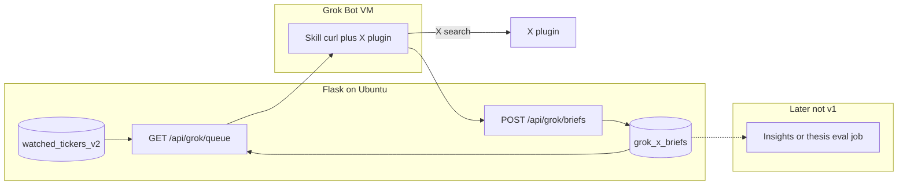

# Grok Bot weekday X research (API + DB)

## What this Bot is for

The dashboard already covers StockTwits + Reddit ([`web_dashboard/social_service.py`](web_dashboard/social_service.py)) and Insights theses ([`docs/INSIGHTS.md`](docs/INSIGHTS.md)). **X is the hole.** Grok’s native read-only X plugin is the collector we never shipped ([`debug/SOCIAL_PLATFORM_B_OPTIONS.md`](debug/SOCIAL_PLATFORM_B_OPTIONS.md)).

The Bot’s job is a **capped weekday X sweep**. Output lands in **Research Postgres immediately** so another LLM can later turn it into Insights / thesis eval / whatever. This ingest is **not** a human review and must not impersonate one (`last_reviewed_at` stays human-only).

## Why not a shared folder (or DB creds on the Bot)

The Bot cloud VM is **not** `ts-cr-desktop`, not the Ubuntu Flask host, and not `/workspace` on your laptop. There is no NFS/SMB/Dropbox between them unless you add a third party.

| Option | How files would move | Verdict |
|--------|----------------------|---------|
| Drop markdown in Bot `/workspace` | Stays on Cursor’s VM until someone copies it | Dead end for “straight into the DB” |
| Google Drive / GitHub as a drop box | Bot writes files; Flask job must still poll and ingest | Two hops, extra plugin, still need a table |
| Give the Bot Research/Supabase URLs + insert scripts | Shared VM = every Bot you ever run sees those creds; an LLM with `psql` can write any table | Too much blast radius |
| **Token API on Flask** (existing pattern: newsletter webhook test token in [`web_dashboard/app.py`](web_dashboard/app.py)) | Bot `curl`s GET/POST; server uses existing clients | **Do this** |

The Bot only holds one secret: `GROK_BOT_TOKEN`. Server-side code already has Supabase + Research access. That is the whole point of “our own API for this task.”

## API contract (v1)

Auth: `Authorization: Bearer <GROK_BOT_TOKEN>`. Env `GROK_BOT_TOKEN` on the Flask host (Woodpecker / container env). Validate with `secrets.compare_digest`. No cookie session, so **CSRF-exempt** this blueprint (same idea as the newsletter webhook). Do not log the token.

Fund: env `GROK_WATCHLIST_FUND` defaulting to Project Chimera. Tickers come from [`watchlist_access.get_active_watchlist_rows`](web_dashboard/watchlist_access.py).

**`GET /api/grok/queue`**

Server computes today’s worklist. Bot does **not** maintain `QUEUE.md` / `SEEN.md`.

- Active A-tier first, then B. Skip C-tier and skip `ideas_inbox` unless we later add a pin table.
- Skip tickers that already have a `grok_x_briefs` row for **today**.
- Prefer never-briefed, then oldest `created_at`.
- Cap **5**.
- Each item: `ticker`, `priority_tier`, `last_brief_at`, `last_cited_urls` (so the Bot does not re-cite the same posts).

**`POST /api/grok/briefs`**

JSON body (one ticker per call, or a batch of ≤5):

- `ticker`, `sweep_date` (UTC date; default today)
- `body` markdown (the brief)
- `notable` bool
- `themes` string[]
- `posts` `[{url, post_id?, summary}]` max 8 per ticker

Rules:

- Reject ticker not on that fund’s active watchlist (400).
- Upsert on `(ticker, sweep_date)` so a retry is idempotent.
- Reject if the Bot already posted 5 distinct tickers today (429).
- `status` = `ingested` (ready for a later job). Do **not** set Insights fields.

Optional later, not v1: `GET /api/grok/watchlist` (full A/B dump) and a `grok_queue_pins` table if you want an LLM or admin to force names onto tomorrow’s queue.

## Where it lands in the DB

**New Research table** `grok_x_briefs` (not `research_articles`, not `ticker_theses`).

Why a new table:

- [`research_articles`](database/schema/research/tables/research_articles.sql) unique-on-`url` and feeds Ideas / meta. Dumping X threads there would pollute collectors and skip the “another LLM decides” step.
- Insights `llm_reply` / `review` have specific meanings ([`docs/INSIGHTS.md`](docs/INSIGHTS.md)). Bot ingest must not bump `last_reviewed_at` or flip disposition.
- A dedicated table is the review queue for the next LLM: `status` can move `ingested` → `evaluated` / `ignored` later.

Sketch:

- `id`, `fund`, `ticker`, `sweep_date`, `body`, `themes text[]`, `posts jsonb`, `notable`, `cited_urls text[]`, `status`, `created_at`, `updated_at`
- `UNIQUE (fund, ticker, sweep_date)`
- Files: [`database/schema/research/tables/`](database/schema/research/) + migration; regenerate [`docs/database/`](docs/database/) after apply. Not added to `CRITICAL_APP_TABLES` (re-runnable from X).

**v1 does not** write `thesis_evidence`, `research_articles`, or `social_metrics`. The follow-on job (separate plan) can `add_evidence(..., evidence_kind='user_url')` or post an advisory `llm_reply` once you have time to define that prompt.

## Bot side (almost no files)

On the Bot VM, keep only:

- `GROK_BOT_TOKEN` (and the Flask base URL, e.g. `https://ai-trading.drifting.space`)
- Skill `/x-watchlist-sweep`: GET queue → X plugin per ticker → POST briefs → chat one-liner with tickers + notable flags
- If X plugin fails: POST nothing; tell chat. **Do not** scrape x.com, **do not** open the dashboard in the browser

No WATCHLIST/QUEUE/SEEN/OUTBOX as source of truth. Optional local copy of the last JSON under `/workspace/grok-research/` for debugging if the VM resets mid-run.

**Never on the VM:** `SUPABASE_*`, Research DB URL, broker logins.

## Skill then routine

Same as before: one manual 1–2 ticker run against **TEST** if we point `GROK_WATCHLIST_FUND` at TEST, or a tiny allowlist in the first deploy. Save skill with failure behavior. Then weekday **07:30 America/Los_Angeles** (10:30 ET, after the open — the operator's local morning, not pre-market). Check the Bot weekly usage bar after the first scheduled run.

## Repo work (this is now the implementation)

- Research schema + migration for `grok_x_briefs`
- Blueprint e.g. [`web_dashboard/routes/grok_bot_routes.py`](web_dashboard/routes/grok_bot_routes.py) registered in [`web_dashboard/routes/__init__.py`](web_dashboard/routes/__init__.py)
- Token helper next to existing webhook compare_digest style
- `tests/test_flask_grok_bot.py` (Flask suite: `python -m pytest tests/test_flask_grok_bot.py -v`)
- [`docs/GROK_BOT_RESEARCH.md`](docs/GROK_BOT_RESEARCH.md) — curl, env vars, Bot profile text, never-do
- `GROK_BOT_TOKEN` + `GROK_WATCHLIST_FUND` in [`web_dashboard/env.example`](web_dashboard/env.example)

No Drive, no GitHub plugin, no export script, no scheduler job on our side (the Bot routine is the scheduler).

## Implementation notes

Deviations from original sketch in deployed implementation (commit `3240c94d`):

- **Default funds**: merged A/B watchlists of `Project Chimera` + `RRSP Lance Webull` (`GROK_WATCHLIST_FUNDS`), not a single `GROK_WATCHLIST_FUND` (still supported as single-fund override).
- **Per-brief fund field**: optional `fund` in POST body (echoed from queue item or resolved against eligible watchlist funds).
- **Rate limiting**: 30 requests/hour on both `/api/grok/queue` and `/api/grok/briefs` (`@rate_limit(limit=30, period=3600)`).
- **Dynamic queue headroom**: `GET /api/grok/queue` returns at most `(5 - distinct tickers briefed today, UTC)`, returning an empty list after a full day's run.
- **Date boundary**: `sweep_date` restricted to UTC date today or yesterday (`YYYY-MM-DD`); any other date returns 400.
- **Payload hygiene**: post URLs must be `http://` or `https://`; theme strings truncated to 100 chars (max 20 themes); body limit is 65,536 characters (not "64 KB").
- **Re-POST idempotency**: same-day re-POST preserves existing `evaluated` or `ignored` status unless `body` or `posts` changed (which resets `status` to `ingested`).

## Security notes

- Token is powerful only for these two routes; still treat it as a secret (shared Bot VM).
- HTTPS only; Flask already sits behind the public dashboard hostname.
- Body size cap (e.g. 64 KB markdown) and post-count cap so a runaway sweep cannot dump a firehose.
- Prompt-injection: store post text as data; the **later** LLM that reads `posts`/`body` must wrap untrusted X text the same way social sentiment does. v1 insert path does not send this to Ollama.

## Success criteria

- `GET /api/grok/queue` with a bad token → 401; with a good token → ≤5 Chimera A/B names.
- Bot POST upserts a row you can `SELECT` in Research.
- Retry of the same ticker/day does not duplicate.
- No Insights thread, action queue, or `research_articles` row appears from this path.
- First weekday routine completes with laptop closed; usage bar has headroom.

## Explicit non-goals (v1)

- Auto-filing Insights / thesis eval / meta bundle inclusion
- Replacing `social_sentiment_ai_job`
- Multi-Bot desk, Cursor cloud agents, grok.com Automations
- Hourly runs or unbounded watchlist sweeps
- Putting DB connection strings on the Bot
