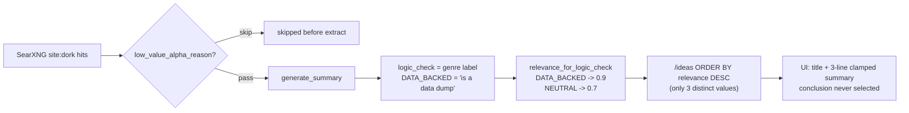

# Ideas inbox quality — implementation plan

**Created 2026-07-27** after Phase H7 (`idea_triage` still 0 rows) and a live Research-DB
sample of the Ideas pool. **Revised 2026-07-27** after code review of the actual pipeline.

**Goal in one line:** the user opens `/ideas` and sees only actionable ideas, each with a
readable reason to care, few enough to triage in one sitting.

**Related docs (context only — not a substitute for this plan):**
- [`docs/ROADMAP.md`](../../docs/ROADMAP.md) §2.2 Ideas inbox; H7 closed same day
- [`docs/PHASE_JK_PLAN.md`](../../docs/PHASE_JK_PLAN.md) — YouTube/events; **do not** conflate
- Mandrel completion `619b10c4-1876-4108-aaef-4b4eb3756999` (H7 empty triage)

---

## Problem statement

`/ideas` is supposed to answer: *which new alpha/opportunity articles merit attention?*
In practice the top of the queue is **boilerplate pages** (ETF holdings lists, dividend
history, empty event calendars). The user cannot tell **why they should care** — and even
when a summary is present it is clamped to 3 lines with **no way to expand it**. So they
never Accept/Dismiss. H7's empty `idea_triage` is a **quality/UX failure**, not missing clicks.

## Evidence (prod Research DB, 2026-07-27)

**Pool (14d Ideas-eligible):** ~112 open rows in the triage window
(`Alpha Research` 90 + `Opportunity Discovery` 22).

**Top by `relevance_score` (0.90):** dominated by `stockanalysis.com` "Holdings List",
dividend-history, and empty "Corporate Event Calendar" pages. Model **conclusions** often
admit the problem while still labeled `logic_check = DATA_BACKED`:

| Title pattern (examples) | Conclusion excerpt |
|--------------------------|--------------------|
| `… Holdings List - … ETF` | "static snapshot… does not offer new information" |
| `… Dividend History, Dates & Yield` | "routine maintenance data" |
| `… Corporate Event Calendar …` | "no new fundamental information… lack of immediate [events]" |

**Rough junk slice (same 14d window):** ~7 titles matching `Holdings List`, ~17 conclusions
matching static/routine/no-new/no-upcoming language; **all 112** had `logic_check` set;
**41** were `DATA_BACKED` (maps to score **0.9**).

**Sources (14d):** fool.com 38, benzinga.com 24, **stockanalysis.com 21**
(disproportionately high average score ~0.9), plus microcapclub / pharma / noise domains.

---

## Root causes (revised — read this before touching code)



### RC1 — The scoring axis is inverted by construction (primary)

This is the real story, and it is stronger than "scoring conflates *has numbers* with
*is an idea*." From the summarizer prompt in
[`summary_common.py:544-554`](../../web_dashboard/summary_common.py):

- `DATA_BACKED` — *"primarily reporting official data/metrics"*
- `NEUTRAL` — *"**DEFAULT** for most articles: analysis pieces, market commentary, opinion,
  recommendations, stock picks… **should be 70-80% of articles**"*

`logic_check` is a **genre** label, not a quality label. Then
[`relevance_for_logic_check`](../../web_dashboard/scheduler/jobs_common.py) maps the
data-dump genre to the **top** score (0.9) and every real thesis piece to 0.7. An ETF
holdings table is the most `DATA_BACKED` object that exists. The evidence confirms it:
41/112 rows are `DATA_BACKED`, and those are the 0.9s at the top of the queue.

> **Implication:** conclusion-regex demotion is a downstream patch on a mislabeled axis.
> Do not lead with it.

### RC2 — `ORDER BY relevance_score` has only three distinct values

0.9 / 0.7 / 0.1. Ranking is a 3-bucket sort then `fetched_at DESC` — there is effectively
no ranking. Regex demotion just shuffles rows between three coarse buckets. The fix is an
explicit composite **inbox score**, not a tweak to the stored score (see RC5).

### RC3 — Pre-filter gaps

[`low_value_alpha_reason`](../../web_dashboard/scheduler/jobs_common.py) only matches
quote/overview/price-history/`Latest … News|Articles|Analysis`. It does **not** catch
Holdings List / Dividend History / Event Calendar. Single caller:
[`alpha_opportunity_workers.py:85`](../../web_dashboard/scheduler/alpha_opportunity_workers.py)
— no blast radius when extending it.

### RC4 — UI hides the honest takeaway *and* truncates what it does show

[`fetch_alpha_ideas`](../../web_dashboard/today_briefing_service.py) SELECTs `summary` but
**not** `conclusion`. [`ideas.ts:140`](../../web_dashboard/src/js/ideas.ts) renders the
summary with `line-clamp-3` and **no expand affordance** — the full text is unreachable
without opening the source. Conclusions that say "no catalyst" never reach the user at all.

Additionally [`ideas.ts:137,140`](../../web_dashboard/src/js/ideas.ts) interpolate
`row.title` and `row.summary` into `innerHTML` **unescaped**. `escapeAttr` exists at
[`ideas.ts:110`](../../web_dashboard/src/js/ideas.ts) but is only applied to thesis badges.

### RC5 — Rewriting `relevance_for_logic_check` cannot fix the current pool

`relevance_score` is written **once at ingest**
([`alpha_opportunity_workers.py:250`](../../web_dashboard/scheduler/alpha_opportunity_workers.py)).
Changing the mapping affects **new rows only** — it does nothing for the existing 112-row
pool for 14 days, so it cannot satisfy the success criteria. It would also ripple into
Research search ordering/thresholds
([`research_repository.py:1074-1085`](../../web_dashboard/research_repository.py)), the
tickerless-junk sweep
([`research_routes.py:949`](../../web_dashboard/routes/research_routes.py)), and
[`jobs_article_relevance.py:391`](../../web_dashboard/scheduler/jobs_article_relevance.py).

**Decision: leave the mapping alone in v1.** It is genuinely wrong; fix it separately and
measured (see Follow-ups).

### RC6 — Supply side

Default [`get_alpha_search_queries`](../../web_dashboard/settings.py) + enabled
`alpha_research_domains` keep surfacing index/holdings URLs. `stockanalysis.com` alone is
21 of 14d hits at ~0.9 average — it is a **structured-data site**, not an analysis
publisher, and is close to pure noise for this use case.

---

## Signals already on the row (use these before inventing regexes)

[`schema/15_add_chain_of_thought_fields.sql`](../../web_dashboard/schema/15_add_chain_of_thought_fields.sql)
already gives structured columns the old plan never used:

| Column | Why it discriminates | Note |
|---|---|---|
| `sentiment` / `sentiment_score` | Every sampled junk row is `NEUTRAL`. `DATA_BACKED + NEUTRAL + no tickers` is a near-exact fingerprint for "routine data page" | zero regex |
| `claims` (JSONB) | Holdings dumps yield 0 trivial claims or dozens of meaningless ones | **guard `jsonb_typeof`** before `jsonb_array_length` — it errors on non-arrays |
| `conclusion` length | The junk conclusions are short dismissive one-liners | cheap proxy for "has a thesis" |
| `tickers` | Idea-ness correlates with a nameable subject | `cardinality(NULL)` is NULL → `COALESCE` |

Structural signals first. Conclusion regexes are a **tiebreaker only** — model/prompt
version drift silently rots them and nothing alerts you.

---

## Plan (ordered — this order is deliberate)

### P1 — UI: readable, untruncated "why care" — ✅ SHIPPED 2026-07-27

Highest value, lowest risk, **zero decisions required**, purely additive. It is also
diagnostic: once conclusions are visible you can eyeball whether P3/P4's patterns are even
needed, instead of making filtering decisions blind.

**Shipped:** `conclusion` / `url` / `logic_check` / `sentiment` on both Ideas fetch paths;
`ideas.ts` renders conclusion as primary "why care" (full text), summary behind
`<details>`, title links to source URL, all fields HTML-escaped; `low_signal` chip ready
for P4.

**Backend** — [`today_briefing_service.py`](../../web_dashboard/today_briefing_service.py):
add `conclusion`, `url`, `logic_check`, `sentiment` to the SELECT in **both**
`_fetch_alpha_ideas_query` **and** `_fetch_alpha_ideas_fallback` (they must not diverge).
Verify `_serialize_rows` in
[`intelligence_routes.py`](../../web_dashboard/routes/intelligence_routes.py) passes the new
fields through unchanged.

**Frontend** — [`ideas.ts`](../../web_dashboard/src/js/ideas.ts):
1. Add the new fields to `IdeaRow`.
2. Render **`conclusion` as the primary body line** ("Why care"), styled as normal body text.
   Fall back to `summary` when conclusion is empty/missing.
3. **Fix the truncation dead end.** No text on this card may be unreachable:
   - Conclusion: render in full. It is 1–3 sentences; clamping it defeats the purpose.
   - Summary: demote to secondary, collapsed behind a native `<details><summary>` disclosure
     ("Full summary") that expands **in place** — no modal, no navigation. When expanded it
     shows the complete text with `whitespace-pre-line` so the bullet `\n`s survive.
   - If any clamp is kept anywhere, it must be paired with a working expand control.
     Prefer `<details>` over a JS toggle: no state, no listener, keyboard-accessible.
4. Add the source `url` as a link on the title.
5. **Escape every interpolated field** — `title`, `summary`, `conclusion`, `source`,
   `article_type`, tickers. `conclusion` is LLM output derived from scraped third-party
   pages: the least-trusted field on the row, about to become the most prominent. Reuse the
   existing `escapeAttr` (rename to `escapeHtml`; it escapes `&`, `"`, `<` which is
   sufficient for text nodes) and apply it consistently.
6. Show a muted chip when `low_signal` is set (arrives in P4; render defensively now).

Build: `pnpm run build:ts`. Tests: `python -m pytest tests/test_flask_intelligence_routes.py -v`.

**Acceptance:** open `/ideas`, pick any card, read the whole why-care line and reach the
full summary without leaving the page.

### P2 — Immediate cleanup of the existing mess — ✅ SHIPPED 2026-07-27 (script; domain ban skipped)

**Shipped:** `web_dashboard/scripts/cleanup_ideas_inbox.py` — dry-run by default; `--execute`
inserts `dismissed` / `decided_by='auto_cleanup'` rows (reversible; does not touch
`research_articles`).

**Not shipped (deliberate):** disabling `stockanalysis.com` in `alpha_research_domains`.
Measured 43% junk / 57% useful — filtering (P3/P4) beats banning. Domain remains in
`STRUCTURED_DATA_DOMAINS` for soft demotion.

P3's filter only prevents *new* junk, and the inbox window is 14 days — so without this
step the page stays unusable for two weeks. Two moves, both reversible, **neither writes to
`research_articles`**:

**2a. Bulk auto-dismiss via `idea_triage`.** The inbox query already excludes any article
with a triage row ([`today_briefing_service.py:120`](../../web_dashboard/today_briefing_service.py)),
and [`idea_triage`](../../database/schema/research/tables/idea_triage.sql) has
`decided_by` / `notes` plus `UNIQUE (article_id)`. So cleanup is an idempotent insert — no
schema change, no score rewrite, undone by a single `DELETE`.

New script `web_dashboard/scripts/cleanup_ideas_inbox.py`, following the house pattern of
[`cleanup_mislabeled_research_articles.py`](../../web_dashboard/scripts/cleanup_mislabeled_research_articles.py)
(`--dry-run` default, `--execute` with confirmation, `--limit`, `_safe_display` for Windows
console):

```sql
INSERT INTO idea_triage (article_id, status, decided_by, notes)
SELECT id, 'dismissed', 'auto_cleanup', 'low_value:' || <matched_reason>
FROM research_articles
WHERE article_type IN ('Alpha Research','Opportunity Discovery')
  AND fetched_at >= NOW() - INTERVAL '14 days'
  AND <title matches boilerplate patterns OR conclusion matches no-catalyst patterns>
ON CONFLICT (article_id) DO NOTHING;   -- never overwrite a human decision
```

Requirements:
- `--dry-run` prints every candidate (id, title, matched reason, conclusion excerpt) so the
  match list is eyeballed **before** anything is written. Expect ~7 title matches + ~17
  conclusion matches from the sample.
- `decided_by='auto_cleanup'` is mandatory and `notes` records the matched reason —
  this keeps machine dismissals distinguishable from human ones.
- `ON CONFLICT DO NOTHING` so a real Accept/Dismiss is never clobbered.
- Provide the exact undo in the docstring:
  `DELETE FROM idea_triage WHERE decided_by = 'auto_cleanup';`
- **Do not delete rows from `research_articles`.** Research search and meta-analysis still
  legitimately consume DATA_BACKED snapshots.

> ⚠️ **Label hygiene:** `auto_cleanup` rows are **not** user labels. Any future relevance
> training or "triage coverage" metric must filter `decided_by <> 'auto_cleanup'`. Record
> this in the ROADMAP note (P6) — it is exactly the trap H7's "don't train on empty
> `idea_triage`" warning was guarding against.

**2b. Disable `stockanalysis.com` in `alpha_research_domains`** (`system_settings`).
One setting, instantly reversible, removes the single largest junk source at the supply
side. Note the before/after hit count in the P5 log so the effect is attributable.

### P3 — Extend the low-value pre-filter (stop new junk) — ✅ SHIPPED 2026-07-27

**Shipped:** shared rules in `ideas_quality.py` / `jobs_common.low_value_alpha_reason`
(title-only for unambiguous holdings lists; title+URL for dividend/calendar/ratings);
tests in `tests/test_alpha_helpers.py` (positive + negative corpus).

Add narrow patterns to `_LOW_VALUE_ALPHA_PATTERNS` in
[`jobs_common.py`](../../web_dashboard/scheduler/jobs_common.py):

| reason label | Match | Scope |
|---|---|---|
| `holdings_list` | `\bHoldings List\b` | **title only** — unambiguous |
| `dividend_history` | `\bDividend History\b` **and** URL path `/dividend` | title **+** URL — real articles exist ("X's dividend history suggests…") |
| `event_calendar` | `\b(?:Corporate\s+)?Event Calendar\b` **and** URL path `/calendar` | title **+** URL |
| `price_targets_page` | `\bAnalyst Ratings and Price Targets\b` **and** URL path `/ratings\|/forecast` | title **+** URL — Benzinga/MarketBeat publish real single-upgrade notes with similar titles |
| ~~non-English quote pages~~ | — | **Cut from v1.** No evidence in the sample; pure false-positive risk. If Spanish pages actually arrive, fix it at the domain/query level, not with a title regex. |

Implementation notes:
- This introduces **URL matching for the first time**. The current docstring says `url` is
  *"accepted for signature stability / not currently matched"*, and the tuning-guidance
  comment block above `_LOW_VALUE_ALPHA_PATTERNS` explicitly claims title-only matching.
  **Update both** — a stale comment here is how the next person reintroduces a bug.
- Pattern tuples need a shape that carries the optional URL requirement (e.g.
  `(reason, title_pat, url_pat | None)`), matching only when both hit. Keep
  `is_low_value_alpha_result` working unchanged.
- **Do not delete rows from Research DB in this step** — prevent *new* junk only.

Tests in [`tests/test_alpha_helpers.py`](../../tests/test_alpha_helpers.py): extend both the
positive corpus and — more importantly — the **negative corpus**
(`test_is_low_value_alpha_result_allows_real_analysis`) with the near-miss titles the new
patterns could wrongly eat: a genuine dividend-thesis article, a real price-target upgrade
note, an earnings-calendar *analysis* piece.

### P4 — Inbox-only composite ranking — ✅ SHIPPED 2026-07-27

Implemented as `ideas_quality.idea_score_sql()`, shared by `_fetch_alpha_ideas_query`
and `_fetch_alpha_ideas_fallback` via `_IDEA_COLUMNS` + `_rank_and_limit_sql()`.

**Validation — the auto-dismissed rows are a free labelled set.** Scoring the 30-day
pool and checking against the 17 rows the cleanup passes had judged junk:

| idea_score | rows | known junk |
|---|---|---|
| ≤ 0 | 22 | 15 |
| 1–2 | 0 | 0 |
| 3–4 | 20 | 2 |
| ≥ 5 | 161 | 0 |

15/17 caught with no pattern tuning, and **a natural empty gap at 1–2** — the
`low_signal` threshold of 3 sits in it rather than cutting through a cluster, so the
boundary is not a knob anyone has to defend. The two escapes are the ambiguous ones:
`KRE ETF Stock Price & Overview` (boilerplate title, but BULLISH with claims — the
Sinda shape, so scoring it 3 is arguably correct) and a Spanish-language quote page
no rule matches. Both now sit at the bottom instead of the top, where `relevance_score`
had them at 0.9.

**Weights differ from the draft below** (3/2/3/1 and −6/−2/−3 rather than 2/1/1/1 and
−3/−4/−3). The draft let a boilerplate match (−4) outweigh every structural signal
combined (+5), which inverts the stated priority. The shipped ceiling is +9 structural
against a −6 boilerplate demote, so a boilerplate title carrying real direction, tickers
and claims still clears the bar — required by the Sinda case.

**Deviation: low-signal rows ARE filtered by default.** The draft said soft-demote
only, reasoning that "a filter bug looks identical to an empty queue." That risk is
real but addressable, and demote-only did not deliver the actual ask (*"I want to see
only good actionable ideas on that page"*) — with `LIMIT 50` a demoted row is still on
screen. Shipped instead with the failure mode closed directly:

- the API returns `low_signal_total`, and the UI always shows *"N low-signal ideas
  hidden — Show anyway"*, so the filter announces itself;
- the count is a window function computed **before** the filter, and an empty page
  re-queries with `include_low_signal=1` — otherwise the one case worth seeing (page
  empty because everything was filtered) would report zero;
- `?include_low_signal=1` remains the escape hatch, and low-signal rows render dimmed
  rather than hidden when shown.

A filter bug is therefore visible as "94 hidden" on a blank page, which is the outcome
the draft was protecting against.

**Also:** the card meta line now shows `signal N/9` instead of `relevance_score`.
Displaying the genre-derived score next to a card invites trusting it.

---

*Original spec, retained for the reasoning:*

**Locked: inbox-only, soft demote.** Add an `idea_score` expression to
`_fetch_alpha_ideas_query` and order by it. Structural signals lead; regexes are tiebreakers.

```sql
(
    CASE WHEN COALESCE(ra.sentiment,'NEUTRAL') <> 'NEUTRAL'                THEN 2 ELSE 0 END
  + CASE WHEN COALESCE(cardinality(ra.tickers),0) > 0                     THEN 1 ELSE 0 END
  + CASE WHEN length(COALESCE(ra.conclusion,'')) >= 120                   THEN 1 ELSE 0 END
  + CASE WHEN COALESCE(
        CASE WHEN jsonb_typeof(ra.claims)='array'
             THEN jsonb_array_length(ra.claims) END, 0) >= 2              THEN 1 ELSE 0 END
  - CASE WHEN ra.logic_check = 'HYPE_DETECTED'                            THEN 3 ELSE 0 END
  - CASE WHEN ra.title ~* :boilerplate_title_re                           THEN 4 ELSE 0 END
  - CASE WHEN ra.conclusion ~* :no_catalyst_re                            THEN 3 ELSE 0 END
) AS idea_score
```

- `:boilerplate_title_re` — **the same patterns as P3**, so old rows are demoted immediately
  with no DB writes. This is why a separate `relevance_score` backfill is unnecessary.
- `:no_catalyst_re` — `static snapshot|routine (maintenance|compositional)|does not offer new|no new fundamental|no upcoming|simply indicates a lack`
- Keep both regexes as **module-level named constants** shared with P3, not inline SQL
  literals, so there is one place to tune them.
- `ORDER BY idea_score DESC, ra.relevance_score DESC NULLS LAST, ra.fetched_at DESC`.
- Emit `low_signal = (idea_score <= 0)` in the payload. **Soft demote, never hard exclude:**
  with a 3-value score a hard filter makes rows unreachable and un-auditable, and since the
  inbox already hides triaged rows, a filter bug looks identical to an empty queue.
- Add `?include_low_signal=1` to the API as the escape hatch so nothing is ever truly
  invisible.
- **Apply the same ordering to `_fetch_alpha_ideas_fallback`.** It is the failure path
  (`idea_triage` missing) and would otherwise silently restore the old junk order at exactly
  the moment nobody is looking.
- Do **not** hard-require tickers: macro/sector ideas are legitimate and ~15 rows in the
  sample lack them. Ticker presence is a ranking bonus, not a gate.

### P5 — Validate that the changes actually produce better ideas

The success criteria are unfalsifiable without a baseline. Do this around the code changes,
not after.

1. **Before any change:** snapshot the current inbox top-50 (id, title, source,
   relevance_score) to `scratchpad/ideas_baseline_2026-07-27.csv`.
2. **After P1:** eyeball 10 cards — is the conclusion actually a usable why-care line, or is
   the model's conclusion field itself weak? This gates whether P3/P4 are sufficient.
3. **After P3:** trigger one `alpha_research` run (`run_job_now('alpha_research')` via
   [`admin_routes.py:2129`](../../web_dashboard/routes/admin_routes.py) or the scheduler
   admin UI). Then **read every `low_value` job step from that run and confirm each dropped
   title is genuinely boilerplate.** P3's failure mode is *silent* — a real article is
   dropped before extraction and only ever appears as a log line. This audit is a hard gate,
   not a nicety.
4. **After P4:** re-query the top-20 and diff against the baseline. Record how many of the
   removed rows were junk vs. real (false-positive rate).
5. **Human spot-check:** of the new top-20, how many are actionable? Target ≥15.

### P6 — Docs — ✅ SHIPPED 2026-07-29

**Shipped in** [`docs/ROADMAP.md`](../../docs/ROADMAP.md) §2.2 / H7 / Phase H index /
post-ship verification:

- Empty-triage diagnosis + Ideas quality P1–P4 shipped note
- RC1 genre-vs-quality finding (DATA_BACKED ranking inversion)
- **`decided_by='auto_cleanup'` must be excluded** from any label set or triage-coverage
  metric; do not train relevance on `idea_triage` until real human labels exist

P5 (live top-20 / alpha-run audit) remains an ops checklist item.

---

## Locked decisions (previously "open questions")

1. **Title-only filtering?** Split it. Title-only for `Holdings List` (unambiguous);
   title **AND** URL path for dividend / calendar / ratings, where the title text alone has
   real false-positive risk.
2. **Inbox-only demote vs. global `relevance_score` rewrite?** **Inbox-only.** Decisive
   reason: the score is written once at ingest, so a mapping change affects only *new* rows
   and does nothing for the existing pool for 14 days (RC5). Secondary reason: four other
   consumers. The `DATA_BACKED → 0.9` mapping is genuinely wrong — fix it separately.
3. **Minimum bar for an "idea"?** No hard ticker requirement (macro/sector ideas are real).
   Ticker presence is a ranking bonus. A non-empty `conclusion` is effectively required to
   rank into the top section, since it is the card's why-care line.
4. **Soft-hide vs. hard-exclude?** ~~**Soft.**~~ **Revised at implementation — hidden by
   default, with the invisibility failure closed directly.** Demote-only does not achieve
   the goal: at `LIMIT 50` a demoted row is still on the page. The original objection
   (false positives become invisible and indistinguishable from an empty queue) is
   answered by always reporting `low_signal_total` in the UI, computing that count
   *before* the filter, and re-querying when the page comes back empty. See the P4
   section.
5. **Better signals than conclusion regexes?** **Yes** — `sentiment`, `claims` length,
   `conclusion` length, `tickers`. Use them first; regexes are tiebreakers only.

---

## Non-goals (v1)

- Training a relevance model on Accept/Dismiss (H7: zero real labels)
- New Ideas admin UI or new DB tables
- Feeding YouTube / Phase J into Ideas
- Rewriting `relevance_for_logic_check` globally (see Follow-ups)
- Rewriting all alpha search queries (see Follow-ups)
- Deleting historical articles from `research_articles`
- Changing sector meta / Ideas `article_type` allowlist for other pipelines

## Success criteria

**Proxies (check immediately):**
- New SearXNG hits titled "X Holdings List" / dividend history / empty calendars are
  **skipped** (`low_value` step) before extract — and the skip log contains **zero** real
  articles.
- Each card shows a complete, readable why-care line, and **no text on the card is
  truncated without a working way to expand it**.
- Default `/ideas` top-20 contains ≥15 actionable ideas (human spot-check vs. baseline).
- Unit tests cover new low-value patterns, positive **and** negative corpus; flask ideas
  routes still pass.

**Real criterion (check within a week of shipping):**
- `idea_triage` has ≥1 genuine human Accept/Dismiss
  (`WHERE decided_by <> 'auto_cleanup'`). Everything above is a proxy for this.

## Implementation checklist (agent)

1. Read this plan + linked files. RC1 and RC5 are the load-bearing findings — do not
   reorder the phases without re-reading them.
2. ~~**P1** UI/API: conclusion + full-text + escaping.~~ ✅ done 2026-07-27
3. **P5.1** baseline snapshot (ops — can still run anytime for a before/after).
4. ~~**P2** cleanup script.~~ ✅ done 2026-07-27
   (`cleanup_ideas_inbox.py`; stockanalysis.com ban **skipped** — filtering beats banning).
   Confirm `--execute` against prod if the 14d pool is still junk-heavy.
5. ~~**P3** patterns + tests.~~ ✅ done 2026-07-27
6. **P5.3** trigger one `alpha_research` run; audit every `low_value` skip. **Hard gate.**
7. ~~**P4** inbox ranking in *both* query paths + `low_signal` + `include_low_signal`.~~ ✅ done
8. **P5.4/5.5** diff top-20 vs baseline; record false-positive rate.
9. ~~**P6** ROADMAP note + `auto_cleanup` hygiene.~~ ✅ done 2026-07-29
   (Mandrel `context_store` optional).

## Follow-ups (deliberately out of v1, with triggers)

| Item | Trigger |
|---|---|
| Fix `relevance_for_logic_check` (`DATA_BACKED` should not outrank `NEUTRAL` for ideas) | After P4 ships and the inbox is stable; measure Research-search impact first |
| Add an explicit `ROUTINE_DATA` bucket to the summarizer prompt so the genre is labeled at the source instead of regex-detected downstream | If conclusion regexes need tuning more than once |
| Alpha query / domain tuning beyond stockanalysis.com | If the P5 top-20 spot-check yields <15 actionable after P1–P4 |
| Ideas relevance learning from real labels | Once `idea_triage` has a meaningful count of `decided_by <> 'auto_cleanup'` rows |
