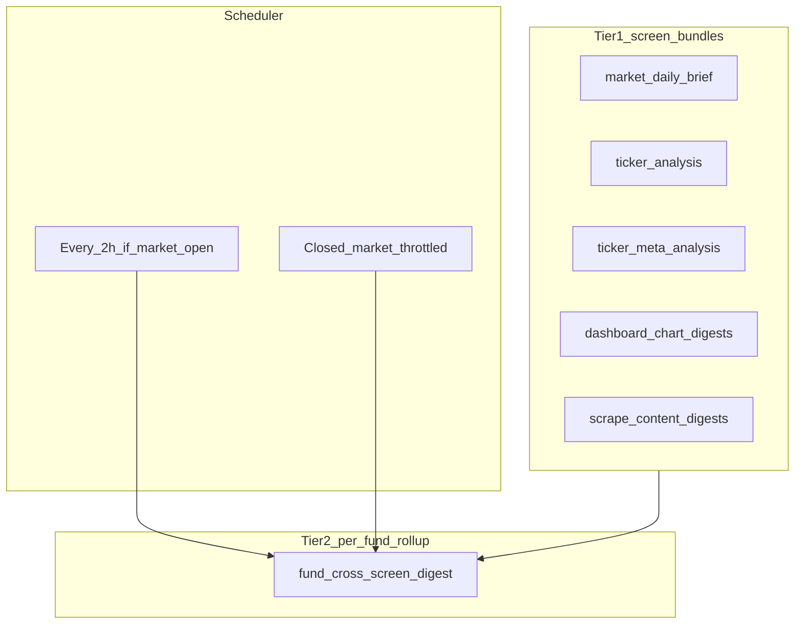

# Layered AI summaries: screen inventory and implementation plan

## Decisions (locked)

- **Tier-2 portfolio / cross-screen digest is per fund** (`scope_key` = fund name or stable fund id). No single global “portfolio” paragraph for all users.
- **Cadence — market open (US equities RTH):** run the **rollup** (and any price-sensitive tier-1 bundles tied to live marks) **once every 2 hours** while the market is **open** (use shared [`MarketHours`](market_data/market_hours.py) / holiday logic; align with existing patterns in [`web_dashboard/routes/ai_routes.py`](web_dashboard/routes/ai_routes.py) that branch on `is_market_open()`).
- **Cadence — market closed / overnight / weekends:** **do not** burn LLM cycles every 2h on summaries that only rehash **unchanged prices**. Split scopes:
  - **Price-linked** (performance vs benchmark, allocation marks, movers, commodities that come from stale closes): run **at most** 1–2× per closed period (e.g. after US close + optional pre-open), or **only when inputs digest changes** (new benchmark refresh, manual trade, new position).
  - **Scrape / content-linked** (research headlines, social, congress, news matches): **may** update on their **existing ingestion cadence** or a **slower** fixed schedule (e.g. every 6–12h overnight); tier-2 rollup can ingest **only** tier-1 rows whose `inputs_digest` or source job version changed.
- **Optimization rule:** each job computes an **`inputs_digest`**; if digest unchanged, **skip LLM** (already in plan). Closed market: expect digest to stay stable for price bundles → natural no-op.

## Current state (what exists today)

### Tier A — Already automatic + persisted (research Postgres unless noted)

| Area | Mechanism | Storage / read path |
|------|-----------|---------------------|
| **Market regime (macro)** | [`market_brief_service.run_market_daily_brief`](web_dashboard/market_brief_service.py) + [`market_daily_brief_job`](web_dashboard/scheduler/jobs_dashboard_research.py) | [`market_daily_brief`](database/schema/research/tables/market_daily_brief.sql); UI via [`GET /api/dashboard/market-brief`](web_dashboard/routes/dashboard_routes.py) |
| **Per-ticker** | Ticker analysis + meta jobs | [`ticker_analysis`](web_dashboard/ticker_analysis_service.py), [`ticker_meta_analysis`](web_dashboard/meta_analysis_service.py) |
| **Action queue** | [`action_queue_ai_review_job`](web_dashboard/scheduler/jobs_dashboard_research.py) | `action_queue_ai_review` |
| **Social / congress / articles** | Various jobs | Existing research/supabase tables |

### Tier B — Metrics on screen, no dedicated persisted “explainer” row

- Dashboard charts ([`/api/dashboard/charts/*`](web_dashboard/routes/dashboard_routes.py)), signals list, research list, etc. — **add tier-1 `ui_ai_summary` rows** per scope.

## Architecture

## Persistence

- **`ui_ai_summary(scope, scope_key, summary_json, inputs_digest, model_used, updated_at, content_class)`** where `content_class` is `price_linked` | `content_linked` to drive closed-market policy.
- **`ui_ai_rollup_fund` (or similar):** `fund`, `headline`, `narrative`, `sources_used jsonb`, `updated_at` — **per fund**, refreshed on the schedule below.

## Scheduling implementation notes

1. **Single cron entry every 2 hours** (e.g. minute 10 past even hours ET) that:
   - If `MarketHours().is_market_open()`: run tier-2 rollup for each production fund + refresh **stale** price-linked tier-1 scopes (or only those with digest change).
   - Else: **skip** price-linked regeneration unless digest changed; optionally run **content-only** tier-1 refresh if upstream scrape jobs bumped a version flag / newer `research_articles.updated_at` max.
2. Reuse **AI lock** ([`get_running_ai_job`](web_dashboard/utils/job_tracking.py)) so digest jobs do not stack with heavy ticker analysis.
3. **market_daily_brief** can remain **daily**; tier-2 **includes** the latest brief row as an input, so the 2h rollup does not duplicate macro LLM calls unless brief is missing.

## Implementation phases

**Phase 0** — Finalize scope ↔ template map and `content_class` per scope.

**Phase 1** — Schema (`ui_ai_summary`, `ui_ai_rollup_fund`) + apply script + pilot dashboard chart digest (price-linked).

**Phase 2** — Tier-1 expansion (signals, research feed digest as content-linked).

**Phase 3** — Tier-2 per-fund rollup job + `GET` API + dashboard card; wire **2h open / throttled closed** as above.

**Phase 4** — Tests (market-open mock, digest skip when inputs unchanged), scheduler registration in [`jobs.py`](web_dashboard/scheduler/jobs.py).

## Plan validation log

**2026-04-26 (post-user commits):** Re-checked repo. Still accurate.

- **New work from this plan:** None. No `ui_ai_summary` / `ui_ai_rollup` tables, jobs, or routes; grep hits only this file.
- **Tier-A references still present:** [`market_brief_service.py`](web_dashboard/market_brief_service.py), [`GET /api/dashboard/market-brief`](web_dashboard/routes/dashboard_routes.py), [`market_daily_brief.sql`](database/schema/research/tables/market_daily_brief.sql) + [`ticker_meta_analysis.sql`](database/schema/research/tables/ticker_meta_analysis.sql) in [`_init_schema.sql`](database/schema/research/_init_schema.sql), [`jobs_dashboard_research.py`](web_dashboard/scheduler/jobs_dashboard_research.py) (market brief + action queue AI).
- **Research `tables/`:** 18 SQL files; no conflicting new “screen summary” table added.
- **Optional follow-up when implementing:** Re-skim [`web_dashboard/scheduler/jobs.py`](web_dashboard/scheduler/jobs.py) `AVAILABLE_JOBS` and [`web_dashboard/docs/SCHEDULER_HEALTH_CHECK_RUNBOOK.md`](web_dashboard/docs/SCHEDULER_HEALTH_CHECK_RUNBOOK.md) so the new 2h digest job is documented alongside any scheduler changes you have made.
