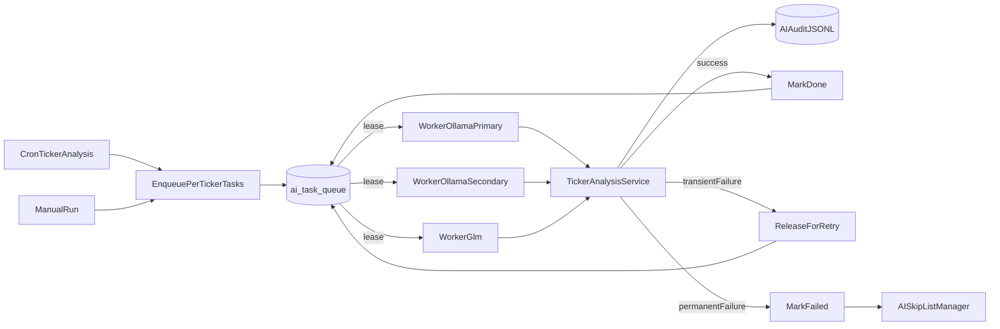

# AI Task Queue Design

Backend-bound AI task queue and worker pool — replaces the coarse global AI lock for AI jobs that opt in via `AI_QUEUE_ENABLED=true` + `AI_QUEUE_JOBS=...`. The legacy inline path remains the default for any job not listed.

## Status (2026-05-24)

| Phase | Scope | Status |
|-------|-------|--------|
| Phase 0 | Design contract (this document) | ✅ |
| **Q1** | `ai_task_queue` schema + lease/finalize RPCs + embedded worker pool gated by `AI_QUEUE_ENABLED` | ✅ shipped |
| **Q2** | Migrate `ticker_analysis` to per-ticker queue tasks | ✅ shipped 2026-05-20; verified end-to-end across `ollama_primary`, `ollama_secondary`, and `glm` workers on 2026-05-21 |
| **Q3** | Retire global mutex for queue-managed jobs (other AI jobs no longer block them) | ✅ shipped 2026-05-23 — `is_queue_managed_job()` helper in `utils/job_tracking.py`; `get_running_ai_job()` short-circuits to None for queue-managed jobs; `run_scheduler_job_once.py` logs ignored `--wait-ai-lock` / `--ignore-ai-lock` flags for queue-managed jobs |
| **Q4a** | Migrate `ticker_meta_analysis` to per-ticker queue tasks | ✅ shipped 2026-05-23 — handler + enqueue helper + scheduler queue-mode path (legacy inline path preserved when not listed). `AI_QUEUE_JOBS` default in `.woodpecker.yml` flipped to `ticker_analysis,ticker_meta_analysis`. Verified end-to-end on 2026-05-24 manual trigger: 62/62 tasks done, 0 failed, **22m 57s total elapsed** (vs ~45m sequential), all three backends (`ollama_primary`, `ollama_secondary`, `glm`) leasing concurrently. |
| **Q4b** | Migrate `sector_meta_analysis` to per-sector queue tasks | ✅ shipped 2026-05-24 — handler + enqueue helper + scheduler queue-mode path (legacy inline path preserved when not listed). `AI_QUEUE_JOBS` default in `.woodpecker.yml` flipped to `ticker_analysis,ticker_meta_analysis,sector_meta_analysis`. Awaiting first production cron for end-to-end verification. |
| **Q4c** | Migrate `etf_group_analysis` to per-(ETF, date) queue tasks | ✅ shipped 2026-05-24 — handler + enqueue helper + scheduler queue-mode path (legacy inline path preserved when not listed). Worker keeps the legacy `ai_analysis_queue` row's status in sync via `payload.legacy_queue_id`. `AI_QUEUE_JOBS` default in `.woodpecker.yml` flipped to `ticker_analysis,ticker_meta_analysis,sector_meta_analysis,etf_group_analysis`. Awaiting first production cron for end-to-end verification. |
| **Q4d** | `market_daily_brief` | ⏭ skipped — see Q4d subsection. Single-LLM-call-per-day in steady state; queue parallelism gives no win and the existing lock-retry mechanism is sufficient as upstream queue-managed jobs no longer hold the global AI mutex. |
| **Q4e** | `ui_ai_summaries` | ⏭ skipped — see Q4e subsection. Heterogeneous unit of work (multiple distinct scopes per cron, each with its own digest-skip optimization that already short-circuits the LLM); a single-shaped queue handler doesn't fit without a service-level refactor. |
| **Q4f** | `action_queue_ai_review` | ⏭ skipped — see Q4f subsection. Per-item prompt construction needs service-side prep that doesn't cleanly split into "enqueuer prep + worker LLM call"; would require a moderate refactor of `action_queue_service` before the queue handler can be a thin wrapper. |
| **Q4g** | Migrate `social_sentiment_analysis` to per-session queue tasks | ✅ shipped 2026-08-13 — handler + enqueue helper + scheduler queue-mode path (legacy inline path preserved when not listed). `AI_QUEUE_JOBS` default in `.woodpecker.yml` gained `social_sentiment_analysis`. Sentiment scoring and ticker extraction were merged into one LLM call (was two round-trips over the same content). Sessions that can never be analyzed are now retired instead of left pending — the old behaviour left 154 dead sessions permanently blocking the oldest-first batch. |

Phases here used to be numbered "Phase 1–4". Renamed to **Q1–Q4** so cross-doc discussion is unambiguous (e.g. "queue Q3" vs `meta_analysis_roadmap.md`'s "Phase 3").

## Related docs

- [`docs/meta_analysis_roadmap.md`](meta_analysis_roadmap.md) — product layers (market → sector → ticker meta) that the queue powers. Q4 migrations directly reduce AI-lock contention seen by meta jobs.
- [`AGENTS.md`](../AGENTS.md) — "Meta Analysis (market → sector → ticker)" pointer block.

## Why

The current AI job execution model serializes too much work. It protects limited LLM capacity, but it does that with a global mutex that cannot represent the capacity we actually have: two Ollama hosts plus GLM.

Today there are three layers:

1. `utils/job_tracking.py` treats every name in `AI_JOB_NAMES` as mutually exclusive through `get_running_ai_job()`. One slow job can block all other AI jobs until its stale-lock window expires.
2. `web_dashboard/ollama_client.py` also has per-host semaphores using `OLLAMA_MAX_CONCURRENT_PER_HOST`. These are useful, but they are process-local protection, not a scheduler-wide queue.
3. `collect_with_summary_model_chain()` tries models sequentially in one caller thread. That is good fallback behavior for a single request, but it does not distribute independent ticker tasks across available backends.

The result is that a long `ticker_analysis` run can keep GLM, Ollama primary, and Ollama secondary effectively idle as a group, even if only one backend is truly busy.

## Goals And Non-Goals

Goals:

- Run multiple independent AI tasks concurrently, bounded by configured backend capacity.
- Bind workers to backends so GLM failures do not block Ollama work, and vice versa.
- Support manual and scheduled runs coexisting through the same queue.
- Use per-ticker tasks for `ticker_analysis` so retries are small and observable.
- Preserve AI audit logging for every LLM attempt.
- Replace silent skips with queue state: pending, leased, done, failed, cancelled.

Non-goals for the first implementation:

- Rewriting every AI job at once.
- Removing `job_executions`; it remains useful as a job audit/status surface.
- Replacing `AISkipListManager`; it remains the owner of permanent ticker skip policy.
- Supporting arbitrary multi-container scaling before the lease RPC is proven in one scheduler process.

## Architecture



The scheduler becomes an enqueuer for queue-managed jobs. Workers become the only code path that performs LLM work for those jobs.

For `ticker_analysis`, the first migrated job, the scheduler should:

1. Select tickers using the existing `TickerAnalysisService.get_tickers_to_analyze()` policy.
2. Insert or update one `ai_task_queue` row per ticker.
3. Mark the top-level `job_executions` row as "enqueued N tasks" rather than "holding the AI lock".

The worker pool should:

1. Lease one eligible task atomically.
2. Heartbeat the lease while the task is running.
3. Execute the task on its configured backend.
4. Mark success, release for retry, or mark failed based on error classification.

## Queue Table Sketch

The new table should be separate from `ai_analysis_queue`. The existing table has a narrower shape and a uniqueness model for pending analysis requests, not leased worker tasks.

```sql
CREATE TABLE ai_task_queue (
  id UUID PRIMARY KEY DEFAULT gen_random_uuid(),
  analysis_type VARCHAR(40) NOT NULL,
  target_key VARCHAR(100) NOT NULL,
  payload JSONB,
  priority INTEGER NOT NULL DEFAULT 0,
  status VARCHAR(20) NOT NULL DEFAULT 'pending',
  attempts INTEGER NOT NULL DEFAULT 0,
  max_attempts INTEGER NOT NULL DEFAULT 3,
  last_error TEXT,
  last_error_class VARCHAR(40),
  leased_by VARCHAR(120),
  leased_backend VARCHAR(40),
  leased_until TIMESTAMPTZ,
  available_at TIMESTAMPTZ NOT NULL DEFAULT now(),
  enqueued_by VARCHAR(40),
  created_at TIMESTAMPTZ NOT NULL DEFAULT now(),
  updated_at TIMESTAMPTZ NOT NULL DEFAULT now(),
  completed_at TIMESTAMPTZ
);

CREATE INDEX ai_task_queue_pending_idx
  ON ai_task_queue (status, priority DESC, created_at)
  WHERE status = 'pending';

CREATE INDEX ai_task_queue_lease_recovery_idx
  ON ai_task_queue (status, leased_until)
  WHERE status = 'leased';

CREATE UNIQUE INDEX ai_task_queue_active_dedupe_idx
  ON ai_task_queue (analysis_type, target_key)
  WHERE status IN ('pending', 'leased');
```

Expected statuses:

- `pending`: available for lease.
- `leased`: assigned to a worker until `leased_until`.
- `done`: completed successfully.
- `failed`: terminal failure.
- `cancelled`: intentionally removed from work.

Q1 added a Postgres RPC for atomic leasing (`lease_ai_task`). The RPC uses `FOR UPDATE SKIP LOCKED` so multiple workers cannot lease the same row.

## Worker Lifecycle

Worker loop:

```text
while running:
    task = lease_one_task(backend, lease_ttl)
    if task is None:
        sleep(idle_poll_seconds)
        continue

    set_audit_context(task_id=task.id, backend=backend)
    start_heartbeat(task.id)

    try:
        run_task(task, backend)
        mark_done(task.id)
    except Exception as exc:
        error_class = classify_error(exc)
        handle_failure(task, error_class, exc)
    finally:
        stop_heartbeat(task.id)
        clear_audit_context()
```

Lease behavior:

- Default lease TTL: 90 seconds.
- Default heartbeat interval: 30 seconds.
- A worker crash naturally stops heartbeats; another worker can reclaim the row after `leased_until`.
- A worker should only finalize a task it still owns.
- A worker id should include process id, thread name, backend, and host where possible.

The worker should not hold or check the global AI lock. Capacity is controlled by worker counts and backend-specific limits.

## Backend Binding

Workers are backend-bound. A worker assigned to `ollama_primary` should call only the primary Ollama host. A worker assigned to `ollama_secondary` should call only the secondary Ollama host. A worker assigned to `glm` should call only GLM.

This avoids a worker starting on GLM and then consuming Ollama capacity inside a fallback chain. Cross-backend fallback happens by releasing the task back to the queue and letting another backend's worker pick it up.

Backend names:

- `ollama_primary`
- `ollama_secondary`
- `glm`

Initial worker counts:

- `AI_QUEUE_WORKERS_OLLAMA_PRIMARY=1`
- `AI_QUEUE_WORKERS_OLLAMA_SECONDARY=1`
- `AI_QUEUE_WORKERS_GLM=3`

The Ollama semaphore in `ollama_client.py` remains useful as defense in depth. If it raises `OllamaHostBusyError`, the worker should classify that as `host_busy` and release the task rather than wait inside the worker thread.

## Fallback Rules

Fallback is rules-based by error class. Workers do not call other backends mid-task.

| Error class | Typical source | Queue action | Backend preference |
| --- | --- | --- | --- |
| `host_busy` | `OllamaHostBusyError` | Release without incrementing attempts | Prefer another backend |
| `timeout_ollama` | Ollama stream/read timeout | Release and increment attempts | Any backend |
| `timeout_glm` | Z.AI request timeout | Release and increment attempts | Prefer non-GLM |
| `model_not_found` | Ollama 404 or missing model | Release and increment attempts | Any other backend |
| `rate_limited` | HTTP 429 from GLM/Z.AI | Release with delayed retry | Any backend after backoff |
| `bad_json` | Non-empty invalid LLM JSON | Retry until max attempts, then failed | Any backend |
| `schema_violation` | Normalized LLM output cannot fit contract | Failed immediately | None |
| `delisted_or_not_found` | Market/data source says ticker is invalid | Failed immediately plus skip-list handling | None |
| `unknown` | Unclassified exception | Retry until max attempts, then failed | Any backend |

The classifier should live in code, not config, so it can be unit tested and changed with the implementation. Only `AISkipListManager` should create permanent skip-list entries.

## Configuration

Feature flags:

- `AI_QUEUE_ENABLED=false` was the default during Q1 plumbing. CI now sets `AI_QUEUE_ENABLED=true` + `AI_QUEUE_JOBS=ticker_analysis` for the Flask deploy (see `web_dashboard/.woodpecker.yml`).
- `AI_QUEUE_JOBS=ticker_analysis,...` controls which jobs route through the queue. Add a job here only after its handler is registered in `build_task_handlers()` (otherwise workers refuse to start for that job).

Worker and lease settings:

- `AI_QUEUE_WORKERS_OLLAMA_PRIMARY=1`
- `AI_QUEUE_WORKERS_OLLAMA_SECONDARY=1`
- `AI_QUEUE_WORKERS_GLM=3`
- `AI_QUEUE_LEASE_TTL_SEC=90`
- `AI_QUEUE_HEARTBEAT_SEC=30`
- `AI_QUEUE_POLL_IDLE_SEC=2`
- `AI_QUEUE_BACKOFF_BASE_SEC=30`
- `AI_QUEUE_MAX_ATTEMPTS=3`
- `AI_QUEUE_STRICT_BACKEND_HEALTH=false` — when true, drop backends that fail the boot probe; default warns but still starts configured workers

**Backend enablement:** At start, `resolve_effective_worker_counts()` zeros workers for backends that lack config (`OLLAMA_BASE_URL` / `_2` / ZHIPU key). A fully configured three-backend deploy is unchanged. Single-host OSS installs only need primary Ollama.

Existing model settings remain in the existing model configuration and settings modules. The queue should decide which backend runs a task, not invent a new model registry.

## Migration Plan

### Q1: Queue Plumbing — ✅ shipped

- `ai_task_queue` schema and lease/finalize RPCs in place (`database/schema/supabase/functions/lease_ai_task.sql` etc.).
- Worker module: `web_dashboard/scheduler/ai_task_workers.py`.
- Workers start only when `AI_QUEUE_ENABLED=true` AND a registered handler exists for at least one entry in `AI_QUEUE_JOBS`.
- Legacy inline path remains for jobs not listed in `AI_QUEUE_JOBS`.
- Unit tests cover config parsing, start gating, lease RPC payloads, and fallback error classification (`tests/test_ai_task_workers.py`).

### Q2: Migrate `ticker_analysis` — ✅ shipped 2026-05-20

- `web_dashboard/scheduler/jobs_ticker_analysis.py` enqueues per-ticker tasks when queue mode is on; legacy inline loop still runs when off.
- Manual `ticker_analysis` runs enqueue work rather than skipping due to a global AI lock.
- Each LLM attempt writes one audit row that joins back to the queue task.
- Verified 2026-05-21: 5 freshly-reset tasks were leased and completed by all three backends (`ollama_primary`, `ollama_secondary`, `glm`) within ~2 minutes; the 04:00 UTC cron the next night enqueued 101/101 with 99 done / 2 model-level failures.

### Q3: Retire Global Mutex For Queue-Managed Jobs — ✅ shipped 2026-05-23

- Added `is_queue_managed_job(job_id)` in `utils/job_tracking.py`. It reads the same `AI_QUEUE_ENABLED` / `AI_QUEUE_JOBS` env vars the worker pool reads (`AIQueueConfig.from_env`), with byte-for-byte equivalent parsing enforced by `tests/test_job_tracking_queue_managed.py::test_is_queue_managed_job_matches_ai_queue_config`. This makes a single env var the only switch needed to opt a job into queue mode.
- `get_running_ai_job(exclude_job_name=...)` now short-circuits to `None` whenever `exclude_job_name` is queue-managed (Q3 bypass). The function gained an `ignore_for_queue_managed=True` keyword for callers that need raw lock state (admin UI). Every scheduler call site that already passes `exclude_job_name=job_id` (`jobs_ticker_analysis`, `jobs_alpha`, `jobs_research`, `jobs_social`, `jobs_signals`, `jobs_opportunity`, `jobs_congress`, `jobs_etf_analysis`, `jobs_newsletter`, `jobs_ticker_meta_analysis`, `jobs_sector_meta_analysis`, `jobs_dashboard_research`, `jobs_ui_ai_summaries`) inherits the bypass automatically when the matching job name is added to `AI_QUEUE_JOBS`.
- `web_dashboard/scripts/run_scheduler_job_once.py` now uses `is_queue_managed_job` as the primary detection path and logs an explicit "Ignoring `--wait-ai-lock`/`--ignore-ai-lock` for queue-managed job X" line when those flags are dropped, instead of silently no-op'ing them.
- Watchdog (`scheduler/jobs_watchdog.py`) is unaffected: it still clears stale `status='running'` rows in `job_executions` for non-queue jobs. Queue-managed jobs now finish their scheduler-side row in seconds (just enqueueing), so the stale-clear window is effectively never hit for them.
- Keep `get_running_ai_job()` (and `AI_JOB_NAMES`, `mark_job_started`, `mark_job_completed`) for legacy jobs until they migrate; the bypass is opt-in via env config.
- **Why this matters now:** on 2026-05-22 `alpha_research` hung for ~1h, holding the global AI lock; the 06:45 UTC `ticker_meta_analysis` cron saw the stale lock and skipped without writing a `job_executions` row. Q3 ensures that as soon as `ticker_meta_analysis` is added to `AI_QUEUE_JOBS` in Q4, that failure mode disappears for it. With only `ticker_analysis` currently in `AI_QUEUE_JOBS`, no production behavior changes for other jobs — the bypass becomes live for each job the moment its name is added to the env list.

### Q4: Migrate More AI Jobs — ⏳ in progress

Candidates after `ticker_analysis`:

- `ticker_meta_analysis` — **code migrated 2026-05-23**, ✅ verified end-to-end 2026-05-24.
- `sector_meta_analysis` — **code migrated 2026-05-23**, awaiting env flip + production observation.
- `etf_group_analysis` — **code migrated 2026-05-24** (Q4c).
- `market_daily_brief` — ⏭ skipped, see Q4d.
- `ui_ai_summaries` — ⏭ skipped, see Q4e.
- `action_queue_ai_review` — ⏭ skipped, see Q4f.

Each migration is a separate rollout so queue behavior can be observed in production. Coordinate with `meta_analysis_roadmap.md`: migrating `ticker_meta_analysis` and `sector_meta_analysis` is the queue side of the same work the meta roadmap calls "lock-aware scheduling" under Later phases.

#### Q4a: `ticker_meta_analysis` — code migrated 2026-05-23

What changed (mirrors the Q2 `ticker_analysis` shape exactly so future Q4 migrations have a copy-pattern):

- `web_dashboard/scheduler/ai_task_workers.py`:
  - New `QUEUE_JOB_TICKER_META_ANALYSIS = "ticker_meta_analysis"` constant.
  - `enqueue_ticker_meta_analysis_tasks()` helper — same `(ticker, priority)` shape as `enqueue_ticker_analysis_tasks`, encodes `manual_request=True` for `priority >= 1000` so manual UI requests can later route through the queue without payload-shape changes.
  - `ticker_meta_analysis_task_handler()` — backend-bound: builds a single-backend `OllamaClient` (GLM uses `force_base_url_only=True`, Ollama backends read `AI_QUEUE_OLLAMA_*_BASE_URL`), then calls `TickerMetaAnalysisService.run_meta_analysis(ticker, model_override=model, model_chain_override=[model], force=True)`. Cross-backend fallback happens via re-leasing, not an inline chain.
  - `build_task_handlers()` registers the meta handler only when `ticker_meta_analysis` is in `AI_QUEUE_JOBS` (same gate as `ticker_analysis`).
- `web_dashboard/meta_analysis_service.py`: `run_meta_analysis()` now accepts an optional `model_chain_override: Sequence[str] | None` and forwards it to `collect_with_summary_model_chain`, matching `TickerAnalysisService.analyze_ticker`. Default `None` preserves the legacy multi-model fallback chain for non-queue callers (scheduler legacy path, `app.py` manual rebuild route).
- `web_dashboard/scheduler/jobs_ticker_meta_analysis.py`:
  - Adds `_ticker_meta_analysis_queue_mode_enabled()` (delegates to `is_ai_queue_job_enabled`).
  - When queue mode is on, takes the `_run_ticker_meta_analysis_enqueue_mode` branch: fetches candidates via `fetch_standard_ticker_candidates`, filters by `needs_refresh` (so cron does not enqueue immediate no-ops), enqueues up to `_MAX_TICKERS_PER_RUN` tasks at `_META_ENQUEUE_PRIORITY = 10`, and marks the scheduler-side `job_executions` row as `"Enqueued N/M ticker_meta_analysis task(s)…"`.
  - Legacy inline path is unchanged when the job is not in `AI_QUEUE_JOBS`.

Operational rollout (single env-var flip, mirroring Q2):

1. Verify in CI: `AI_QUEUE_JOBS=ticker_analysis,ticker_meta_analysis` lets `build_task_handlers` register both handlers and the worker pool starts.
2. Flip the deploy env var in `web_dashboard/.woodpecker.yml` from `AI_QUEUE_JOBS=ticker_analysis` to `AI_QUEUE_JOBS=ticker_analysis,ticker_meta_analysis`.
3. Observe one nightly cron + one manual rebuild request:
   - Scheduler row should complete in seconds with `"Enqueued N/M ticker_meta_analysis task(s); failed=0 …"`.
   - `ai_task_queue` rows should appear with `analysis_type='ticker_meta_analysis'` and reach `status='done'` across all three backends.
   - `/admin/ai-audit` should show per-attempt rows tagged `function='ticker_meta_analysis'` with the backend-bound model used.
4. If anything regresses, the rollback is the same env flip in reverse — the legacy inline path is preserved verbatim in `ticker_meta_analysis_job()`.

Tests (focused, run with `.\venv\Scripts\python.exe -m pytest -v`):

- `tests/test_ai_task_workers.py` — handler/enqueue registration, payload shape, backend-bound model binding, missing-Ollama-base-URL guard, blank-target skipping.
- `tests/test_ticker_meta_analysis_queue_mode.py` — scheduler queue-mode enqueues only tickers that `needs_refresh`, bypasses `get_running_ai_job` entirely (Q3 contract), does NOT invoke `run_meta_analysis` inline; legacy non-queue path remains covered.

#### Q4b: `sector_meta_analysis` — code migrated 2026-05-23

What changed (mirrors Q4a exactly so the next Q4 migrations have an even tighter copy-pattern):

- `web_dashboard/scheduler/ai_task_workers.py`:
  - New `QUEUE_JOB_SECTOR_META_ANALYSIS = "sector_meta_analysis"` constant.
  - `enqueue_sector_meta_analysis_tasks()` helper — same `(target_key, priority)` shape as the ticker-side helpers, but `target_key` is the sector label returned by `SectorMetaAnalysisService.list_sector_keys()` (e.g. `"Technology"`, `"Energy"`, or `"__UNTAGGED__"` for the catch-all bucket). Sector labels are not uppercased — they round-trip the original casing from `research_articles.sector`. The `manual_request` branch (priority ≥ 1000) is intentionally **omitted** because there is no manual-rebuild UI route for sector meta today; the helper docstring carries a `TODO` noting where to add it without a payload-shape change.
  - `sector_meta_analysis_task_handler()` — backend-bound, identical to the ticker_meta handler shape: builds a single-backend `OllamaClient` (GLM uses `force_base_url_only=True`, Ollama backends read `AI_QUEUE_OLLAMA_*_BASE_URL`), then calls `SectorMetaAnalysisService.run_sector_meta(sector_key, model_override=model, model_chain_override=[model])`. Cross-backend fallback happens via re-leasing, not an inline chain. The service has no `force=` parameter (no per-sector freshness gate exists), so the handler does not pass one.
  - `build_task_handlers()` registers the sector handler only when `sector_meta_analysis` is in `AI_QUEUE_JOBS` (same gate as the other queue jobs).
- `web_dashboard/sector_meta_analysis_service.py`: `run_sector_meta()` now accepts an optional `model_chain_override: Sequence[str] | None` and forwards it to `collect_with_summary_model_chain`, matching the Q4a extension on `TickerMetaAnalysisService.run_meta_analysis`. Default `None` preserves the legacy multi-model fallback chain for non-queue callers (scheduler legacy path). **No other behavior changed** — no prompt changes, no contract changes, no normalization changes.
- `web_dashboard/scheduler/jobs_sector_meta_analysis.py`:
  - Adds `_sector_meta_analysis_queue_mode_enabled()` (delegates to `is_ai_queue_job_enabled`).
  - When queue mode is on (and the `META_ANALYSIS_PHASE3_SECTOR` phase flag is on), takes the `_run_sector_meta_analysis_enqueue_mode` branch: fetches candidates via `SectorMetaAnalysisService.list_sector_keys()`, enqueues up to `_MAX_SECTORS_PER_RUN = 18` tasks at `_SECTOR_META_ENQUEUE_PRIORITY = 10`, and marks the scheduler-side `job_executions` row as `"Enqueued N/M sector_meta_analysis task(s); failed=… (candidates=K)."`.
  - There is **no per-sector freshness filter** because the inline path does not have one — sector meta upserts on `(sector, run_date)` so re-running is idempotent. The queue's `(analysis_type, target_key)` dedupe index prevents double-enqueue while a task is active.
  - Legacy inline path (including the `SECTOR_META_IGNORE_AI_LOCK` escape hatch and the `_schedule_sector_meta_after_ai_lock` one-shot retry) is unchanged when the job is not in `AI_QUEUE_JOBS`.

Operational rollout (mirroring Q2/Q4a — code default, no Woodpecker secret):

1. Verify in CI: `AI_QUEUE_JOBS=ticker_analysis,ticker_meta_analysis,sector_meta_analysis` lets `build_task_handlers` register all three handlers and the worker pool starts.
2. ✅ `.woodpecker.yml` default for `AI_QUEUE_JOBS` is now `ticker_analysis,ticker_meta_analysis,sector_meta_analysis` (changed 2026-05-24). Activates on the next deploy. The host-side `trading-dashboard-optional.env` can still override with a different value, but the in-repo default is the source of truth going forward.
3. Observe one nightly cron:
   - Scheduler row should complete in seconds with `"Enqueued N/M sector_meta_analysis task(s); failed=0 (candidates=K)."`.
   - `ai_task_queue` rows should appear with `analysis_type='sector_meta_analysis'` and reach `status='done'` across all three backends.
   - `/admin/ai-audit` should show per-attempt rows tagged `function='sector_meta_analysis'` with the backend-bound model used.
   - `/sector_insights` should continue to render today's `sector_meta_analysis` rows — the queue path writes through the same service and the same upsert, so the contract is byte-identical.
4. If anything regresses, the rollback is the same env flip in reverse — the legacy inline path is preserved verbatim in `sector_meta_analysis_job()`.

Tests (focused, run with `.\venv\Scripts\python.exe -m pytest -v`):

- `tests/test_ai_task_workers.py` — extended with sector_meta_analysis cases: handler/enqueue registration (alone and alongside the ticker handlers), payload shape (sector labels preserve original casing including `__UNTAGGED__`), backend-bound model binding parametrized across all three backends, missing-Ollama-base-URL guard, blank-target skipping, and a `None`-result-raises check so retry/failure classification is exercised.
- `tests/test_sector_meta_analysis_queue_mode.py` — scheduler queue-mode enqueues every sector returned by `list_sector_keys()` (no per-sector freshness gate), caps at `_MAX_SECTORS_PER_RUN`, bypasses `get_running_ai_job` entirely (Q3 contract), does NOT invoke `run_sector_meta` inline; legacy non-queue path remains covered; `META_ANALYSIS_PHASE3_SECTOR=off` continues to short-circuit before either path.

#### Q4c: `etf_group_analysis` — code migrated 2026-05-24

What changed (mirrors Q4b exactly so the next Q4 migrations have a tight copy-pattern):

- `web_dashboard/scheduler/ai_task_workers.py`:
  - New `QUEUE_JOB_ETF_GROUP_ANALYSIS = "etf_group_analysis"` constant.
  - `enqueue_etf_group_analysis_tasks()` helper — accepts `(etf_ticker, date_str, priority)` tuples plus an optional `queue_ids: Mapping[target_key, ai_analysis_queue_id]`. The composite `target_key` is the legacy `ai_analysis_queue` shape `f"{ETF}_{date_str}"` (uppercased ETF, ISO `YYYY-MM-DD` date) so cross-checking the per-day legacy rows is trivial and the dedupe index `(analysis_type, target_key) WHERE status IN ('pending','leased')` keeps a re-enqueue from doubling up while a task is active. The `manual_request` branch (priority ≥ 1000) is intentionally **omitted** because there is no manual-rebuild UI route for ETF group analysis today; the helper docstring carries a `TODO` noting the addition is a payload-shape no-op when needed.
  - `etf_group_analysis_task_handler()` — backend-bound, identical to the sector_meta handler shape: builds a single-backend `OllamaClient` (GLM uses `force_base_url_only=True`, Ollama backends read `AI_QUEUE_OLLAMA_*_BASE_URL`), parses the `target_key` / payload back into `(etf_ticker, datetime)`, then calls `ETFGroupAnalysisService.analyze_group(etf_ticker, analysis_date, model_override=model, model_chain_override=[model])`. Cross-backend fallback happens via re-leasing, not an inline chain. The handler keeps the **legacy `ai_analysis_queue` row's status in sync** via `payload.legacy_queue_id` (`completed` on success, `failed`+`retry_count++` on raise) using a best-effort helper (`_mark_legacy_etf_queue_outcome`); failures to update the legacy row are logged and swallowed so the `ai_task_queue` outcome remains the source of truth.
  - `build_task_handlers()` registers the handler only when `etf_group_analysis` is in `AI_QUEUE_JOBS` (same gate as the other queue jobs).
- `web_dashboard/etf_group_analysis.py`: `ETFGroupAnalysisService.analyze_group()` now accepts optional `model_override: str | None` and `model_chain_override: Sequence[str] | None` kwargs and forwards them to `collect_with_summary_model_chain`, matching the Q4a / Q4b extensions on `TickerMetaAnalysisService.run_meta_analysis` and `SectorMetaAnalysisService.run_sector_meta`. Default `None` preserves the legacy multi-model fallback chain for non-queue callers (scheduler legacy path). **No other behavior changed** — no prompt changes, no contract changes, no normalization changes; the article URL stays `etf-analysis://{ETF}/{date}` so the existing `ON CONFLICT` upsert continues to dedupe.
- `web_dashboard/scheduler/jobs_etf_analysis.py`:
  - Adds `_etf_group_analysis_queue_mode_enabled()` (delegates to `is_ai_queue_job_enabled`).
  - When queue mode is on, takes the `_run_etf_group_analysis_enqueue_mode` branch: re-uses the existing legacy discovery path (`reset_stale_in_progress_queue` → `queue_recent_missing_etf_analysis` → `get_pending_etf_analysis`) so candidate selection is byte-identical to the inline job, parses each pending row's `target_key` into `(etf_ticker, date_str)`, enqueues up to `_MAX_ETF_GROUPS_PER_RUN = MAX_ITEMS_PER_RUN = 6` tasks at `_ETF_GROUP_ENQUEUE_PRIORITY = 10`, and forwards the legacy queue id via the helper's `queue_ids=` map so the worker can keep that row's status in sync. The scheduler-side `job_executions` row completes with `"Enqueued N/M etf_group_analysis task(s); failed=… (candidates=K)."` in seconds.
  - There is **no separate per-(ETF, date) freshness gate** because the legacy discovery step already filters out pairs whose `etf-analysis://` article exists. Queue mode mirrors that behavior. Rows with malformed `target_key` (no `_` separator) are logged + dropped, not enqueued.
  - Legacy inline path (including the global AI lock check, the `mark_analysis_started`/`mark_analysis_completed`/`mark_analysis_failed` lifecycle on `ai_analysis_queue`, and the per-item `MAX_JOB_DURATION` time budget) is unchanged when the job is not in `AI_QUEUE_JOBS`.

Operational rollout (mirroring Q2/Q4a/Q4b — code default, no Woodpecker secret):

1. Verify in CI: `AI_QUEUE_JOBS=ticker_analysis,ticker_meta_analysis,sector_meta_analysis,etf_group_analysis` lets `build_task_handlers` register all four handlers and the worker pool starts.
2. ✅ `.woodpecker.yml` default for `AI_QUEUE_JOBS` is now `ticker_analysis,ticker_meta_analysis,sector_meta_analysis,etf_group_analysis` (changed 2026-05-24). Activates on the next deploy. The host-side `trading-dashboard-optional.env` can still override with a different value.
3. Observe one nightly cron:
   - Scheduler row should complete in seconds with `"Enqueued N/M etf_group_analysis task(s); failed=0 (candidates=K)."`.
   - `ai_task_queue` rows should appear with `analysis_type='etf_group_analysis'` and reach `status='done'` across all three backends.
   - `ai_analysis_queue` rows for the same `(ETF, date)` should flip from `pending`/`failed` → `completed` as workers finish (or stay `failed` with `retry_count` incremented + `error_message` populated when a task terminally fails).
   - `/admin/ai-audit` should show per-attempt rows tagged `function='etf_group_analysis'` with the backend-bound model used.
   - `research_articles.url='etf-analysis://{ETF}/{date}'` rows should continue to render in the ETF analysis UI — the queue path writes through the same service and the same `repo.save_article` upsert, so the contract is byte-identical.
4. If anything regresses, the rollback is the same env flip in reverse — the legacy inline path is preserved verbatim in `etf_group_analysis_job()`.

Tests (focused, run with `.\venv\Scripts\python.exe -m pytest -v`):

- `tests/test_ai_task_workers.py` — extended with etf_group_analysis cases: handler/enqueue registration (alone and alongside the other three handlers), payload shape (composite `IWC_2026-05-23` target_key with optional `legacy_queue_id` only when mapped), backend-bound model binding parametrized across all three backends, missing-Ollama-base-URL guard, blank-target raises, invalid-date raises, and a `None`-result-raises check so retry/failure classification is exercised.
- `tests/test_etf_group_analysis_queue_mode.py` — scheduler queue-mode enqueues every pending row returned by `get_pending_etf_analysis` (no per-target freshness gate), caps at `_MAX_ETF_GROUPS_PER_RUN`, forwards each row's `id` as `legacy_queue_id`, bypasses `get_running_ai_job` entirely (Q3 contract), drops malformed `target_key` rows, does NOT invoke `analyze_group` inline; legacy non-queue path remains covered.

#### Q4d: `market_daily_brief` — skipped

**Why skipped:** the unit of work is a single `brief_date` and the steady-state cron runs **one LLM call per day**. The job already accepts a `model_override`, so its service signature is queue-friendly, but the queue's central value proposition — distributing N independent tasks across `ollama_primary` + `ollama_secondary` + `glm` workers — gives no win when N ≈ 1. Even the worst case (`_compute_missing_brief_dates` after a multi-day outage) tops out at ~5 weekday backfill calls; one cron's-worth of parallelism on five short calls is not worth a separate handler/payload contract.

**What blocks migration today:** nothing structural — `run_market_daily_brief()` is the same shape as `run_meta_analysis` / `run_sector_meta` (single primary call, idempotent `ON CONFLICT (brief_date)` upsert). The migration would be a near-mechanical mirror of Q4b.

**What would need to be true to migrate later:** any of (a) the brief becomes per-region or per-asset-class so N grows beyond ~1 per cron, (b) backfill becomes a regular pattern rather than an exception, or (c) we want every AI job on the queue for operational consistency (e.g. a single `/admin/ai-queue` page that shows every active LLM task without a legacy fallback). At that point the migration is: add `QUEUE_JOB_MARKET_DAILY_BRIEF`, an `enqueue_market_daily_brief_tasks([(brief_date_str, priority), ...])` helper with `target_key=YYYY-MM-DD`, a backend-bound handler that calls `run_market_daily_brief(..., model_override=model, model_chain_override=[model], brief_date=parsed_date)`, plus the standard scheduler queue-mode branch. The `_schedule_market_daily_brief_after_ai_lock` lock-retry one-shot can stay as the legacy fallback.

**Mitigation while skipped:** Q3 already removes the global AI mutex contention market_daily_brief used to lose to. As more upstream jobs migrate to the queue, fewer hold the legacy AI lock at all — so `market_daily_brief`'s inline AI-lock check is increasingly a no-op. The lock-retry one-shot remains in place as a safety net.

#### Q4e: `ui_ai_summaries` — skipped

**Why skipped:** the cron is heterogeneous — within a single run it touches **multiple distinct scopes** with different prompts, digest shapes, and persistence targets:

- 3 global tier-1 scopes (`signals.overview`, `research.feed`, `dashboard.commodities`) — each calls a different `refresh_*` function with a different digest builder + prompt template + scope key.
- Per fund × `display_currency=CAD`: tier-1 portfolio overview (`refresh_dashboard_portfolio_overview`), tier-1 currency (`refresh_dashboard_currency`), tier-2 cross-screen rollup (`refresh_fund_cross_screen_rollup`).

Each `refresh_*` function ALSO computes its own `inputs_digest` and **skips the LLM entirely when the digest is unchanged** (`existing.inputs_digest == d_hash`). The cron is intentionally cheap: in steady state most of the ~3 + 3·N_funds candidate calls are no-ops, and the actual LLM work happens only when underlying data has changed since the last refresh. Migrating to the queue would require either (a) a dispatch-on-`scope` handler with a different payload shape per scope, or (b) running each refresh function speculatively in a worker (paying the digest computation cost in N separate worker leases) — the second variant pays for queue overhead on what are already inline no-ops.

**What blocks migration today:**
- The handler can't be one-shaped: each scope has a different signature (`fund` vs. global, with/without `display_currency`, different digest builders / prompt templates). A queue task payload would need to carry both a `scope_id` discriminator and the scope-specific args.
- The digest-skip optimization is computed inside each `refresh_*` against the postgres state at call time. To preserve it, either the enqueuer pre-computes digests + skip-decisions before enqueuing (fetches that should ideally happen close to the LLM call), or the worker re-computes them and frequently exits without doing any LLM work — wasting a queue lease per no-op.
- Cron cadence is "every ~2h on US market weekdays" — high frequency. A failure in queue plumbing would amplify error rates per day far more than once-nightly jobs do.

**What would need to be true to migrate later:**
- Refactor `ui_ai_summary_service` so each scope exposes a uniform `(scope_id, scope_args) -> result` shape that a single queue handler can dispatch on, OR
- Split the cron into per-scope sub-jobs (one job-id per scope), each of which is a thin queue migration mirroring Q4b. This is more code surface but each migration would be a clean copy of the Q4b pattern.
- Cron cadence drops (e.g. only on data-change events) so the digest-skip optimization is no longer the dominant code path.

Until one of those is true, the inline path is genuinely the simpler / cheaper shape for this job and Q3 already handles the AI-lock contention concern.

#### Q4f: `action_queue_ai_review` — skipped

**Why skipped:** the unit of work is per-`(fund, ticker, signal_analysis_date)` row, but the **prompt construction requires service-side prep that does not cleanly split into "enqueuer prep + worker LLM call":**

1. The cron loads positions per fund (`supabase.get_current_positions(fund)`).
2. `build_action_queue_items(supabase, fund, 12, positions_df=...)` builds the action queue list, which depends on current price/signal data — a snapshot that may shift between cron and worker execution.
3. `attach_research_context(postgres, items)` enriches each item with research context.
4. For each top-5 item per fund, the cron queries `ticker_analysis.summary` and `ticker_meta_analysis.narrative` from postgres to build an excerpt, then formats `queue_row` JSON, then formats the final prompt, then runs the LLM, then upserts a `(fund_key, ticker, signal_analysis_date)` row.

The natural target_key would be `f"{fund}|{ticker}|{signal_date}"`, but reconstructing the full prompt from that key requires re-running steps (1)-(3) inside the worker — meaning the worker would need full access to positions data, the action queue service, and the `attach_research_context` plumbing. That's a service-shape change, not a Q4-pattern migration.

**What blocks migration today:**
- The "pick top 5" step is dynamic based on cron-time market state; an enqueuer that snapshots top-5 at cron time and stores the prep'd prompt in `payload` would be enqueuing pre-computed text that may go stale before the worker runs.
- If the worker re-runs `build_action_queue_items` at lease time it would see a different snapshot than the enqueuer, breaking the "enqueuer chose top 5" intent.
- The current job's failure mode is graceful per-item (`errors += 1, continue`); a queue migration that fails an entire task on a single item failure would change semantics.

**What would need to be true to migrate later:**
- Refactor `action_queue_service` to separate (a) `build_action_queue_review_payload(fund, ticker, signal_date) -> {prompt, audit_extras, upsert_args}` from (b) `run_action_queue_review_for_payload(payload) -> {verdict, one_liner}`. Then the queue enqueuer iterates funds × top-N and stores prep'd payloads; the queue handler is a thin wrapper around (b) that does the upsert.
- OR collapse the multi-step prep into a single `compute_for_target(fund, ticker, signal_date)` call where the worker fetches everything itself at lease time — accepting the small drift between cron-snapshot and lease-time state.

Until one of those refactors lands, the inline path is genuinely the right shape for this job and Q3 already handles the AI-lock contention concern.

## What We Keep

- `job_executions` as a high-level status/audit table.
- `job_steps` for append-only progress breadcrumbs.
- `AISkipListManager` for permanent ticker skip policy.
- `collect_with_summary_model_chain()` for non-queue jobs and for any job where one request should still own its own fallback chain.
- `OLLAMA_MAX_CONCURRENT_PER_HOST` as process-local protection.
- AI audit JSONL logging and provider detection.

## What We Retire

For queue-managed jobs only (live since Q3, 2026-05-23):

- The global AI mutex semantics from `get_running_ai_job()`. The function returns `None` immediately when `exclude_job_name` is in `AI_QUEUE_JOBS` and `AI_QUEUE_ENABLED=true`. Pass `ignore_for_queue_managed=False` only when you intentionally want raw lock state (admin UI).
- The top-of-job "already running, skip" guard in `ticker_analysis` (handled by the queue's `ai_task_queue_active_dedupe_idx`).
- Long-running job rows as the source of truth for active AI work. `job_executions` is still written by the scheduler-side wrapper as an audit trail; for queue-managed jobs that row reflects only "enqueued N tasks" and completes in seconds.

Instead, `ai_task_queue` rows become the source of truth for what is pending, leased, failed, or complete.

## Open Questions

1. Should manual `force=True` delete or supersede an existing active queue row, or should it update that row's priority and payload?
2. Should we add a backend-level circuit breaker so GLM workers pause for several minutes after repeated 429/timeout failures?
3. Should queue status be shown in the existing Jobs page or a dedicated AI Queue page?
4. Should finished queue rows be retained forever, archived after N days, or compacted into aggregate task history?
5. Once the lease RPC uses `FOR UPDATE SKIP LOCKED`, can we safely run more than one scheduler process, or do we still want an explicit singleton scheduler?

## Future Model Candidates

Models worth evaluating as we add more queue-managed jobs. Not committed to a phase yet — track here so we don't lose them.

| Model          | Pull name       | Size  | Good for                           | Installed on  |
| -------------- | --------------- | ----- | ---------------------------------- | ------------- |
| Magistral Small | `magistral:24b` | 14 GB | Financial reasoning, deep analysis | ts-cr-desktop |
| GPT-OSS         | `gpt-oss:20b`   | 13 GB | JSON output, fast tool/agent calls | ts-cr-desktop |

When evaluating each, decide whether it slots in as:

- A drop-in replacement for an existing backend's model (e.g. `AI_QUEUE_MODEL_OLLAMA_SECONDARY`), or
- A new backend binding with its own worker pool entry (e.g. a `magistral` or `gptoss` backend), which would also require updating `model_for_backend` / `ollama_base_url_for_backend` and the worker count flags.

Practical checks before promoting either to a real backend:

- VRAM headroom on the host that will run it (24 GB 3090 fits both, but not concurrently with qwen3.8:27b-mtp-q4_K_M).
- JSON-mode reliability against our ticker / sector / ETF schemas (run the audit comparison harness).
- Latency under realistic prompt sizes — Magistral's reasoning traces can be long; GPT-OSS is usually fast but verify on agent-style prompts.

## Q1 Plumbing Acceptance Criteria (historical — all met)

Q1 plumbing was considered done when all of the following held; left here as a record so future migrations (Q4) can mirror the same bar:

- `ai_task_queue` schema and lease/finalize RPCs exist in the clean Supabase schema and an idempotent migration.
- Embedded worker pool code exists behind `AI_QUEUE_ENABLED`.
- Workers do not start unless both queue jobs and concrete handlers are registered.
- `ticker_analysis` and other AI jobs still use their legacy execution path until a later migration phase changes them (now changed for `ticker_analysis` in Q2).
- Focused tests cover config parsing, start gating, lease RPC payloads, and fallback error classification.
