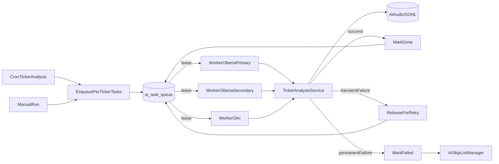

# AI Task Queue Design

Phase 0 design for replacing the coarse global AI lock with a backend-bound AI task queue and worker pool.

This started as a Phase 0 design contract. Phase 1 queue plumbing now exists, and Phase 2 has migrated `ticker_analysis` behind feature flags. The legacy inline path remains the default until `AI_QUEUE_ENABLED=true` and `AI_QUEUE_JOBS=ticker_analysis`.

## Why

The current AI job execution model serializes too much work. It protects limited LLM capacity, but it does that with a global mutex that cannot represent the capacity we actually have: two Ollama hosts plus GLM.

Today there are three layers:

1. `utils/job_tracking.py` treats every name in `AI_JOB_NAMES` as mutually exclusive through `get_running_ai_job()`. One slow job can block all other AI jobs until its stale-lock window expires.
2. `web_dashboard/ollama_client.py` also has per-host semaphores using `OLLAMA_MAX_CONCURRENT_PER_HOST`. These are useful, but they are process-local protection, not a scheduler-wide queue.
3. `collect_with_summary_model_chain()` tries models sequentially in one caller thread. That is good fallback behavior for a single request, but it does not distribute independent ticker tasks across available backends.

The result is that a long `ticker_analysis` run can keep GLM, Ollama primary, and Ollama secondary effectively idle as a group, even if only one backend is truly busy.

## Goals And Non-Goals

Goals:

- Run multiple independent AI tasks concurrently, bounded by configured backend capacity.
- Bind workers to backends so GLM failures do not block Ollama work, and vice versa.
- Support manual and scheduled runs coexisting through the same queue.
- Use per-ticker tasks for `ticker_analysis` so retries are small and observable.
- Preserve AI audit logging for every LLM attempt.
- Replace silent skips with queue state: pending, leased, done, failed, cancelled.

Non-goals for the first implementation:

- Rewriting every AI job at once.
- Removing `job_executions`; it remains useful as a job audit/status surface.
- Replacing `AISkipListManager`; it remains the owner of permanent ticker skip policy.
- Supporting arbitrary multi-container scaling before the lease RPC is proven in one scheduler process.

## Architecture



The scheduler becomes an enqueuer for queue-managed jobs. Workers become the only code path that performs LLM work for those jobs.

For `ticker_analysis`, the first migrated job, the scheduler should:

1. Select tickers using the existing `TickerAnalysisService.get_tickers_to_analyze()` policy.
2. Insert or update one `ai_task_queue` row per ticker.
3. Mark the top-level `job_executions` row as "enqueued N tasks" rather than "holding the AI lock".

The worker pool should:

1. Lease one eligible task atomically.
2. Heartbeat the lease while the task is running.
3. Execute the task on its configured backend.
4. Mark success, release for retry, or mark failed based on error classification.

## Queue Table Sketch

The new table should be separate from `ai_analysis_queue`. The existing table has a narrower shape and a uniqueness model for pending analysis requests, not leased worker tasks.

```sql
CREATE TABLE ai_task_queue (
  id UUID PRIMARY KEY DEFAULT gen_random_uuid(),
  analysis_type VARCHAR(40) NOT NULL,
  target_key VARCHAR(100) NOT NULL,
  payload JSONB,
  priority INTEGER NOT NULL DEFAULT 0,
  status VARCHAR(20) NOT NULL DEFAULT 'pending',
  attempts INTEGER NOT NULL DEFAULT 0,
  max_attempts INTEGER NOT NULL DEFAULT 3,
  last_error TEXT,
  last_error_class VARCHAR(40),
  leased_by VARCHAR(120),
  leased_backend VARCHAR(40),
  leased_until TIMESTAMPTZ,
  available_at TIMESTAMPTZ NOT NULL DEFAULT now(),
  enqueued_by VARCHAR(40),
  created_at TIMESTAMPTZ NOT NULL DEFAULT now(),
  updated_at TIMESTAMPTZ NOT NULL DEFAULT now(),
  completed_at TIMESTAMPTZ
);

CREATE INDEX ai_task_queue_pending_idx
  ON ai_task_queue (status, priority DESC, created_at)
  WHERE status = 'pending';

CREATE INDEX ai_task_queue_lease_recovery_idx
  ON ai_task_queue (status, leased_until)
  WHERE status = 'leased';

CREATE UNIQUE INDEX ai_task_queue_active_dedupe_idx
  ON ai_task_queue (analysis_type, target_key)
  WHERE status IN ('pending', 'leased');
```

Expected statuses:

- `pending`: available for lease.
- `leased`: assigned to a worker until `leased_until`.
- `done`: completed successfully.
- `failed`: terminal failure.
- `cancelled`: intentionally removed from work.

Phase 1 should add a Postgres RPC for atomic leasing. The RPC should use `FOR UPDATE SKIP LOCKED` or an equivalent single-statement update so multiple workers cannot lease the same row.

## Worker Lifecycle

Worker loop:

```text
while running:
    task = lease_one_task(backend, lease_ttl)
    if task is None:
        sleep(idle_poll_seconds)
        continue

    set_audit_context(task_id=task.id, backend=backend)
    start_heartbeat(task.id)

    try:
        run_task(task, backend)
        mark_done(task.id)
    except Exception as exc:
        error_class = classify_error(exc)
        handle_failure(task, error_class, exc)
    finally:
        stop_heartbeat(task.id)
        clear_audit_context()
```

Lease behavior:

- Default lease TTL: 90 seconds.
- Default heartbeat interval: 30 seconds.
- A worker crash naturally stops heartbeats; another worker can reclaim the row after `leased_until`.
- A worker should only finalize a task it still owns.
- A worker id should include process id, thread name, backend, and host where possible.

The worker should not hold or check the global AI lock. Capacity is controlled by worker counts and backend-specific limits.

## Backend Binding

Workers are backend-bound. A worker assigned to `ollama_primary` should call only the primary Ollama host. A worker assigned to `ollama_secondary` should call only the secondary Ollama host. A worker assigned to `glm` should call only GLM.

This avoids a worker starting on GLM and then consuming Ollama capacity inside a fallback chain. Cross-backend fallback happens by releasing the task back to the queue and letting another backend's worker pick it up.

Backend names:

- `ollama_primary`
- `ollama_secondary`
- `glm`

Initial worker counts:

- `AI_QUEUE_WORKERS_OLLAMA_PRIMARY=1`
- `AI_QUEUE_WORKERS_OLLAMA_SECONDARY=1`
- `AI_QUEUE_WORKERS_GLM=3`

The Ollama semaphore in `ollama_client.py` remains useful as defense in depth. If it raises `OllamaHostBusyError`, the worker should classify that as `host_busy` and release the task rather than wait inside the worker thread.

## Fallback Rules

Fallback is rules-based by error class. Workers do not call other backends mid-task.

| Error class | Typical source | Queue action | Backend preference |
| --- | --- | --- | --- |
| `host_busy` | `OllamaHostBusyError` | Release without incrementing attempts | Prefer another backend |
| `timeout_ollama` | Ollama stream/read timeout | Release and increment attempts | Any backend |
| `timeout_glm` | Z.AI request timeout | Release and increment attempts | Prefer non-GLM |
| `model_not_found` | Ollama 404 or missing model | Release and increment attempts | Any other backend |
| `rate_limited` | HTTP 429 from GLM/Z.AI | Release with delayed retry | Any backend after backoff |
| `bad_json` | Non-empty invalid LLM JSON | Retry until max attempts, then failed | Any backend |
| `schema_violation` | Normalized LLM output cannot fit contract | Failed immediately | None |
| `delisted_or_not_found` | Market/data source says ticker is invalid | Failed immediately plus skip-list handling | None |
| `unknown` | Unclassified exception | Retry until max attempts, then failed | Any backend |

The classifier should live in code, not config, so it can be unit tested and changed with the implementation. Only `AISkipListManager` should create permanent skip-list entries.

## Configuration

Feature flags:

- `AI_QUEUE_ENABLED=false` by default in Phase 1.
- `AI_QUEUE_JOBS=ticker_analysis` controls which jobs use the queue once the queue exists.

Worker and lease settings:

- `AI_QUEUE_WORKERS_OLLAMA_PRIMARY=1`
- `AI_QUEUE_WORKERS_OLLAMA_SECONDARY=1`
- `AI_QUEUE_WORKERS_GLM=3`
- `AI_QUEUE_LEASE_TTL_SEC=90`
- `AI_QUEUE_HEARTBEAT_SEC=30`
- `AI_QUEUE_POLL_IDLE_SEC=2`
- `AI_QUEUE_BACKOFF_BASE_SEC=30`
- `AI_QUEUE_MAX_ATTEMPTS=3`

Existing model settings remain in the existing model configuration and settings modules. The queue should decide which backend runs a task, not invent a new model registry.

## Migration Plan

### Phase 1: Queue Plumbing

- Add `ai_task_queue` schema and lease/finalize RPCs.
- Add a worker module, likely `web_dashboard/scheduler/ai_task_workers.py`.
- Start workers only when `AI_QUEUE_ENABLED=true`.
- Keep all current jobs on their existing path.
- Add unit tests for leasing, heartbeat extension, expired lease recovery, and failure classification.

### Phase 2: Migrate `ticker_analysis` (implemented behind flags)

- Change `web_dashboard/scheduler/jobs_ticker_analysis.py` so queue mode enqueues per-ticker tasks instead of processing tickers inline.
- Preserve the legacy inline path when `AI_QUEUE_ENABLED=false` or `ticker_analysis` is absent from `AI_QUEUE_JOBS`.
- Make manual `ticker_analysis` runs enqueue work rather than skip because a job is already running.
- Ensure one audit row is written per LLM attempt and includes enough context to join to the queue task.

### Phase 3: Retire Global Mutex For Queue-Managed Jobs

- Update global lock checks so queue-managed jobs are not blocked by unrelated running AI jobs.
- Keep `get_running_ai_job()` for legacy jobs until they migrate.
- Change job status wording from "running AI lock owner" to "enqueued / workers active / completed / failed".

### Phase 4: Migrate More AI Jobs

Candidates after `ticker_analysis`:

- `ticker_meta_analysis`
- `sector_meta_analysis`
- `etf_group_analysis`
- `market_daily_brief`
- `ui_ai_summaries`
- `action_queue_ai_review`

Each migration should be separate so queue behavior can be observed in production.

## What We Keep

- `job_executions` as a high-level status/audit table.
- `job_steps` for append-only progress breadcrumbs.
- `AISkipListManager` for permanent ticker skip policy.
- `collect_with_summary_model_chain()` for non-queue jobs and for any job where one request should still own its own fallback chain.
- `OLLAMA_MAX_CONCURRENT_PER_HOST` as process-local protection.
- AI audit JSONL logging and provider detection.

## What We Retire

For queue-managed jobs only:

- The global AI mutex semantics from `get_running_ai_job()`.
- The top-of-job "already running, skip" guard in `ticker_analysis`.
- Long-running job rows as the source of truth for active AI work.

Instead, `ai_task_queue` rows become the source of truth for what is pending, leased, failed, or complete.

## Open Questions

1. Should manual `force=True` delete or supersede an existing active queue row, or should it update that row's priority and payload?
2. Should we add a backend-level circuit breaker so GLM workers pause for several minutes after repeated 429/timeout failures?
3. Should queue status be shown in the existing Jobs page or a dedicated AI Queue page?
4. Should finished queue rows be retained forever, archived after N days, or compacted into aggregate task history?
5. Once the lease RPC uses `FOR UPDATE SKIP LOCKED`, can we safely run more than one scheduler process, or do we still want an explicit singleton scheduler?

## Future Model Candidates

Models worth evaluating as we add more queue-managed jobs. Not committed to a phase yet — track here so we don't lose them.

| Model          | Pull name       | Size  | Good for                           | Installed on  |
| -------------- | --------------- | ----- | ---------------------------------- | ------------- |
| Magistral Small | `magistral:24b` | 14 GB | Financial reasoning, deep analysis | ts-desktop    |
| GPT-OSS         | `gpt-oss:20b`   | 13 GB | JSON output, fast tool/agent calls | ts-desktop    |

When evaluating each, decide whether it slots in as:

- A drop-in replacement for an existing backend's model (e.g. `AI_QUEUE_MODEL_OLLAMA_SECONDARY`), or
- A new backend binding with its own worker pool entry (e.g. a `magistral` or `gptoss` backend), which would also require updating `model_for_backend` / `ollama_base_url_for_backend` and the worker count flags.

Practical checks before promoting either to a real backend:

- VRAM headroom on the host that will run it (24 GB 3090 fits both, but not concurrently with qwen3.6:27b).
- JSON-mode reliability against our ticker / sector / ETF schemas (run the audit comparison harness).
- Latency under realistic prompt sizes — Magistral's reasoning traces can be long; GPT-OSS is usually fast but verify on agent-style prompts.

## Phase 1 Plumbing Acceptance Criteria

Phase 1 plumbing is done when:

- `ai_task_queue` schema and lease/finalize RPCs exist in the clean Supabase schema and an idempotent migration.
- Embedded worker pool code exists behind `AI_QUEUE_ENABLED`.
- Workers do not start unless both queue jobs and concrete handlers are registered.
- `ticker_analysis` and other AI jobs still use their legacy execution path until a later migration phase changes them.
- Focused tests cover config parsing, start gating, lease RPC payloads, and fallback error classification.
