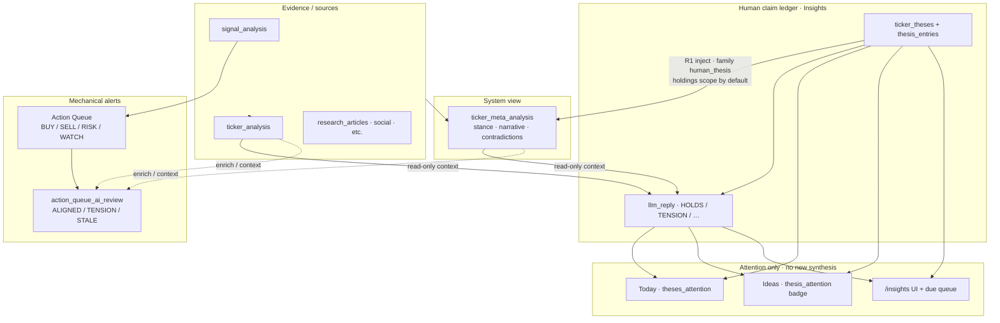

# Insights — human thesis threads

Org-wide, fund-agnostic thesis threads for tickers. Separate from automated signals,
`stance_history`, and fund-level philosophy (`fund_thesis` / `thesis_update_job`).

**UI:** `/insights` (sidebar after Ideas). Dossier also loads `/api/ticker/<ticker>/insights`.

## Tables (Research DB)

| Table | Role |
|-------|------|
| `ticker_theses` | Header: ticker, title, disposition, intent, status, `last_reviewed_at` |
| `thesis_entries` | Flat thread: `opening`, `comment`, `review`, `llm_reply` |
| `thesis_evidence` | Links to user URLs, articles, meta, stance rows, etc. |

Schema: `database/schema/research/tables/ticker_theses.sql` (+ entries/evidence).
Migration: `database/migrations/2026-07_add_ticker_theses.sql`.

## Axes

- **Disposition:** `bullish` | `bearish` | `neutral`
- **Intent:** `seek_entry` | `seek_exit` | `monitor`
- **Status:** `active` | `archived` | `superseded` (soft archive = recycle bin; admin hard-delete)

## Entry kinds

| Kind | Who writes | Notes |
|------|------------|--------|
| `opening` | User (on create) | First post |
| `comment` | User | Does not change disposition/intent |
| `review` | User | May change disposition/intent; bumps `last_reviewed_at` |
| `llm_reply` | System / eval job | Advisory only; does **not** bump `last_reviewed_at` |

User API (`add_entry`) rejects `opening` and `llm_reply`. Jobs use `add_llm_reply`.

## Freshness / due-for-review

`reviewed_at = COALESCE(last_reviewed_at, created_at)`

| Status | Age |
|--------|-----|
| `due_for_review` | ≥ 14 days |
| `stale` | ≥ 30 days |

Weak moat drafts (`[WEAK CONTEXT]` in title/body, or `weak_context` tag) sort first in the due queue.

**API:** `GET /api/insights/due`

Only a human `review` clears due/stale — an `llm_reply` is advisory context.

## AI evaluation job

- **Job id:** `insights_thesis_evaluation` (not `thesis_update_job` — that updates fund philosophy)
- **Schedule:** Tue/Thu 18:30 America/New_York (respects global AI lock via `AI_JOB_NAMES`)
- **Pick:** active theses due/stale (and weak drafts); over-fetch then fill up to **8 LLM
  calls** per run (digest skips do not count against the 8)
- **Context:** thesis header + recent entries + stored `ticker_meta_analysis` narrative/stance +
  latest `ticker_analysis` summary (read-only; does not re-run meta)
- **Digest gate:** each `llm_reply` stores `metadata.research_digest` (thesis claim fingerprint +
  saved research ids/`updated_at`). Same digest as prior reply → **skip LLM**
  (`skipped_digest` in job message)
- **Weak auto-archive:** after **3** consecutive `INSUFFICIENT_DATA` replies on a weak draft,
  soft-archive via `archive_thesis(..., system=True)` (`archived_weak` in job message)
- **Write:** `add_llm_reply` with verdict `HOLDS` | `TENSION` | `STALE_THESIS` |
  `INSUFFICIENT_DATA`, optional suggested disposition/intent (advisory), optional evidence
  link to meta row
- Does **not** auto-flip disposition/intent, bump `last_reviewed_at`, or write `stance_history`

Prompt: `INSIGHTS_THESIS_EVALUATION_PROMPT` in `web_dashboard/ai_prompts.py`.

## Consumed by other jobs

| Consumer | Status |
|----------|--------|
| Insights UI / due queue / eval job | Shipped |
| Ticker evidence timeline | Shipped (`fetch_thesis_timeline_events`) |
| **`ticker_meta_analysis` artifact bundle** | **Shipped (R1)** — family `human_thesis`; default scope **production holdings only** via `META_ANALYSIS_HUMAN_THESIS` / `META_ANALYSIS_HUMAN_THESIS_SCOPE`. **Skips unreviewed weak/bootstrap** drafts (no human `review` yet) |
| **Today / Ideas surfacing** | **Shipped (R2)** — Today `theses_attention`; Ideas `thesis_attention` badges; `/insights?thesis=` deep links |
| **`stance_history` (`thesis_ai_review`)** | **Shipped (R3)** — eval records suggested/current disposition; no flip of thesis header |
| **Advise v0/v1** | **Shipped** — Today `advise_pack` ranks BUY/SELL/RISK/WATCH; v1 reweights by track-record + confluence |

Env (see `web_dashboard/env.example`):

```
# META_ANALYSIS_HUMAN_THESIS=true
# META_ANALYSIS_HUMAN_THESIS_SCOPE=holdings   # or holdings_or_recent | all
```

## Bootstrap (one-off)

`web_dashboard/scripts/probe_moat_theses.py` drafts positive/moat theses from Research DB + SearXNG.
Treat drafts with `weak_context` as noise until a human reviews them.

**Lessons (2026-07):** never use title/summary `ILIKE` for article lookup — `COST`→costs,
`RAIL`→Trail, `FAST`→Faster polluted drafts. Use ticker-array matches only + company-first
SearXNG. Moat framing is a poor fit for index/sector ETFs — `--stocks-only` skips them;
archive weak ETF bootstrap drafts rather than rewriting.

Smoke eval one ticker: `python scripts/smoke_thesis_eval.py COST`

## Analysis layers — what each pass is for

Roadmap’s Collect → Synthesize → Decide → Learn chart is the **pipeline** mental model
([`ROADMAP.md`](ROADMAP.md)). This section is the **Decide-layer job map**: three LLM
comparators and two presentation surfaces that look similar but answer different questions.
Do not add a fourth LLM pass on the same evidence without retiring one of these.

### Comparison table

| Layer | Object under review | Question | Writes | Reads for LLM? | Human clears? |
|-------|---------------------|----------|--------|----------------|---------------|
| **`ticker_meta_analysis`** | System synthesis of artifacts | “What does *automated* evidence say?” | Research `ticker_meta_analysis` (overwrite per ticker) | Yes — multi-artifact bundle (incl. human theses when gated) | No — regenerates on schedule |
| **`insights_thesis_evaluation`** | One human thesis thread | “Does *this claim* still hold vs stored research?” | `thesis_entries.llm_reply` only | Yes — thesis + **already-saved** meta/analysis (no re-run) | Yes — human `review` bumps `last_reviewed_at` |
| **`action_queue_ai_review`** | One mechanical queue row | “Is this *BUY/SELL/RISK/WATCH* aligned with research?” | Action-queue review rows (fund × ticker × signal date) | Yes — queue item + research context | N/A — mechanical action still from signals |
| **Fund `thesis_update_job`** | Fund philosophy | “What’s the *book-level* thesis?” | Supabase `fund_thesis*` | Yes | Fund editors |
| **Sector Insights** | Sector / ETF meta | “What’s rotating at the sector layer?” | `sector_meta_analysis` UI | Meta jobs | N/A |
| **Today / Ideas (R2)** | Attention routing | “What deserves a click *today*?” | Nothing new — reads due/TENSION | **No LLM** | Optional — inspect threads |
| **Advise v0/v1** | Ranked nudge list | “What would we *tell you* to buy/sell?” | Nothing — merges queue + theses + Learn/confluence | **No LLM** | You decide; never auto-trades |
| **`stance_history` / `thesis_ai_review` (R3)** | Learn ledger row | “What did thesis advice say, for scoring later?” | Research `stance_history` | Via eval job | N/A |

Presentation (Today badges, Ideas, Advise pack) is **not** another analysis layer.
Insights **does** append `thesis_ai_review` rows to `stance_history` (separate source from meta/queue).

### Data-flow chart



### Circularity guards (keep these)

Meta can ingest theses (R1); eval can read meta. That is deliberate tension, not a second meta.

| Guard | Why |
|-------|-----|
| Eval does **not** bump `last_reviewed_at` or flip disposition | AI cannot “clear” due as a human review |
| Eval does **not** re-run meta | Cheap second opinion on *stored* research |
| Digest-gated eval | Unchanged research → skip LLM (GPU slots) |
| Weak × 3× `INSUFFICIENT_DATA` → soft-archive | Stops re-evaluating hopeless bootstrap drafts |
| Meta skips unreviewed weak drafts | Cuts meta↔eval chatter on noise theses |
| `META_ANALYSIS_HUMAN_THESIS_SCOPE=holdings` default | Limits meta refresh blast radius + loop chatter |
| Weak still labeled when a human `review` exists | Inspectable, not ground truth |
| Today / Ideas only **surface** due + TENSION | No extra LLM cost for attention |
| Do not expand to more synthesis jobs lightly | Same ticker can already see moat draft → meta → eval |

**Smell test:** if you are not reading the Insights thread or queue review, extra LLM passes on that ticker have zero benefit — archive weak theses or pause eval instead of adding prompts.

### Naming — do not confuse

| Name in UI / jobs | Actual thing |
|-------------------|--------------|
| Insights `/insights` | Human ticker thesis threads (this doc) |
| Sector Insights `/sector_insights` | ETF / sector meta surface |
| `thesis_update_job` / `fund_thesis` | Fund-level philosophy in Supabase |
| `insights_thesis_evaluation` | Thesis ↔ research advisory `llm_reply` |
| `action_queue_ai_review` | Queue row ↔ research; different table/prompt |
| `stance_history` / `thesis_ai_review` | Learn ledger; Insights eval appends advisory rows (R3) |

## Related

- Roadmap Collect→Learn + Decide backlog: [`docs/ROADMAP.md`](ROADMAP.md)
- Research loop screen map: [`docs/DASHBOARD_RESEARCH_LOOP.md`](DASHBOARD_RESEARCH_LOOP.md)
- Meta program (market → sector → ticker): [`docs/meta_analysis_roadmap.md`](meta_analysis_roadmap.md)
