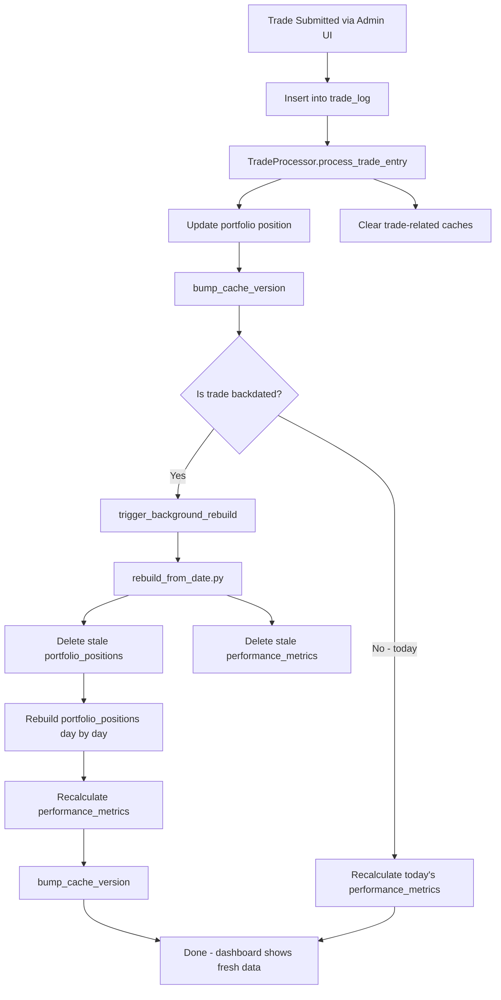

# Portfolio Architecture

## Core Concepts

### Trade Log (Source of Truth)
- Supabase table: `trade_log`
- Records EVERY trade action with exact timestamp
- Append-only: Trades are never removed or modified
- Multiple trades per day: Normal and expected (buy 10am, sell 11am, buy 2pm)

### Portfolio Positions (Derived Data)
- Supabase table: `portfolio_positions`
- Stores per-position snapshots at end of each trading day
- One row per (fund, ticker, date) with value, cost basis, P&L, and currency
- Populated daily at 5 PM EST by the `update_portfolio_prices` scheduled job
- Gaps are auto-detected and backfilled on scheduler startup (`scheduler/backfill.py`)

### Performance Metrics (Aggregated Data)
- Supabase table: `performance_metrics`
- Pre-aggregated daily fund-level totals (total value, cost basis, unrealized P&L, performance %)
- One row per (fund, date) - unique constraint enforced
- Populated daily at 5 PM EST by the `performance_metrics_populate` scheduled job
- Gaps are auto-detected and backfilled on scheduler startup (90s delay to ensure positions exist first)
- Used by the Portfolio Performance chart for fast rendering (~100 rows vs ~10k+ position rows)
- Safety net: if coverage is below 50% of expected trading days, the chart falls back to aggregating `portfolio_positions` on the fly

### Data Pipeline

```
trade_log (source of truth)
    |
    v
portfolio_positions (daily per-position snapshots)
    |
    v
performance_metrics (daily per-fund aggregates, used by charts)
```

## Rules

1. **When executing a trade** (via Admin UI):
   - Trade is inserted into `trade_log`
   - Portfolio position is updated immediately
   - If today's trade: `performance_metrics` recalculated for today
   - If backdated: background rebuild triggered automatically (no manual intervention)

2. **One snapshot per date**:
   - Timestamp should be market close (16:00 ET) for historical
   - Contains ALL active positions at end of day
   - Multiple trades on same day = ONE final snapshot

3. **When in doubt**:
   - For today's data: the scheduled job will process it at 5 PM EST
   - For historical gaps: restart the scheduler (startup backfill auto-detects)
   - For manual backfill: `python web_dashboard/backfill_performance_metrics.py`

## Trade Entry → Metrics Recalculation Flow

When a trade is submitted through the admin UI, the system updates both `portfolio_positions` and `performance_metrics` to keep the dashboard chart accurate.



**Key files:**
- `web_dashboard/routes/admin_routes.py` — trade submission endpoint, today's metrics recalc
- `web_dashboard/utils/rebuild_from_date.py` — backdated rebuild + metrics recalc + cache bump
- `web_dashboard/utils/background_rebuild.py` — launches rebuild as background subprocess
- `portfolio/trade_processor.py` — position updates and cache clearing
- `web_dashboard/scheduler/jobs_metrics.py` — `populate_performance_metrics_job()`

## Scheduled Jobs

| Job | Schedule | What It Does |
|-----|----------|--------------|
| `update_portfolio_prices` | Daily 5 PM EST | Fetches current prices, writes `portfolio_positions` for today |
| `performance_metrics_populate` | Daily 5 PM EST | Aggregates yesterday's `portfolio_positions` into `performance_metrics` |
| `exchange_rates_refresh` | Every 2 hours | Updates USD/CAD exchange rates |
| `startup_backfill_check` | On startup | Detects gaps in `portfolio_positions` and backfills from `trade_log` |
| `startup_performance_metrics_backfill` | On startup (+90s) | Detects gaps in `performance_metrics` and backfills from `portfolio_positions` |
| `watchdog` | Every 30 min | Retries failed jobs from the retry queue |

## Backdated Trades

When you add a backdated trade:
1. Trade is saved to `trade_log`
2. System automatically detects the backdated trade (timestamp < today)
3. Background rebuild triggered via `rebuild_from_date.py`
4. All `portfolio_positions` from that date onward are deleted and rebuilt
5. All `performance_metrics` from that date onward are recalculated
6. Cache is bumped so the dashboard picks up fresh data
7. No manual intervention required

## Architecture Benefits

### Separation of Concerns
- **Trade Log**: Records what happened (immutable history)
- **Portfolio Positions**: Per-position daily snapshots (derived from trades + prices)
- **Performance Metrics**: Fund-level daily aggregates (derived from positions)

### Data Integrity
- `trade_log` is the single source of truth
- `portfolio_positions` can be rebuilt from `trade_log` + market prices
- `performance_metrics` can be rebuilt from `portfolio_positions`
- Startup backfill jobs auto-detect and repair gaps

### Performance
- `performance_metrics` pre-calculates daily aggregates for fast chart rendering
- Reduces chart data transfer from ~10k+ rows to ~100-200 rows
- Safety net falls back to `portfolio_positions` if metrics are sparse

## Implementation Details

### Repository Pattern
- `BaseRepository`: Abstract interface defining standard operations
- `SupabaseRepository`: Cloud database storage (primary, used by web dashboard)
- `CSVRepository`: Local CSV file storage (console app - may be out of date, not recently tested)
- `DualWriteRepository`: Writes to both CSV and Supabase (CSV as read source)
- `SupabaseDualWriteRepository`: Writes to both (Supabase as read source)

**Design Principles:**
- **Factory Pattern**: Use `data.repositories.repository_factory.get_repository()` to instantiate
- **Interface Segregation**: All repositories implement standard methods (`get_portfolio_data`, `save_trade`)
- **Dependency Injection**: Repositories are injected into services, never hardcoded

**Two entry points:**
- **Web dashboard** (production): Reads/writes via Supabase directly using `SupabaseClient`. All scheduled jobs, trade entry, and chart rendering go through this path.
- **Console app** (`trading_script.py`): Uses the repository pattern and can write to local CSV files (`llm_trade_log.csv`, `llm_portfolio_update.csv`). This was the original entry point but hasn't been tested recently and may have bit-rotted.
- Never use `pd.read_csv()` or direct file access in web dashboard code

### Portfolio Performance Chart Data Flow

The chart in `flask_data_utils.py` (`calculate_portfolio_value_over_time_flask`):
1. Queries `performance_metrics` (fast, pre-aggregated)
2. Checks coverage: if <50% of expected trading days, falls back to step 3
3. Fallback: queries `portfolio_positions` and aggregates on the fly (slower but complete)
4. Appends live data for today from current positions
5. Calculates performance index (normalized to 100 baseline)
6. Returns data for Plotly chart rendering

## Troubleshooting

### Portfolio Performance Chart Has Gaps
- **Cause**: `performance_metrics` table is missing data for some dates
- **Quick fix**: Restart the scheduler (startup backfill detects and fills gaps)
- **Manual fix**: `python web_dashboard/backfill_performance_metrics.py`
- **Safety net**: If coverage <50%, the chart automatically falls back to `portfolio_positions`

### Missing Positions for a Date
- **Cause**: Scheduled job missed a day (downtime, Supabase outage)
- **Fix**: Restart scheduler (startup backfill auto-detects gaps in `portfolio_positions`)
- **Verify**: Check `portfolio_positions` for the missing date in Supabase

### Backdated Trade Not Reflected
- **Cause**: Background rebuild may still be running
- **Check**: Look for rebuild logs in the scheduler output
- **Manual fix**: The rebuild is triggered automatically; if it failed, check logs for errors

### Performance Issues
- If the chart is slow, check that `performance_metrics` is being used (look for "Using pre-aggregated performance metrics" in logs)
- If it says "Falling back to portfolio_positions", run the backfill to populate `performance_metrics`
