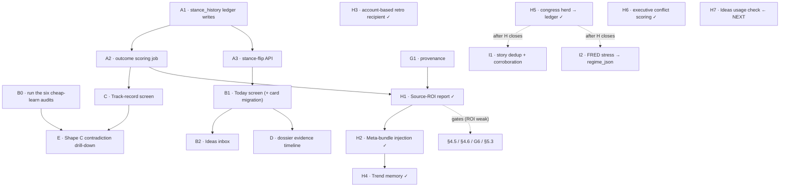
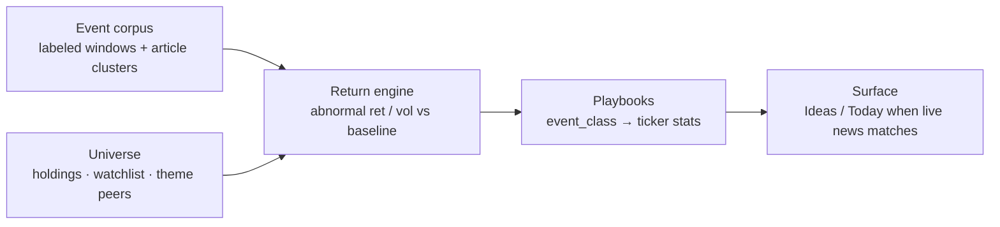
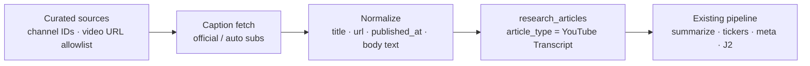

# Portfolio-AI Roadmap — Intelligence & UX

**This is the master plan. Start here.** Created 2026-06-09 from a full design review of the
collection → synthesis → presentation pipeline. If you only remember one doc, remember this one.

| Doc | Relationship to this one |
|-----|--------------------------|
| **This doc → [Phase H](#phase-h--close-the-learn--synthesize-loop-active)** | **Active work:** H1–H6 shipped; **H7** Ideas usage check next. |
| **This doc → [AI Assistant](#ai-assistant--decide-chat-surface-shipped--wishlist)** | **Decide chat surface (2026-07):** Today pulse + tools shipped; wishlist is parallel polish (not a new phase ahead of H7). |
| **This doc → [Phase I](#phase-i--collection-quality--macro-context-worldmonitor-borrows)** | **Backlog (post-H):** story dedup, FRED/stress → regime, Form 4 P/S filter — from [`research/WORLDMONITOR.md`](research/WORLDMONITOR.md). Do not start until Phase H closes. |
| **This doc → [Phase J](#phase-j--event--news-catalyst-backtesting)** | **Backlog (post-I):** backtest news/world-event windows against price moves to find securities with predictable, high-magnitude responses (e.g. defense names in conflict escalations, COVID-era theme winners). Learn-layer research; not a new collector binge. |
| **This doc → [Phase K](#phase-k--youtube-captions--research-articles)** | **Backlog (post-H, prefer after I1):** pull video captions/subtitles → normalize into `research_articles`-shaped rows so existing extract/summarize/meta paths analyze them (earnings calls, IR, curated finance channels). Absorbs the deferred “earnings-call transcript” idea from Phase G. |
| [`docs/PHASE_JK_PLAN.md`](PHASE_JK_PLAN.md) | **Integration brief for Phases J + K** (2026-07-22): how captions and event playbooks plug into `research_articles` → meta / Ideas / Today / dossier / source-ROI. Read before implementing either phase. |
| [`docs/PHASE_G_PLAN.md`](PHASE_G_PLAN.md) | Phase G brief (2026-06-11): provenance, dilution, EDGAR filings, confluence. **G1–G5 + G7 shipped; G6 optional.** No longer the primary kickoff — see Phase H. |
| [`docs/INSIGHTS.md`](INSIGHTS.md) | Human thesis threads + **Decide-layer job map** (meta vs Insights eval vs Action Queue review — table + mermaid). Not Sector Insights; not fund `fund_thesis`. |
| [`docs/meta_analysis_roadmap.md`](meta_analysis_roadmap.md) | Deep detail on the meta-analysis layers (Phases 1–3 shipped). This doc supersedes its "Later phases" section as the prioritized plan. |
| [`docs/executive_trade_scoring_plan.md`](executive_trade_scoring_plan.md) | Executive conflict rubric for `chamber='Executive'` — **v1 shipped (Phase H6)**. |
| [`docs/AI_TASK_QUEUE_DESIGN.md`](AI_TASK_QUEUE_DESIGN.md) | Infra status for the AI task queue. Any new LLM job in this plan should be queue-managed. |
| [`docs/DASHBOARD_RESEARCH_LOOP.md`](DASHBOARD_RESEARCH_LOOP.md) | How the Action Queue / market brief / enrichment currently fit together. |

---

## The one-paragraph thesis

**As of 2026-07-15:** Collect and Learn *plumbing* are ahead of the loop that joins them.
`stance_history` + `stance_outcomes` + Today / Ideas / track-record / Phase G risk signals are
live, but the system's center of gravity is still one layer too early: synthesis
(`ticker_meta_analysis`) still reasons without insider clusters, dilution/filing/confluence
events, or its own prior stance + hit rate; the **source-ROI report** (G1's reason for being)
is still unbuilt even though ~30d outcome data matured ~2026-07-10. Hold the June guardrail —
*no new collectors until Learn says which earn their keep* — and cash in that unlock before
§4.5 / §4.6 / §5.3 / G6.

*(Historical June thesis, for context: the system was production-pipeline-rich and
consumption-poor — nightly meta overwrite destroyed memory, and screens were source-centric.
Pillars 1–2 and Phases A–G largely closed those gaps; Phase H closes the Learn→Synthesize /
Learn→Collect arrows.)* The north star is unchanged: *help a human answer what to buy/sell,
with inspectable outputs* — never autonomous execution.

## The four-layer mental model

```mermaid
flowchart LR
    subgraph Collect["1 · COLLECT — rich, frozen until Learn exists"]
        A1["SearXNG market research"]
        A2["Alpha Hunter (site dorks)"]
        A3["Opportunity discovery"]
        A4["RSS + email ingest"]
        A5["Reddit / StockTwits"]
        A6["Congress + insider trades"]
        A7["ETF Watchtower holdings"]
        A8["Benchmarks / dividends"]
        A9["YouTube captions → articles ← Phase K"]
    end
    subgraph Synthesize["2 · SYNTHESIZE — shipped, healthy"]
        B1["ticker_analysis"]
        B2["ticker_meta_analysis<br/>stance · confidence · contradictions"]
        B3["sector_meta_analysis"]
        B4["market_daily_brief (regime)"]
        B5["social / congress AI"]
        B6["ui_ai_summaries"]
    end
    subgraph Decide["3 · DECIDE — exists, but buried"]
        C1["Action Queue + ai_review<br/>ALIGNED / TENSION / STALE"]
        C2["Advisory rebalance"]
        C3["Insights theses + due review<br/>/insights · llm_reply advisory"]
    end
    subgraph Learn["4 · LEARN — plumbing shipped; ROI loop open (Phase H)"]
        D1["stance_history ledger ✓"]
        D2["Outcome scoring 7/30/90d ✓"]
        D3["Stance-flip events ✓"]
        D4["Track-record screen ✓"]
        D5["Source-ROI report ← missing"]
        D6["Prior stance → meta bundle ← missing"]
        D7["Event/news catalyst backtest ← Phase J"]
    end
    Collect --> Synthesize --> Decide --> Learn
    Learn -.->|"down-weight noisy sources"| Synthesize
    Learn -.->|"kill collectors that never pay off"| Collect
    Learn -.->|"event→ticker playbooks when macro rhymes"| Decide
```



The feedback-loop confusion of early 2026 came from repeatedly enriching layer 2 (sector priors,
regime fusion — all good work) while the loop never **terminated** anywhere: no grader (layer 4)
and no surface a human reads daily (layer 3 is one card among ~15 on the dashboard). By mid-2026
those surfaces and the ledger shipped; the **2026-07-15** failure mode is different — collectors
and score plumbing without reading outcomes (or Phase G risk signals) back into synthesis.

**Decide-layer job map** (meta vs Insights eval vs Action Queue review vs fund thesis — table +
flow mermaid, circularity guards): [`INSIGHTS.md` → Analysis layers](INSIGHTS.md#analysis-layers--what-each-pass-is-for).

## Key findings from the 2026-07-15 design review

Cross-checked roadmap + Phase G + meta docs against scheduler jobs, `build_artifact_bundle` in
`meta_analysis_service.py`, and consumers of each data table. **Verdict: on track, not lost** —
architecture and discipline are sound; center of gravity is still one layer too early (Collect /
Learn plumbing ahead of Learn→Synthesize / Learn→Collect wiring).

### Three diagnostic questions

1. **Collecting as much as possible?** **Yes — arguably enough.** ~55 scheduler jobs (prices,
   benchmarks, SearXNG/RSS/email/scrape news, social, congress, US + Canadian insiders, ETF
   holdings, SEC filings, dilution, dividends). Known gaps (G6 short volume, §4.5 short interest,
   §4.6 13F, §5.3 FEC) stay **gated** behind Learn proving existing collectors earn their keep.
   **Do not add collectors now.**
2. **All available to the LLM for reasoning?** **No — biggest real gap.** Ticker meta bundle has
   analysis rows, signals, market regime, sector prior, social, articles, congress, human theses.
   It does **not** include:
   - **Insider clusters** — 130k rows + cluster detection shipped; **zero** insider consumption in
     the meta service (Today-only for humans).
   - **Dilution / SEC filing / confluence events** — Phase G risk work is Today/dossier-facing;
     invisible to `ticker_meta_analysis`.
   - **Own stance history + hit rate** — ledger writes nightly; nothing reads prior stance or
     outcomes back into the prompt (nightly amnesia). Confluence counts some signals mechanically
     but there is no LLM reasoning over “cluster + dilution + I was BULLISH at 0.8 last week.”
3. **Outputs feed back as inputs for more complex reasoning?** **Partially.** Confluence (G4) and
   Advise recombine mechanically. Contradiction drill-down exists but stays gated (~1.7/day vs
   ~10/day bar — correct). Missing: **source-ROI report** (G1 provenance’s payoff; 30d outcomes
   matured ~2026-07-10 — **highest-leverage unbuilt item**); **temporal memory** in synthesis
   (`market_brief` never reads prior briefs; sector `rotation_rank` has no delta — cannot say
   “risk-off five sessions” or “energy rank climbed three weeks”). History rows already accumulate;
   nothing reads them back.

### Data collected into a void (confirmed)

| Dead / half-wired end | Reality |
|----------------------|---------|
| **Executive trades** | Open Cabinet → `congress_trades` (`chamber='Executive'`) with Congress UI filter. **H6 shipped 2026-07-21:** executive sessions use a policy/contract rubric instead of the degenerate committee prompt. Spot-check scores after deploy; kill collector only if v1 stays useless. |
| **Weekly retro** | Computes flips + hit rates Sundays; Mailgun code shipped 2026-06-20; **`RETRO_DIGEST_RECIPIENTS` never set in prod** — self-review logs into the abyss. Five-minute env fix. |
| **Congress Learn exemption** | Herd → `stance_history` shipped as **Phase H5** (2026-07-20). **5.1b / 5.1c** still open. |
| **Ideas inbox labels** | `idea_triage` empty at June verify; if Accept/Dismiss unused, alpha terminus produces no labeled relevance data — honest product signal if still unused. |

### Failure mode to watch

Not detail-obsession — **collectors are more fun than loops.** Phase G shipped four valuable
collectors while source-ROI, retro email hookup, and bundle injection of the new signals sat
unbuilt. Hold the roadmap’s own sequencing: close Learn→Synthesize / Learn→Collect before any
new feed.

### Ordered next work → [Phase H](#phase-h--close-the-learn--synthesize-loop-active)

---

## Key findings from the 2026-06-09 design review

> Status note (2026-07-15): items 1–4 and most of 5–6 were addressed by Phases A–G + Insights /
> Advise. Remaining spirit of item 5 (short interest, etc.) and the Learn→Collect dashed arrow
> are now Phase H / gated §4.5–4.6. Do not re-open Pillar 1 ledger work.

1. **Stance history is destroyed nightly.** `ticker_meta_analysis` has `UNIQUE (ticker)`
   (`database/schema/research/tables/ticker_meta_analysis.sql`) and the save path does
   `ON CONFLICT (ticker) DO UPDATE` (`web_dashboard/meta_analysis_service.py`). Yesterday's
   stance is unrecoverable. Phase 4 (outcome feedback) is **impossible** with current tables.
   Every week without a ledger is history lost forever — this is the time-sensitive item.
2. **Screens are source-centric, not decision-centric.** Congress, insiders, social, ETF,
   research, signals each have a page; no page answers "what changed and what deserves my
   attention today?"
3. **The alpha pipeline has no terminus.** `alpha_research` / `opportunity_discovery` articles
   land in the research list and stop. No triage, no accept-into-watchlist action, no feedback
   on which finds were good.
4. **The dashboard sprawls (~15 cards).** Portfolio tracking and intelligence are interleaved;
   neither is well served.
5. **No event/risk tracking that matters for micro-caps:** earnings dates, dilution filings,
   liquidity/exit risk, short interest. (Only "earnings" in the codebase is a growth ratio in
   `web_dashboard/signals/fundamental_signal.py`.)
6. **The "cheap learns" from the meta roadmap were never run** (six SQL-only audits gating the
   LLM-driven-research-selection shapes A–E).

---

## Pillar 1 — Give the system a memory (P0, do first)

### 1.1 `stance_history` append-only ledger (Research DB)

Sketch (adapt to local conventions; match `ticker_meta_analysis` migration style):

```sql
CREATE TABLE IF NOT EXISTS stance_history (
    id UUID PRIMARY KEY DEFAULT gen_random_uuid(),
    ticker TEXT NOT NULL,
    source TEXT NOT NULL,        -- 'ticker_meta' | 'ticker_analysis' | 'action_queue' | 'sector_meta'
    fund_key TEXT,               -- NULL for fund-agnostic sources; set for action_queue rows
                                 -- (action is fund-conditional: BUY only when fund doesn't hold, etc.)
    stance TEXT NOT NULL,        -- BULLISH/BEARISH/NEUTRAL/... or BUY/SELL/RISK/WATCH
    confidence NUMERIC,
    as_of TIMESTAMPTZ NOT NULL,
    price_at_stance NUMERIC,     -- close near as_of; NULL ok, backfillable from benchmark/price data
    key_drivers JSONB,
    risk_flags JSONB,
    model_used TEXT,
    source_ref JSONB,            -- pointer back to source row (id, inputs digest)
    created_at TIMESTAMPTZ DEFAULT now()
);
CREATE INDEX IF NOT EXISTS idx_stance_history_ticker_asof ON stance_history (ticker, as_of DESC);
```

Wire one INSERT into each save path — start with `meta_analysis_service.py` (the overwrite
offender), then `ticker_analysis_service.py` and the action-queue AI review job. Skip the
insert when stance + confidence are unchanged from the latest ledger row for that
(ticker, source, fund_key) to avoid noise rows.

**Action-queue mapping (decided 2026-06-10):** `action_queue_ai_review` rows store only a
*non-directional* verdict (ALIGNED/TENSION/STALE) — the directional `action`
(BUY/SELL/RISK/WATCH) is computed in-memory in
`web_dashboard/action_queue_service.py::build_action_queue_items()` and never persisted.
So the ledger hook must live **inside the review job at the moment it holds the queue item**:
record the mechanical `action` as `stance` (with `fund_key`), and store the AI `verdict` +
`one_liner` in the metadata jsonb (`source_ref`). The verdict-as-metadata enables the single
best calibration question in the system: *do TENSION-flagged actions hit less often than
ALIGNED ones?* If not, the AI review pass adds no information and can be retired.

### 1.2 Outcome scoring job (no LLM)

New scheduler module (e.g. `web_dashboard/scheduler/jobs_stance_outcomes.py`), nightly, cheap:

```sql
CREATE TABLE IF NOT EXISTS stance_outcomes (
    id UUID PRIMARY KEY DEFAULT gen_random_uuid(),
    stance_id UUID NOT NULL REFERENCES stance_history(id),
    horizon_days INT NOT NULL,            -- 7 | 30 | 90
    ticker_return NUMERIC,
    benchmark_return NUMERIC,             -- ^RUT same window (micro-cap book)
    excess_return NUMERIC,
    scored_at TIMESTAMPTZ DEFAULT now(),
    UNIQUE (stance_id, horizon_days)
);
```

For each ledger row aged ≥ horizon and not yet scored: compute ticker return vs ^RUT from
existing benchmark/price data. A BULLISH stance with positive excess return = a hit. This single
table converts every stance into a scored prediction.

**Directional scoring applies only to directional stances** (BULLISH/BEARISH, BUY/SELL).
WATCH is neutral-attention and RISK means "held position + elevated fear" — scoring RISK as
bearish would mislabel it. V1: keep RISK/WATCH rows in the ledger but exclude them from
directional hit-rate; a later pass can score RISK on realized drawdown/volatility instead.
The track-record screen (§2.4) should slice hit rate by `source`, confidence band, **and the
ai_review verdict in metadata** (ALIGNED vs TENSION calibration).

### 1.3 Stance-flip detection

With history, flips are computable: compare the two latest ledger rows per (ticker, source).
Expose as `GET /api/dashboard/stance-flips?since=...`. Flips are **more interesting than
stances** — they are the top item on the Today screen (Pillar 2) and candidates for the
contradiction drill-down (Pillar 3).

---

## Pillar 2 — Decision-centric screens

Four questions, four surfaces. Mostly aggregation over existing APIs/tables; almost zero new AI.

### 2.1 "Today" briefing screen — *what changed, what needs my attention?*

New route (e.g. `/today`) + `GET /api/today/briefing`, new template + `web_dashboard/src/js/today.ts`
(remember: edit TypeScript, never `static/js`). Sidebar link via `web_dashboard/shared_navigation.py`.

Content, in priority order (every block already has a data source):

| Block | Source |
|-------|--------|
| Market regime card | existing `GET /api/dashboard/market-brief` (`regime_canonical`) |
| Stance flips since yesterday | new (Pillar 1.3) |
| Top Action Queue items + ai_review verdicts | existing `GET /api/dashboard/action-queue` |
| New high-relevance alpha/opportunity articles | `research_articles` via `research_repository.py` |
| Watchlist movers (price/signal deltas) | existing signals data |
| Upcoming dividends / events | existing dividends data; earnings once 4.4 ships |

Migrate the intelligence cards (market brief, portfolio snapshot AI, fund digest) from the
dashboard to this screen; the dashboard returns to pure portfolio tracking. This fixes the
15-card sprawl without losing anything.

### 2.2 Ideas inbox — *which new ideas merit attention?*

The missing terminus for the alpha pipeline. New `/ideas` screen showing
`alpha_research` + `opportunity_discovery` articles as a ranked triage queue
(relevance score, extracted tickers, age), with three actions per row:

- **Accept** → add ticker(s) to watchlist via `web_dashboard/watchlist_access.py`
- **Dismiss** / **Snooze**

Persist decisions in a small Research-DB table (e.g. `idea_triage(article_id, status, decided_at, notes)`).
Side effect: accept/dismiss clicks become labeled data for the article relevance scorer.

**Manual watchlist (shipped 2026-07):** `/watchlist` + ticker-page Add/Remove for friend tips
and ad-hoc names (bulk paste, soft-remove, tier). Do **not** route those through Ideas —
Ideas stays discovery triage only.

### 2.3 Ticker dossier upgrade — *evidence timeline*

On ticker details, render all artifacts on one chronological axis under the price chart:
signals, congress trades, insider buys/sells, social spikes, article publications, stance
history (Pillar 1). "Three insiders bought the week before the stance flipped" is invisible
across six tabs and obvious on one timeline. Plotly (already used there) handles this as a
scatter/annotation layer on the price chart.

### 2.4 Track-record screen — *was the system right?*

Once `stance_outcomes` has ~30 days of rows: hit rate by source, sector, and confidence band;
best/worst calls; calibration (does confidence 0.8 actually hit more than 0.5?). This screen is
the input for deciding which collection jobs to keep (the Learn→Collect dashed arrow).

### 2.5 Cross-cutting polish

- **Freshness/provenance badge component**: standardized `as_of` + `model_used` chip rendered
  on every AI card/row (data already persisted nearly everywhere — Phase 1 item 7).
- **Thesis-status column on holdings tables**: latest meta stance vs the position you hold —
  ALIGNED / TENSION / STALE, the action-queue concept extended to the whole book.
- **Trade journal tie-in**: when a trade is logged, snapshot the artifacts that existed at that
  moment (stance, signals, queue verdict) so retrospectives show what the system believed at
  trade time.

### 2.6 Insights — human thesis threads (shipped + backlog)

**Shipped:** `/insights` + Research tables `ticker_theses` / `thesis_entries` /
`thesis_evidence`. Soft archive. Axes: disposition × intent. Human `review` bumps
`last_reviewed_at`. Moat bootstrap script is optional and noisy — see
[`INSIGHTS.md`](INSIGHTS.md).

**Immediate review loop (shipped 2026-07):** due queue (14d soft / 30d hard) +
`insights_thesis_evaluation` job posting advisory `llm_reply` only (no disposition flip,
no `stance_history` writes). Pattern donor: `action_queue_ai_review_job` — separate
prompt/table. Do **not** confuse with fund `thesis_update_job`. Schedule: Tue/Thu 18:30 ET
(global AI lock). **Automation quick wins (2026-07):** digest-gated skip when saved research
unchanged; soft-archive weak drafts after 3× `INSUFFICIENT_DATA`; meta inject skips
unreviewed weak/bootstrap. Details: [`INSIGHTS.md`](INSIGHTS.md).

#### Backlog R1 — Inject active theses into `ticker_meta` artifact bundle — **shipped 2026-07**

**Shipped:** `build_artifact_bundle_with_evidence` appends `### Human ticker thesis threads`
+ artifact family `"human_thesis"`. Weak/bootstrap drafts are labeled so meta does not
launder them. Gated by `META_ANALYSIS_HUMAN_THESIS` (default on) and
`META_ANALYSIS_HUMAN_THESIS_SCOPE` default **`holdings`** (production positions only) to
avoid a one-shot meta refresh backlog across every thesis ticker. Prompt rule #8 in
`TICKER_META_ANALYSIS_PROMPT` reconciles human disposition vs automated artifacts.

Widen later with `META_ANALYSIS_HUMAN_THESIS_SCOPE=holdings_or_recent` or `all`.

**Design notes (history):**

- Injection site: end of `build_artifact_bundle_with_evidence` — section
  `### Human thesis threads`, append family `"human_thesis"`.
- Pull via `format_human_theses_for_meta_bundle` (active only; truncate opening + latest
  review/`llm_reply`).
- Label bootstrap / `weak_context` clearly so meta does not launder weak SearXNG noise
  into stance (short-ticker false matches taught this the hard way).
- Keep naming distinct from fund philosophy (`Human ticker thesis` vs `fund_thesis`).

#### Backlog R2 — Ideas / Today stale + contradiction surfacing — **shipped 2026-07**

**Shipped:** Today block `theses_attention` (“Theses due / in tension”) from
`list_theses_attention` (due/stale/weak + latest `llm_reply` `TENSION`/`STALE_THESIS`).
Ideas inbox badges overlapping tickers via `thesis_attention` on idea rows — not a third
inbox. Deep links: `/insights?thesis=<id>` (and `#id`) open the thread detail.

**Design notes (history):**

- Today block candidate: “Theses due / in tension” from `list_theses_due` + latest
  `llm_reply.verdict in (TENSION, STALE_THESIS)`.
- Ideas: badge tickers that already appear as discovery/queue items — avoid a third inbox.
- After R1, meta contradictions vs human disposition can feed future work; R2 uses eval-job
  verdicts + due queue.
- Click-through to `/insights?thesis=…` for human `review` (still advisory).

#### Backlog R3 — Optional stance ledger for thesis advice — **shipped 2026-07**

**Shipped:** `insights_thesis_evaluation` calls `record_stance_safe(..., source=
"thesis_ai_review")` for `HOLDS` / `TENSION` / `STALE_THESIS` (not `INSUFFICIENT_DATA`).
Stance = suggested disposition if present, else current thesis disposition (mapped to
BULLISH/BEARISH/NEUTRAL). Metadata keeps verdict + `advisory_only`. Separate source — never
overwrites `ticker_meta_analysis` / `action_queue_ai_review` rows. Enables hit-rate
calibration of thesis advice vs queue TENSION later.

#### Advise v0 — ranked buy/sell pack — **shipped 2026-07**

**Shipped:** `advise_service.build_advise_recommendations` merges Action Queue (+ AI review +
meta conflict) with Insights attention into a ranked `advise_pack` on Today briefing (no LLM,
not auto-trade). Flags `dual_tension` when queue and thesis both say TENSION; BUY+SELL conflict
prefers SELL. UI: `#today-advise` after market regime.

#### Advise v1 — Learn reweight + lock-retry for queue review — **shipped 2026-07**

**Shipped:** Advise scores multiply by track-record hit rates (source + ALIGNED/TENSION verdict)
when sample sizes are large enough; recent confluence bullish/risk adjusts rank (risk can
downgrade BUY→RISK). `action_queue_ai_review` and `insights_thesis_evaluation` schedule a
one-shot AI-lock retry (same pattern as market brief / UI summaries) and log
`skipped_ai_lock` instead of failing silently.

### AI Assistant — Decide chat surface (**shipped** + wishlist)

**Created 2026-07-24.** Chat is a Decide-layer *consumption* surface over data Today / queue /
research already produce — not a new collector and not auto-trading. Keep wishlist work
**parallel** to Phase H (do not displace H7); prefer small PR-sized items.

#### Shipped (2026-07-24)

| Piece | What |
|-------|------|
| **Today Intelligence Pulse** | Lean context block: market brief + top candidates (`ai_intelligence_pulse.py`). Toggle: `ai_include_intelligence_pulse`. |
| **Signal fallback** | When Action Queue / Advise are empty (common: no BUYs, SELL/RISK need held), rank watchlist `signal_analysis` (SELL→BUY→WATCH; skip HOLD) — `ai_assistant_candidates.py`. |
| **v1 tools** | `list_entry_candidates`, `get_ticker_setup`, `get_market_brief`, `get_sector_rotation`, `get_signals_overview`, `get_holdings_snapshot`, `search_web`, `search_research` — question matrix in `ai_assistant_question_matrix.py`. |
| **Tool loop** | Chat handler tool rounds (max 3) + SSE `{status:"tool"}`; skip search/RAG prefetch when tools on. |
| **Reliable reads** | Service-role Supabase after fund ACL for watchlist/signals (`ai_assistant_clients.py`); degraded pulse (no market / 0 candidates) caches ≤90s instead of 6h closed-session TTL. |
| **Quality harness** | `web_dashboard/scripts/quality_test_ai_assistant_chat.py` → `verification/ai_assistant_quality_latest.json`. |

**Not “market closed”:** `Market: (unavailable)` means Research DB brief fetch failed (or no row) — briefs are cached and should load after hours. UI copy is model-agnostic (“the model can call tools…”).

#### Wishlist (benefit from more changes)

Ordered by leverage for the chat surface; all stay human-in-the-loop.

| ID | Item | Why |
|----|------|-----|
| **A1** | **Multi-backend tool calling** | Tools currently default on for the GLM transport (`backend == "glm"`). Model dropdown already lists Qwen / Granite / others — extend the tool loop (or Ollama-native tools) so non-GLM picks get the same Decide path instead of prefetch-only. |
| **A2** | **Contradiction-aware pulse / candidates** | Quality runs already show signal `SELL` + analysis `stance: BUY` on the same ticker (e.g. CLS.TO, MU). Rank/label TENSION (or demote) instead of presenting a clean “entry” hint. Reuse queue `ai_review` / research_context patterns. |
| **A3** | **Single ranking source with Today Advise** | Pulse rebuilds queue→advise→signal fallback; Today ships `advise_pack`. Drift confuses humans. Prefer one builder (or thin wrapper) so chat pulse and `/today` agree. |
| **A4** | **Tool catalog v2** | Add lean tools for thesis attention, confluence / liquidity / earnings calendar, Ideas triage peek, and a track-record / source-ROI slice — so open-ended questions don’t invent Learn answers. |
| **A5** | **Pulse health in the UI** | Context preview still looks “fine” when market is unavailable. Chip or one-line reason (`research_db:…`) + optional “refresh context” when degraded. |
| **A6** | **Sector tool honesty** | `get_sector_rotation` often hits `INSUFFICIENT_DATA` when ETF Analysis articles are thin — return that reason clearly; don’t pretend sector narrative exists. (Data fix stays ETF/meta ops, not chat.) |
| **A7** | **Learn reweight in chat candidates** | Mirror Advise v1: multiply candidate scores by track-record hit rates when n is large enough, so chat discovery inherits the Learn→Decide arrow. |

#### Still out of scope for this surface

| Item | Why |
|------|-----|
| Auto-orders from chat / tools | North star unchanged |
| Stuffing friend tips into Ideas via chat | Watchlist / Ideas separation stays |
| New collectors “for the assistant” | Assistant consumes existing artifacts; Phase H/I/J/K own feeds |

---

## Pillar 3 — Smarter loops (only after Pillars 1–2)

1. **Run the six "cheap learns"** from
   [`meta_analysis_roadmap.md` → Exploratory section](meta_analysis_roadmap.md#exploratory--llm-driven-research-selection):
   article supply audit, domain health, theme-coverage stress test, contradiction supply,
   hypothesis-evaluable check, discovery-target check. SQL/log-only, ~30 min each. They gate
   everything below.
2. **Shape C — Contradiction Drill-Down** (likely winner per the roadmap's own decision rule):
   when ticker meta produces `contradictions ≥ 2` or `confidence < 0.5`, enqueue a targeted
   second research pass for that ticker; output a drill-down memo artifact + refreshed stance.
   This *is* the "feed data back into itself" idea — scoped, inspectable, consuming a signal
   the system already produces. Use the AI task queue, not a new legacy-lock job.
3. **Weekly retro newsletter** (infra exists in `jobs_outbound_newsletter.py`): stance flips of
   the week, hit rates from `stance_outcomes`, best/worst calls. The system reviewing itself
   instead of producing more forward chatter. (This also satisfies meta roadmap Phase 2c's
   "digests consume `regime_canonical`" when implemented.)
4. **Shape A — Smart Prioritizer** (optional, after C): use meta outputs + staleness to rank
   the nightly research queue instead of round-robin.
5. **Event / news catalyst backtesting** (Phase J, after I1): labeled world-event windows +
   article evidence → abnormal returns → repeatable `event_class` playbooks → Ideas/Today when
   live news rhymes. See [Phase J](#phase-j--event--news-catalyst-backtesting).
6. **YouTube captions → articles** (Phase K, after H; prefer after I1): allowlisted channels /
   earnings uploads → caption text landed as `research_articles` so summarize/meta/J2 reuse
   the same path. See [Phase K](#phase-k--youtube-captions--research-articles).

## Pillar 4 — New things to track (micro-cap-focused)

Ordered by value-per-effort:

| # | Tracker | Why / How | Effort |
|---|---------|-----------|--------|
| 4.1 | **Dilution watch** | #1 micro-cap killer. Monitor EDGAR full-text for S-3 / 424B5 / ATM offerings / reverse splits on holdings + watchlist. SEC plumbing exists (`web_dashboard/scheduler/sec_form4_poc.py`). Surface on Today screen + dossier. | M |
| 4.2 | **Insider cluster-buy detection** — **shipped 2026-06-11** | 130k insider rows already collected. "3+ distinct insiders buying within 30 days" is one SQL view + a Today-screen block. No new collection. | S |
| 4.3 | **Liquidity / exit-risk panel** — **shipped 2026-06-11 (panel; holdings column open)** | Position size ÷ avg dollar volume = "days to exit" per holding. Pure math on existing data; more honest micro-cap risk than beta. Holdings-table column + portfolio panel. | S |
| 4.4 | **Earnings calendar** | Genuinely absent. Earnings dates for holdings/watchlist (yfinance), countdown badges on Today + dossier; optional pre-earnings AI note later. | M |
| 4.5 | **Short interest** | FINRA bi-monthly; days-to-cover on dossier. | M |
| 4.6 | **13F ownership deltas** | Quarterly EDGAR; institutional accumulation/distribution on dossier. | M/L |

---

## Pillar 5 — Congress trade intelligence (aggregation + external validation)

**Added 2026-06-15** after reviewing GovGreed (govgreed.com), a proprietary platform that scores
congressional trading ("Greediness" scores, "Triple Signals", leaderboards) off the same public
STOCK Act / committee / FEC data we already collect. The takeaways below are deliberately scoped to
fit this repo's guardrails — **not** to adopt their paid API as a runtime dependency.

### What we already have (do not rebuild)

A future agent should treat the congress pipeline as **mature** and additive-only:

| Capability | Where |
|------------|-------|
| Trade ingestion (FMP every 12 min + Capitol Trades scraper) | `web_dashboard/scheduler/jobs_congress.py` |
| Politician identity + party/state/chamber | `web_dashboard/utils/politician_mapping.py`, `politicians` table |
| Committee → sector mapping ("complicated sector stuff") | `data/committee_map.py` → `committees.target_sectors` (filled by `scripts/fill_committee_target_sectors.py`) |
| Committee jurisdiction cheat-sheet for the LLM | `data/committee_jurisdictions.py` (`COMMITTEE_CONTEXT`) |
| Per-trade + per-session AI conflict scoring | `congress_trades_analysis`, `congress_trade_sessions` (Postgres): `conflict_score`, `confidence_score`, `risk_pattern`, `reasoning` |
| Trade-level realized return tracking | `congress_trade_returns` (`pct_change` vs entry adj close) |
| Reconstructed positions | `web_dashboard/scheduler/jobs_congress_positions.py` |
| Per-ticker congress context into synthesis | `meta_analysis_service.py::_fetch_congress_snippets` (feeds `ticker_meta_analysis` bundle) |

**The honest gap vs GovGreed:** we have committee-overlap + trade + AI scoring, but we lack
(a) **cross-politician aggregation** (leaderboards, herd detection, late-filer flags), (b) **FEC
campaign-contribution** data (the third leg of their "Triple Signal"), and (c) congress as a
**forward signal** on the Today screen the way insider clusters (§4.2) already are.

### 5.1 Congress aggregation trackers (aggregation only — fits the "no new collection" guardrail)

Pure SQL/aggregation over tables we already populate, mirroring the **shipped** insider-cluster
pattern (`insider_clusters_service.py` → `GET /api/insiders/cluster-buys` → Today-screen block).
No new collection job, no new LLM call site.

| # | Tracker | Definition (existing columns) | Effort |
|---|---------|-------------------------------|--------|
| 5.1a | **Congress herd buys** | N+ distinct `politician_id` with `type='Purchase'` on one `ticker` within a lookback window (`congress_trades`); rank held/watchlist tickers first | S |
| 5.1b | **Politician "greediness" leaderboard** | Aggregate `congress_trades_analysis.conflict_score` (volume-weighted by `amount` band) per politician; join `congress_trade_returns.pct_change` for a "do their conflicted trades actually win?" column | S |
| 5.1c | **Late-filer flag** | `disclosure_date − transaction_date` > 45 days (STOCK Act window); surface as a data-quality / signal-quality badge on the congress page and dossier | S |

Surface 5.1a on the **Today** briefing next to `insider_cluster_buys` (feature-flagged,
INSUFFICIENT_DATA-safe). 5.1b/5.1c extend the existing congress page/dossier. Record any directional
"follow the herd" reading as a **scoreable stance** in `stance_history` (`source='congress_herd'`)
so Pillar 1's outcome scoring grades it automatically — this is the disciplined version of their
leaderboard, with a built-in honesty check.

### 5.2 GovGreed external-validation audit (read-only benchmark — *not* a runtime dependency)

Per the agreed approach: use GovGreed's **free tier** (20 calls/day, `X-API-Key`) only to
**spot-check our own conclusions**, exactly like the read-only "cheap-learn" audits above. One
manual script, no scheduler job, no production code path.

- `web_dashboard/scripts/validate_against_govgreed.py` (manual; mirrors
  `run_cheap_learn_audits.py` shape): pull a small sample of their top signals / a few
  `/v1/companies/{ticker}` + `/v1/politicians` rows, join to our `congress_trades_analysis` on
  (politician, ticker), and report rank correlation / disagreements between our `conflict_score`
  and their score. Write findings into this doc under a "GovGreed validation results" heading
  (like the cheap-learn results table).
- **Purpose:** calibrate/trust our self-hosted scores; find systematic blind spots (e.g. a
  committee→sector edge in `committee_map.py` we're missing). **Anti-goal:** importing their scores
  into any user-facing surface or making any job depend on their API.
- Respect their free-tier limits and ToS; key via env (`GOVGREED_API_KEY`), absent → script no-ops
  with a clear message. OpenAPI spec: `https://www.govgreed.com/api/v1/openapi.json`.

### 5.3 FEC contributions → "Triple Signal" (the one genuinely new collection — deferred)

Adding FEC campaign-contribution data would let us replicate their "Triple Signal" (committee
jurisdiction overlap + trade + donor-industry match) using our **existing** `committee_map.py`
sector mapping for the donor-industry → sector leg. But this is a **new collection source**, which
the guardrails gate behind the Learn layer proving existing collectors earn their keep. Capture it
here; **do not build it** until 5.1 ships and the track-record screen shows congress signals have
edge. When unblocked: official free FEC API (`api.data.gov` key), new `campaign_contributions`
table + job following the `jobs_congress.py` pattern, additive and INSUFFICIENT_DATA-safe.

### Similar projects / sources worth investigating

Captured as a research backlog — any project mining the same public data is a useful reference for
our own scoring, enrichment, and blind spots. **Investigate, don't depend.**

| Source | Type | Why look |
|--------|------|----------|
| **GovGreed** (govgreed.com) | Commercial + free API | The trigger for Pillar 5; 7-layer ML scoring, "Triple Signals", Bill Pass Index. Benchmark via §5.2. |
| **QuiverQuant / Capitol Trades / Unusual Whales** | Commercial | Competing congress/insider dashboards; compare what signals they surface vs ours. |
| **burd5/congress_stock_trading** (GitHub) | OSS pipeline | Senate + House PDF scraping → Postgres → DBT; reference for scraper robustness. |
| **kadoa-org/congress-trading-monitor** (GitHub) | OSS dataset + dashboard | Open dataset of every congressional trade; cross-check our ingestion completeness. |
| **johnisanerd/Apify-Congressional-Trading-Data-Scraper** | OSS / Apify actor | Clean JSON of House + Senate PTRs; potential backfill/redundancy for our FMP+scraper. |
| **Congress.gov API** (api.data.gov) | Official free | Bills, committees, members, **roll-call votes** — the path to bill/vote correlation (Tier 3). |
| **ProPublica Congress API** | Official-ish free | Members, votes, bills, committees; alternate to Congress.gov. |
| **FEC API + bulk data** (api.data.gov) | Official free | Campaign contributions — the §5.3 "Triple Signal" donor leg. |
| **OpenSecrets** | Bulk data / tools | Donations + lobbying aggregation; reference for donor→industry mapping. |

When a new comparable platform shows up (the prompt for this pillar), add a row here and decide
whether it warrants a §5.2-style read-only benchmark before anything else.

### Pillar 5 checklist

- [x] **5.1a** congress herd-buy service + `GET /api/congress/herd-buys` + Today-screen block (mirror `insider_clusters_service`) — shipped 2026-06-20
- [ ] **5.1b** politician greediness leaderboard (conflict × volume, with realized-return column) on the congress page — after H5
- [ ] **5.1c** late-filer flag (disclosure − transaction > 45d) on congress page + dossier — after H5
- [x] **5.1** record congress herd reading as `stance_history` source for outcome scoring — **Phase H5** (shipped 2026-07-20)
- [ ] **5.2** `validate_against_govgreed.py` read-only audit + results table in this doc
- [ ] **5.3** FEC "Triple Signal" — **deferred** until Learn layer clears the new-collection guardrail (and after H1 + H5)

---

## Cheap-learn results

Run date: **2026-06-10** (script: `web_dashboard/scripts/run_cheap_learn_audits.py`; raw JSON:
`docs/cheap_learn_audit_results.json`).

| Audit | Finding | Implication |
|-------|---------|-------------|
| 1. Article supply | 2,545 articles / 30d; dominant type `Ticker News` (2,022); `ETF Analysis` 269 from 1 source; 9 ETF rows with null `sector` | Sector meta quality OK but ETF sector invariant needs occasional cleanup |
| 2. Domain health | Table `research_domain_health` **not present** in Research DB | Shape B theme research should wait until domain-health tracking ships |
| 3. Theme coverage | rate_cuts 123/39 domains; ai_capex 698/64; lithium **22/13**; geopolitics 415/60; retail_consumer **26/14** | Lithium and retail_consumer below ~20-article / ~5-domain bar — **Shape B premature** for those themes |
| 4. Contradiction supply | **24** `ticker_meta_analysis` rows in 14d with `contradictions ≥ 2` AND `confidence < 0.5` (~1.7/day) | Below ~10/day steady-state — **defer dedicated Shape C job** until ledger + scoring mature; revisit after 30d |
| 5. Hypothesis evaluable | `^RUT` has **318** rows in Supabase `benchmark_data` | 7/30/90d stance scoring is feasible |
| 6. Discovery target | Supabase `etf_holdings_log` dropped (holdings in Research `etf_holdings_log`) | Run cross-check against `watched_tickers_v2` via Research DB when sizing Shape E |

**Decision:** Ship Pillar 1 (stance ledger + outcomes + flips) first. Start Shape A (Smart Prioritizer) only after track-record has signal. Defer Shape B/C until audits #2 and #4 improve.

## Source-ROI results (Phase H1)

Run date: **2026-07-15** (script: `web_dashboard/scripts/run_source_roi_report.py`; raw JSON:
[`docs/source_roi_report_results.json`](source_roi_report_results.json)). Domain credit uses
fractional **1/N** when a stance cites multiple article domains.

### By source (7d / 30d)

| Source | 7d scored | 7d hit rate | 7d mean excess | 30d scored | 30d hit rate | 30d mean excess |
|--------|-----------|-------------|----------------|------------|--------------|-----------------|
| `ticker_meta_analysis` | 862 | 44.1% | −0.58 | 156 | 51.3% | −1.45 |
| `ticker_analysis` | 446 | 47.8% | −0.28 | 85 | 52.9% | −1.84 |
| `action_queue_ai_review` | 25 | 68.0% | −4.24 | — | — | — |
| `confluence` | 3 | 33.3% | −3.51 | — | — | — |

90d outcomes: **0 rows** yet (ledger still maturing).

### Evidence coverage (on the 7d join)

| Source | % with `evidence` | % with article_ids |
|--------|-------------------|--------------------|
| `ticker_meta_analysis` | 87.3% | 78.0% |
| `ticker_analysis` | 81.4% | 71.6% |
| `action_queue_ai_review` / `confluence` | 0% (by design) | 0% |

Older 30d `ticker_analysis` rows predate G1 (0% article_ids on that horizon slice) — domain ROI
is only trustworthy on post-provenance ledger rows.

### Top domains by 7d scored weight (fractional)

| Domain | Scored (weight) | Hit rate | Mean excess |
|--------|-----------------|----------|-------------|
| finance.yahoo.com | 299.7 | 42.8% | −1.33 |
| theglobeandmail.com | 147.5 | 43.7% | −0.71 |
| aol.com | 56.6 | 39.4% | −1.15 |
| seekingalpha.com | 49.2 | 51.3% | −0.11 |
| ETF AI Analysis | 44.1 | 43.2% | −1.41 |
| ca.finance.yahoo.com | 40.1 | 56.5% | +0.35 |
| morningstar.com | 7.6 (low-n) | 71.3% | +2.48 |

### Decision notes (2026-07-15)

1. **Directional hit rates hover ~44–53%** on meta/analysis — barely better than a coin flip at
   7d; 30d slightly better on rate but **mean excess vs ^RUT is still negative**. Do not unlock
   new collectors (G6 / §4.5 / §4.6 / §5.3) on the strength of current ROI.
2. **Queue ALIGNED vs TENSION** on 7d: ALIGNED 100% (tiny n) vs TENSION 60% — calibration signal
   exists but sample is small; keep logging before retiring the review pass.
3. **Yahoo Finance dominates** article evidence weight; Canadian/Yahoo hosts and SA are the only
   domains with meaningful 7d mass. Domain down-weighting is premature until 30d evidence coverage
   catches up (post-G1). Next Learn step stays **H2** (feed clusters / dilution / prior stance into
   the meta bundle) rather than new feeds.

### Phase A checklist

- [x] 1.1 `stance_history` table + INSERT hooks (meta, ticker_analysis, action_queue review)
- [x] 1.2 `stance_outcomes` nightly scoring job (7/30/90d vs ^RUT)
- [x] 1.3 `GET /api/dashboard/stance-flips`
- [x] B0 cheap-learn audits (this section)
- [x] **Verified live in prod 2026-06-11** — see post-ship verification below

## Sequencing



| Phase | Scope | Size |
|-------|-------|------|
| **A** (now — time-sensitive) | 1.1 ledger + 1.2 scoring + 1.3 flips; B0 cheap learns | days — **shipped 2026-06-10** |
| **B** | 2.1 Today screen, then 2.2 Ideas inbox | ~1–2 wk — **shipped 2026-06-10 (V1)** |
| **C** | 2.4 Track record (after ledger matures) | days — **shipped 2026-06-10 (V1; 30d mature ~2026-07-10)** |
| **D** | 2.3 dossier timeline; 2.5 polish; 4.4 earnings | ~1–2 wk — **partial 2026-06-10** |
| **E** | Pillar 3 Shape C + weekly retro | ~1 wk — **Shape C gated; retro code + account recipient shipped** |
| **F** | 4.1 dilution watch; 4.5/4.6 as appetite allows | ongoing — **4.1/G3 shipped; 4.5/4.6 gated by H1** |
| **G** | Stance provenance; dilution watch; EDGAR filing watch; confluence scorer; retro Mailgun; Yahoo SEDI insiders — see [`PHASE_G_PLAN.md`](PHASE_G_PLAN.md) | ~2 wk — **G1–G5 + G7 shipped; G6 optional** |
| **H** (now — active) | Source-ROI; meta-bundle injection; trend memory; congress herd ledger; executive scoring; retro recipients | ~1–2 wk — **H1–H6 shipped; H7 next** |
| **I** (backlog) | Collection quality + macro from WorldMonitor research — story dedup, FRED/stress, Form 4 | after H — **not started** |
| **J** (backlog) | Event/news catalyst backtesting — labeled world events + article themes → abnormal returns → repeatable playbooks | after I (needs clean news + I2 stress optional) — **not started** |
| **K** (backlog) | YouTube captions → `research_articles` — earnings/IR + curated channels; reuse summarize/meta | after H (prefer after I1); gated new collector — **not started** |

### Phase H — Close the Learn ↔ Synthesize loop (**active**)

**Created 2026-07-15** from the [2026-07-15 design review](#key-findings-from-the-2026-07-15-design-review).
Do **not** start §4.5 / §4.6 / §5.3 / G6 until H1 produces a readable source-ROI answer.
Pattern donor for bundle work: Insights R1 (`### Human ticker thesis threads` + feature flags).

#### H checklist (recommended order)

- [x] **H1 · Source-ROI report** (P0) — hit rate + excess return sliced by `stance_history.source`
  and by evidence article domain (G1 `metadata` / evidence manifest). Extended
  `build_track_record_summary` + `/track-record` +
  `web_dashboard/scripts/run_source_roi_report.py` →
  [`docs/source_roi_report_results.json`](source_roi_report_results.json). Shipped 2026-07-15;
  see [Source-ROI results](#source-roi-results-phase-h1) below.
- [x] **H2 · Meta-bundle injection** — feature-flagged artifact families into
  `build_artifact_bundle_with_evidence` (mirror R1) behind `META_ANALYSIS_PHASE_H2`
  (default on). Families: `insider_cluster`, `dilution`, `filing`, `confluence`,
  `prior_stance`. Prompt rule #9. Shipped 2026-07-15.
- [x] **H3 · Weekly retro recipient** — account-based resolution via
  `RETRO_DIGEST_RECIPIENT_ACCOUNTS`; production deploy defaults to dashboard account
  `Lance Colton`, resolving its current `user_profiles.email` at send time. Ambiguous
  account matches are skipped. Direct `RETRO_DIGEST_RECIPIENTS` remains supported.
  Shipped 2026-07-16.
- [x] **H4 · Trend memory** — prior regime history into market brief (last 10 sessions) and
  rotation-rank history into sector meta (last 4 runs), behind `META_ANALYSIS_TREND_MEMORY`
  (default on). Prompt rules updated; kill with `=false`. Shipped 2026-07-16.
- [x] **H5 · Congress herd → `stance_history`** — nightly `congress_herd` job calls
  `record_congress_herd_stances` → `record_stance_safe(..., source='congress_herd',
  stance='BULLISH')` (mirror confluence). Today/API remain read-only. Shipped 2026-07-20;
  5.1b/5.1c remain follow-ons.
- [x] **H6 · Executive conflict scoring (v1)** — `chamber='Executive'` sessions use
  `EXECUTIVE_SESSION_PROMPT_TEMPLATE` (policy/contract levers) instead of committee
  rubric; collector stays on. See [`executive_trade_scoring_plan.md`](executive_trade_scoring_plan.md).
  Shipped 2026-07-21.
- [ ] **H7 · Ideas usage check** — confirm whether `idea_triage` has any Accept/Dismiss in prod;
  if unused after months, treat as product signal (retire pressure or fix UX) before building
  relevance-scorer training on empty labels.

#### Still gated (do not start in Phase H)

| Item | Why gated |
|------|-----------|
| **G6** FINRA daily short volume | Optional; new feed |
| **§4.5** Short interest / days-to-cover | New collection; after source-ROI |
| **§4.6** 13F ownership deltas | New collection; after source-ROI |
| **§5.3** FEC Triple Signal | Explicitly deferred until congress Learn edge proven |
| **Shape A/B** LLM research selection | After ROI + (for B) domain-health / theme coverage |

### Phase I — Collection quality & macro context (WorldMonitor borrows)

**Created 2026-07-20** from [`docs/research/WORLDMONITOR.md`](research/WORLDMONITOR.md).
**Do not start until Phase H closes** (H5–H7). These are clean-room ideas only —
**never** fork WorldMonitor AGPL handlers into this repo; reimplement algorithms / call
the MIT `worldmonitor-sdk` if needed. Do **not** stand up a second meta-analysis stack or
use their BTC Market Radar as a micro-cap BUY/CASH gate.

| ID | Item | Why | Gate |
|----|------|-----|------|
| **I1** | Story dedup + `corroboration_count` | Exact URL/text-hash dedup lets SearXNG+RSS double-count the same catalyst; port hashed dual-view cosine technique into Python; feed count into `calculate_relevance_score` | Quality fix (not a new collector); after H — pull forward only if H1 news ROI looks inflated |
| **I2** | FRED stress (+ optional equity F&G) → `regime_json` | Narrative regime has no quantitative curve/stress backing; `pandas-datareader` already unused in requirements | New macro inputs; after H |
| **I3** | Finish `sec_form4_poc.py` → raw Form 4 codes, then P/S conviction filter | Quiver scrape already collapsed codes; filter needs EDGAR XML | After H |
| **I4** | Add SEC + Fed press-release feeds; 3 new SearXNG queries | Confirmed live: 6 feeds in `rss_feeds` (not 4); `finance.yahoo.com`/`seekingalpha.com` already top source-ROI domains via SearXNG, no feed needed; SEC/Fed press releases confirmed absent from every path (RSS, domain-health, source-ROI) | Ops/verify anytime; cheap |
| **I5** | Optional `worldmonitor-sdk` / MCP for macro only | MIT SDK; cache hard; Pro quota tight | Lowest priority; prefer I1–I2 in-house |

#### I checklist

- [ ] **I1 · Story dedup + corroboration** — clean-room Python module; wire into
  `market_research_job` + `rss_feed_ingest_job`; skip re-extract/re-summarize on match;
  increment `corroboration_count`; use as relevance multiplier.
- [ ] **I2 · FRED stress → `market_daily_brief.regime_json`** — spike with
  `pandas-datareader` (no new dep); optional equity Fear & Greed blend later.
- [ ] **I3 · Raw Form 4 ingestion + P/S filter** — finish `sec_form4_poc.py`, then
  conviction filter on open-market P/S only.
- [ ] **I4 · RSS feed additions** — add SEC (`sec.gov/news/pressreleases.rss`) and Fed
  (`federalreserve.gov/feeds/press_all.xml`) direct feeds; add 3 SearXNG/Google-News queries
  (financial regulation/enforcement, IPO news, economic data — CPI/GDP/jobs) to the
  `market_research_job` rotation. Skip Yahoo Finance/Seeking Alpha as dedicated feeds — already
  arriving via SearXNG and top-scored in source-ROI; a dedicated feed would just raise the
  near-dup rate I1 is meant to fix.
- [ ] **I5 · Optional WorldMonitor SDK/MCP** — macro/news context only; last resort after I1–I2.

### Phase J — Event / news catalyst backtesting

**Created 2026-07-22.** Goal: find securities that **move hard and repeatedly** around
recognizable news / world-event classes — defense & weapons primes when conflict escalates,
pandemic beneficiaries during COVID waves, energy names on supply shocks, etc. — so a human
can get a short, evidence-backed watchlist when a similar event starts forming.

**Full integration map:** [`docs/PHASE_JK_PLAN.md`](PHASE_JK_PLAN.md) (schema sketch, job list,
which pipelines auto-consume vs need explicit wiring — Ideas is Alpha/Opportunity-only today).

This is a **Learn-layer** capability (historical pattern mining → inspectable playbooks), not
autonomous trading and not “add another news feed.” Prefer existing `research_articles`,
price history, sector/theme tags, and (once shipped) Phase I story clusters + FRED stress.

**Do not start until Phase I has landed I1** (story dedup — otherwise event windows double-count
the same catalyst) and Phase H is closed. I2 (FRED stress) is optional but useful as a
non-narrative event marker.

#### Why this belongs here

| Existing piece | Gap Phase J fills |
|----------------|-------------------|
| Nightly article ingest + theme tags | Articles are scored for *today’s* ticker meta; we never ask “which names historically exploded around *this class* of event?” |
| `stance_outcomes` / source-ROI | Grades *our* stances, not exogenous macro shocks |
| Sector / market regime | Regime is present-tense; no replay of named historical episodes (COVID, Ukraine invasion, rate-hike cycle, …) |
| Ideas / Today | Need a path from “event rhymes with past episode” → ranked tickers with abnormal-return evidence |

#### Mental model



#### Design constraints

- **Human-in-the-loop only** — playbooks suggest watchlists / Ideas candidates; never auto-orders.
- **No new collectors to start** — seed events manually or from existing articles; optional public
  event calendars later only if J1–J3 prove signal.
- **Repeatability > one-off pumps** — a name that spiked once in 2020 is anecdote; a name (or
  thin peer set) that responded the same way across ≥2 analogous windows is a candidate.
- **Micro-cap honest** — liquidity / days-to-exit (§4.3) must appear on any surfaced name;
  “predictable” that you can’t exit is worthless.
- **Inspectable** — every playbook row links event window dates, article IDs / story clusters,
  and the return series used.

#### J checklist (recommended order)

- [ ] **J1 · Event corpus v0** — curated table of named historical episodes with
  `event_class`, `start_date`, `end_date` (or peak window), optional `geo` / `severity`, and
  notes. Seed ~8–15 hand-labeled windows first (COVID waves, major conflict escalations,
  energy shocks, rate-panic weeks, etc.). Schema in Research DB; admin/script seed only —
  no LLM required for v0.
- [ ] **J2 · Article → event linking** — attach `research_articles` (and Phase I story clusters
  when available) to event windows by date overlap + theme/keyword/`event_class` tags.
  Output: evidence pack per event (article IDs, tickers mentioned, domains).
- [ ] **J3 · Abnormal-return backtest engine** — for each event × candidate ticker (holdings,
  watchlist, theme peers from articles/ETF holdings): compute excess return and vol vs a
  market/sector baseline over configurable windows (e.g. T−5…T+20 trading days). Persist
  results (`event_backtest_results` or similar). Pure math / yfinance — no LLM.
- [ ] **J4 · Playbook rollup** — aggregate across events in the same `event_class`: hit rate of
  direction, median excess return, consistency score, sample size. Emit
  `event_class → ranked tickers` playbooks with min-N gates so one-off spikes don’t rank.
- [ ] **J5 · Live rhyme surfacing** — when current news / regime / (optional) FRED stress
  matches an `event_class` (rules or light classifier), push top playbook names into Ideas
  or a Today “event rhymes” block with the historical evidence link. Feature-flagged;
  queue-managed if any LLM classification is used.
- [ ] **J6 · Optional enrichment** — only after J4 shows useful consistency: expand event
  corpus via LLM-assisted labeling of article clusters; optional external event calendars;
  sector-level playbooks (not just tickers). Still no AGPL WorldMonitor fork — macro context
  via I2 / I5 only.

#### Still gated / out of scope for J

| Item | Why |
|------|-----|
| Auto-trading off playbooks | North star remains human approval |
| Standing up a second “world events” collector farm | Use existing news + curated windows first |
| Treating BTC Market Radar / WorldMonitor conflict maps as buy gates | Wrong universe; license risk |
| Replacing source-ROI / stance Learn | Complementary — exogenous shocks vs our own calls |

### Phase K — YouTube captions → research articles

**Created 2026-07-22.** Goal: treat long-form video (earnings calls, investor days, curated
finance / macro channels) as first-class text evidence by pulling **captions/subtitles** and
normalizing them into rows the existing article pipeline already understands
(`research_articles` → extract tickers / summarize / meta fusion / Phase J event linking).

**Full integration map:** [`docs/PHASE_JK_PLAN.md`](PHASE_JK_PLAN.md) (caption stack, summarize
requirement for meta snippets, Ideas allowlist gotcha, source-ROI `source` grain, length/cost).

Absorbs the deferred **“Earnings-call transcript summarization”** item from
[`PHASE_G_PLAN.md`](PHASE_G_PLAN.md) (gated there on source-ROI; H1 has since shipped).

**Do not start until Phase H closes.** Prefer **after I1** (story dedup) so the same talk
mirrored on YouTube + a news write-up does not double-count. This *is* a new collector —
keep the allowlist tiny until source-ROI on `article_type = 'YouTube Transcript'` (or similar)
looks useful.

#### Why this belongs here

| Existing piece | Gap Phase K fills |
|----------------|-------------------|
| SearXNG / RSS / email / scrape | Text web only; misses primary-source spoken content (CEO Q&A, channel deep-dives) |
| Social posts (Reddit / StockTwits) | Short-form chatter, not hour-long structured narrative |
| §4.4 earnings calendar | Dates only — no transcript body to reason over |
| Phase G deferred earnings transcripts | Same need; never scheduled as a phase |

#### Mental model



#### Design constraints

- **Captions, not audio ASR first** — prefer YouTube timedtext / `yt-dlp --write-auto-subs`
  (or equivalent). Whisper/local ASR only as fallback when no captions exist and the video is
  on the allowlist.
- **Article-shaped, not a parallel store** — unique `url` = canonical watch URL (with stable
  video id); body = cleaned caption text (drop `[Music]`, collapse duplicates); metadata
  carries `video_id`, `channel_id`, `duration_s`, `caption_lang`, `caption_kind`
  (manual vs auto).
- **Curated allowlist only** — start with: (1) IR / earnings uploads for holdings + watchlist
  when discoverable, (2) a short hand-picked channel list (macro / sector experts you already
  trust). No open-web “scrape all finance YouTube.”
- **Reuse consumers** — after insert, the same summarize / relevance / ticker-extract paths as
  other articles; do **not** build a separate YouTube meta stack.
- **ToS / storage hygiene** — fetch for internal analysis; don’t re-host video; respect rate
  limits; skip age-restricted / no-caption videos cleanly.
- **Queue-managed LLM** — any transcript summarization goes through the AI task queue like
  other article enrichment.

#### Research notes — what to borrow (2026-07-22)

GitHub survey for **subtitle/caption rippers only** (not trading apps). Clear winners; thin
wrapper ecosystem on top.

| Project | Stars / license | Role for us |
|---------|-----------------|-------------|
| [`jdepoix/youtube-transcript-api`](https://github.com/jdepoix/youtube-transcript-api) | ~8k · **MIT** | **Primary borrow for K1.** Pure Python timedtext client: manual + auto captions, language preference, translate helper, no API key, no Selenium. Actively maintained (1.x `fetch` / `list` API). Proxy support for IP blocks. |
| [`yt-dlp/yt-dlp`](https://github.com/yt-dlp/yt-dlp) | ~180k · **Unlicense** | **Channel/playlist enumeration + resilient VTT fallback.** `--write-auto-subs --skip-download` or Python `YoutubeDL`; also pulls title/upload date/channel id without a Data API key. Heavier dep than transcript-api alone. |
| [`jkawamoto/mcp-youtube-transcript`](https://github.com/jkawamoto/mcp-youtube-transcript) | ~450 · **MIT** | Optional **dev/agent MCP** to poke transcripts while building K — not a runtime dependency for Flask. |
| `haron/yt-dlp-transcript`, `LinuxIsCool/yt-dlp-transcripts`, assorted “channel transcript downloader” gists | &lt;20 stars | Thin CLI wrappers around the two above. **Don’t vendor** — copy patterns (list videos → fetch captions → join text), not the packages. |
| Older one-offs (`vvigilante/youtube-subtitles-downloader`, `sdtblck/youtube_subtitle_dataset`, `danielcliu/youtube-channel-transcript-api`) | stale / tiny | Superseded by transcript-api + yt-dlp; channel helper needs YouTube Data API v3 quota — prefer yt-dlp listing instead. |

**Recommended K1 stack:** `youtube-transcript-api` for caption body + `yt-dlp` (already the
industry default) for allowlisted channel/playlist discovery and metadata. Official YouTube
Data API **does not** expose caption download for arbitrary videos — these unofficial timedtext
clients are the standard approach. Expect breakage when Google changes internals; pin versions
and treat fetch failures as skippable.

#### K checklist (recommended order)

- [ ] **K1 · PoC caption fetch** — script: video URL → cleaned plain text + metadata; prefer
  [`youtube-transcript-api`](https://github.com/jdepoix/youtube-transcript-api) (official + auto
  EN); fall back to `yt-dlp --write-auto-subs --skip-download` + VTT strip if timedtext fails.
  Document failure modes (no subs, geo, login, `RequestBlocked`). No browser automation unless
  both paths fail on allowlisted IR videos.
- [ ] **K2 · Normalize → `research_articles`** — upsert by watch URL; set
  `article_type` (e.g. `YouTube Transcript`), title from video title, `published_at` from
  upload time, body from captions; domain/source label distinct for source-ROI slicing.
  Wire retention/domain-health the same way as other ingest paths.
- [ ] **K3 · Allowlist job** — scheduler job: poll curated `youtube_sources` (channel id or
  playlist / search query scoped to ticker IR) for new videos since last run; enqueue caption
  fetch + article upsert. Cap per run. Holdings-scoped discovery filters
  `funds.is_production = true`.
- [ ] **K4 · Enrichment parity** — ensure new rows hit existing summarize / ticker extraction
  (queue-managed); confirm they appear in ticker meta article blocks and dossier evidence
  timeline. Spot-check an earnings-call video end-to-end.
- [ ] **K5 · Source-ROI slice** — after ~30d of outcomes, compare
  `YouTube Transcript` (and channel domains) vs other article sources in the H1 report; kill
  or shrink the allowlist if it never pays off.
- [ ] **K6 · Optional ASR fallback** — only for allowlisted no-caption videos; local/cheap
  model; still land as the same article type.

#### Still gated / out of scope for K

| Item | Why |
|------|-----|
| Vacuuming trending finance YouTube | Noise + ToS risk; allowlist first |
| Parallel “video insights” UI/stack | Must flow through `research_articles` |
| Replacing paid transcript vendors as a dependency | Optional later; captions-first is free enough for v0 |
| Auto-trading on video-derived stances | Same north star — human approval |

### Phase B–F checklist (2026-06-10)

- [x] **B · §2.1** `/today`, `GET /api/today/briefing`, `today.ts`
- [x] **B · §2.2** `/ideas`, `idea_triage` table, triage API + `ideas.ts`
- [x] **C · §2.4** `/track-record`, `GET /api/track-record/summary`, verdict calibration slice
- [x] **D · §2.3** `GET /api/ticker/<ticker>/evidence-timeline` + dossier timeline panel on ticker details
- [x] **D · §2.5** `_freshness_badge.html` component (reuse on AI surfaces incrementally)
- [x] **D · §4.4** `GET /api/earnings/calendar` (yfinance, no persistence)
- [x] **E · Shape C** `contradiction_drilldown_job` (audit #4 gate; AI task queue)
- [x] **E · weekly retro** `weekly_stance_retro_job` (log summary; Mailgun digest hookup next)
- [x] **F · §4.1** `dilution_watch_job` advisory V1 (ticker scope scan; EDGAR hookup next)
- [ ] **F · §4.5/4.6** short interest / 13F — **gated by Phase H1** (source-ROI); not started
- [x] **Quick win · §4.2** insider cluster buys (2026-06-11): `insider_clusters_service.py`,
  `GET /api/insiders/cluster-buys`, Today-screen block. 3+ distinct insiders buying within
  30d, held/watchlist tickers ranked first. Live check found 15 clusters on day one.
  **Note (2026-07-15):** Today-only — not yet in ticker meta bundle (Phase H2).
- [x] **Quick win · §4.3** liquidity/exit-risk panel (2026-06-11): `liquidity_service.py`,
  `GET /api/liquidity/panel`, Today-screen block. Days-to-exit = shares / (10% × 1-mo avg
  daily volume), share-based so currency never enters the math; yfinance volumes cached 6h
  and kept out of the briefing payload (panel loads async). Holdings-table column still open.
- [x] **§2.6 Insights review loop** (2026-07): due queue + `insights_thesis_evaluation`; R1
  meta injection + R2 Today/Ideas attention + R3 thesis advice → `stance_history` **all shipped**.
  Pattern for Phase H2 bundle injection.

Quick wins remaining: 2.5 badges rollout slots into any phase as a palate cleanser.

### Phase G checklist (planned 2026-06-11)

Full specs, research tasks, and acceptance criteria live in
[`docs/PHASE_G_PLAN.md`](PHASE_G_PLAN.md) — keep the two checklists in sync.

- [x] **G1** stance evidence provenance (article IDs into `stance_history.metadata`) — P0,
  unblocks the source-ROI report; every stance written without it is unattributable forever.
  Shipped 2026-06-13.
- [x] **G3** dilution watch via **shares-outstanding** (free; yfinance `get_shares_full`) —
  **shipped 2026-06-14**; replaces the §4.1 placeholder; detects realized dilution for **all
  tickers incl. `.TO`**; live run flagged GLO.TO +59%, GANX +37%, OKLO +25%, PANW +21% (365d),
  LTRX +12% (90d). *SEDAR+/SEDI dropped: only free path is a CAPTCHA bypass (ToS), only clean path
  is a paid feed (declined); Canadian insider gap accepted.*
- [x] **G2** **EDGAR (US)** filing-risk watch (`filing_events`, new `sec_filings` job): the
  *forward* dilution signal (shelf/S-3) + distress/late-filing, delisting, activist 13D —
  categories the share count can't show. **Shipped 2026-06-14** (shared SEC client, ticker→CIK
  map, classifier, Today `filing_alerts` block + dossier timeline, 21 tests; `enabled_by_default`
  True in prod). See [`PHASE_G_PLAN.md`](PHASE_G_PLAN.md) G2.
- [x] **G4** confluence scorer (`confluence_events`, ledger hook at score ≥ 3, Today block) — shipped 2026-06-17
- [x] **G5** weekly retro → Mailgun digest — **code shipped 2026-06-20** (`retro_digest_service.py`);
  account-based recipient resolution + deploy default shipped as **Phase H3** (2026-07-16)
- [x] **G7** Canadian insider coverage via yfinance (`source` on `insider_trades`, weekly job) — shipped 2026-06-20
- [ ] **G6** FINRA daily short volume (optional) — **gated by Phase H1**; do not start in H

## Post-ship verification (2026-06-20)

Checked with `web_dashboard/scripts/verify_stance_pipeline.py` (read-only; rerun anytime):

- **Ledger is live.** Meta + ticker_analysis hooks writing nightly; G1 provenance at
  100% for those sources (action_queue stores `verdict` in metadata by design — not
  the `evidence` article-ID manifest).
- **`stance_outcomes` scoring live.** First 7d scores landed **2026-06-19** (~127 rows
  by 2026-06-20). Track-record `/track-record` uses 7d data now; **30d horizon matured
  ~2026-07-10** — Phase H1 (source-ROI) is unblocked. Fixed 2026-06-20: NaN yfinance returns
  no longer crash `build_track_record_summary` (purged + skipped on insert).
- **`sec_filings` enabled in prod** — `filing_events` populated; job runs weekdays 18:30 ET.
  **Note (2026-07-15):** Today/dossier only — not in meta bundle until H2.
- **`confluence` live** — events + Today block shipping. **Same gap:** not in meta bundle (H2).
- **G5 retro Mailgun** — code shipped (`retro_digest_service.py`); Phase H3 now resolves
  the `Lance Colton` dashboard account to its current profile email at send time.
- **`idea_triage` empty** at June verify — re-check under **Phase H7**.

Two real findings from the June 2026 ledger rollout (still relevant):

1. **Test-fund pollution reached the LLM pipeline.** `get_tickers_to_analyze()` pulled
   holdings from **all** funds, and test-suite runs leave TEST_* funds with fixture
   positions (STOCK1, FIFO, COMPLEX, …) in prod Supabase — so the nightly job spent real
   model cycles on fake tickers and wrote them into `ticker_analysis`,
   `ticker_meta_analysis`, and the new ledger. **Fixed in code** (holdings now filtered to
   `funds.is_production = true`, with unfiltered fallback if the lookup fails; tests in
   `tests/test_ticker_analysis_service.py`). **Data cleanup is a manual step:**
   `python web_dashboard/scripts/cleanup_test_fund_pollution.py --fix-tfsa --apply`.
2. **TFSA was never flagged `is_production`.** Only Project Chimera and RRSP carry the
   flag, so the action-queue AI review job (and now the holdings filter) silently skip
   TFSA. The cleanup script's `--fix-tfsa` flag corrects it.

Root cause worth keeping in mind: the test suite writes into prod Supabase (TEST_*
funds). Until tests run against the Docker sandbox by default, expect recurring
TEST_* residue — production jobs must filter by `is_production`.

## Guardrails (carry over from the meta roadmap, plus new)

- **No autonomous trading.** Outputs are suggestions a human approves. Ever.
- **No new collection jobs until the Learn layer says which existing ones earn their keep.**
  As of 2026-07-15 that means: **finish Phase H1 (source-ROI) before G6 / §4.5 / §4.6 / §5.3.**
  Phase I (WorldMonitor borrows) starts **after Phase H closes**; I1 is a quality fix on
  existing news paths, not a license to add feeds early. Phase J (event/news catalyst
  backtesting) starts **after I1**; it mines existing articles + curated event windows — do
  not invent new event collectors until J4 proves repeatable signal. Phase K (YouTube
  captions → articles) is an allowlisted new collector — start only after H closes (prefer
  after I1); kill channels that fail the source-ROI slice (K5).
- **No AGPL infection.** WorldMonitor platform code is AGPL-3.0 — learn locally from
  `.research_worldmonitor/` (gitignored); reimplement algorithms clean-room or use the MIT
  SDK. Never merge their TypeScript handlers into this app.
- **No collector-into-a-void.** If a job writes data with no route, analysis, or ledger consumer,
  either ship the consumer or disable the job. (Executive trades: scoring v1 shipped as H6;
  spot-check before considering kill.)
- New value must be a **new artifact type, a queue decision, or a screen** — not "more articles."
  Prefer **reading existing scored/structured outputs back into synthesis** (Phase H2/H4) over
  new collectors.
- New LLM call sites go through `collect_with_summary_model_chain` and the **AI task queue**
  (queue-managed; don't add new global-mutex jobs).
- Additive schema only: new tables/columns with fallbacks; never repurpose
  `ticker_meta_analysis`'s UPSERT semantics — the ledger is a **separate** append-only table.
- Flask is production; Streamlit is prototype-maintenance only. Edit TypeScript in
  `web_dashboard/src/js/`, never `static/js/`. Don't delete `verification/`.
- Keep this doc updated when phases land; it is linked from the README's top.

---

## Appendix — Agent kickoff prompts

Ready-to-paste prompts for a coding agent (Cursor plan mode, etc.) live here so they're never
lost. Paste as-is; each instructs the agent to read the relevant doc first.

### Phase H kickoff (current — use this one)

> You are working in the Portfolio-AI repo (Windows + PowerShell, venv at `.\venv`). Read
> `docs/ROADMAP.md` in full — especially **Key findings from the 2026-07-15 design review** and
> **Phase H** — plus Guardrails and `.claude/CLAUDE.md` / `AGENTS.md` for conventions (Flask is
> production; edit TypeScript in `web_dashboard/src/js/` never `static/js/`; Decimal for money;
> TEST fund for local data; run the right pytest suite).
>
> Implement Phase H **in checklist order (H1 → H2 → H3 ops → H4 → H5 → H6 → H7), one item per
> PR-sized change set**. H1 (source-ROI) is P0 and gates new collectors. H2 mirrors Insights R1
> meta-bundle injection (feature-flagged artifact families: insider clusters, dilution/filing/
> confluence, prior stance + track record). H3 is ops-only (`RETRO_DIGEST_RECIPIENTS`). Do **not**
> start G6, §4.5, §4.6, or §5.3 in this phase.
>
> Hard rules: no autonomous trade execution; no new collection jobs; additive schema only;
> holdings-scoped work filters `funds.is_production = true`; don't touch `verification/`;
> check off Phase H items in `docs/ROADMAP.md` as they land; run relevant tests before declaring
> done. Where the review contradicts the codebase, trust the codebase and update the roadmap.

### Phase G kickoff (historical — G1–G5 + G7 shipped; G6 gated)

> You are working in the Portfolio-AI repo (Windows + PowerShell, venv at `.\venv`). Read
> `docs/PHASE_G_PLAN.md` in full — it was the Phase G implementation brief — plus the Guardrails
> section of `docs/ROADMAP.md` and `.claude/CLAUDE.md` for conventions (Flask is production,
> Streamlit is prototype-only; edit TypeScript in `web_dashboard/src/js/` never `static/js/`;
> use Decimal for money; run `python -m pytest tests/ -v` and keep it green).
>
> **Note:** Active work moved to **Phase H** in `docs/ROADMAP.md` (2026-07-15). Only pick up
> remaining G6 if Phase H1 source-ROI has cleared the new-collection guardrail.
>
> Implement any remaining Phase G item **one PR-sized change set**. Where this plan contradicts
> the codebase, trust the codebase and update the plan.
>
> Hard rules (the plan repeats them with detail): no autonomous trade execution; additive
> schema only; holdings-scoped jobs must filter `funds.is_production = true`; paginate
> Supabase REST past its 1000-row cap; SEC fair-access headers + throttling; if a data
> source's ToS is unclear or requires defeating an anti-bot measure, deliver a feasibility memo
> and stop for a human decision instead of working around it (this is why SEDAR+/SEDI was
> dropped); no new LLM call sites except where the plan marks
> them optional (and then only via `collect_with_summary_model_chain` + the AI task queue);
> don't touch `verification/`; check items off in both `PHASE_G_PLAN.md` and `ROADMAP.md` as
> they land; run the relevant test suite before declaring any item done. If a data assumption
> fails (a table or column the plan names doesn't exist), stop and re-verify against
> `docs/database/research_schema.md` and `database/schema/` rather than guessing.

### Phases A–F kickoff (historical — shipped 2026-06-10/11)

> You are working in the Portfolio-AI repo (Windows + PowerShell, venv at `.\venv`). Read
> `docs/ROADMAP.md` in full — it is the master plan — plus the Guardrails section of
> `docs/meta_analysis_roadmap.md` and `.claude/CLAUDE.md` for conventions (Flask is production,
> Streamlit is prototype-only; edit TypeScript in `web_dashboard/src/js/` never `static/js/`;
> use Decimal for money; run `python -m pytest tests/ -v` and keep it green).
>
> Implement the roadmap **in phase order, one phase per PR-sized change set**, starting with
> Phase A (Pillar 1): (1) `stance_history` append-only table in the Research DB matching the
> migration style of `ticker_meta_analysis`, with INSERT hooks in `meta_analysis_service.py`,
> `ticker_analysis_service.py`, and the action-queue AI review job (per ROADMAP §1.1: record
> the queue item's mechanical action as stance with fund_key; store the non-directional AI
> verdict as metadata — the action is computed in-memory and never persisted, so hook at
> review time), deduped against the latest row per (ticker, source, fund_key); (2) `stance_outcomes` scoring job
> (`web_dashboard/scheduler/jobs_stance_outcomes.py`, nightly, no LLM) computing 7/30/90-day
> returns vs ^RUT from existing benchmark data; (3) `GET /api/dashboard/stance-flips` API.
> Write unit tests for each (see `tests/test_jobs_rebalance.py` for job-test patterns). Then
> proceed to Phase B (Today screen per ROADMAP §2.1, then Ideas inbox §2.2), Phase C
> (track-record screen §2.4), Phase D (§2.3, §2.5, §4.4), Phase E (§Pillar 3), Phase F (§4.1+).
> Also run the six "cheap learn" SQL audits from `docs/meta_analysis_roadmap.md` (Exploratory
> section) early and write the results into `docs/ROADMAP.md` under a new "Cheap-learn results"
> heading.
>
> Hard rules: no autonomous trade execution; no new data-collection jobs; new LLM call sites
> must use `collect_with_summary_model_chain` and the AI task queue; additive schema only —
> never alter `ticker_meta_analysis`'s existing UPSERT; don't touch the `verification/` folder;
> update `docs/ROADMAP.md` phase table and check off items as you complete them; run the
> relevant test suite (`tests/test_flask_*.py` for Flask changes, `-k "not flask"` for core)
> before declaring any phase done. If a data assumption fails (e.g., a table or column named in
> the roadmap doesn't exist), stop and re-verify against `docs/database/research_schema.md` and
> `database/schema/` rather than guessing.

### Phase J / K kickoff (backlog — do not start until H closes + prefer I1)

> You are working in the Portfolio-AI repo (Windows + PowerShell, venv at `.\venv`). Read
> `docs/ROADMAP.md` Phase J and Phase K, then **`docs/PHASE_JK_PLAN.md` in full** (integration
> map). Also Guardrails in ROADMAP and `AGENTS.md` (Research DB via Postgres for articles;
> Flask uses SupabaseRepository for fund data; Decimal; TEST fund locally).
>
> Implement **one checklist item per PR-sized change**. Prefer K1 PoC or J1+J3 math first —
> see kickoff snippets at the bottom of `PHASE_JK_PLAN.md`. Critical gotchas already verified
> in code: ticker meta only embeds article **title/conclusion/sentiment** (top 6 / 90d);
> Ideas inbox only lists `Alpha Research` + `Opportunity Discovery`; sector meta only reads
> `ETF Analysis`. Do **not** assume a new `research_articles` row appears on Ideas or in
> sector meta. Summarize is mandatory before YouTube rows are useful to meta.
>
> Hard rules: no autonomous trading; allowlisted YouTube only; additive Research schema;
> holdings filters use `funds.is_production = true`; AI enrichment via task queue; no AGPL
> WorldMonitor code; don't touch `verification/`; update ROADMAP checklists + PHASE_JK_PLAN
> open questions as you resolve them.
