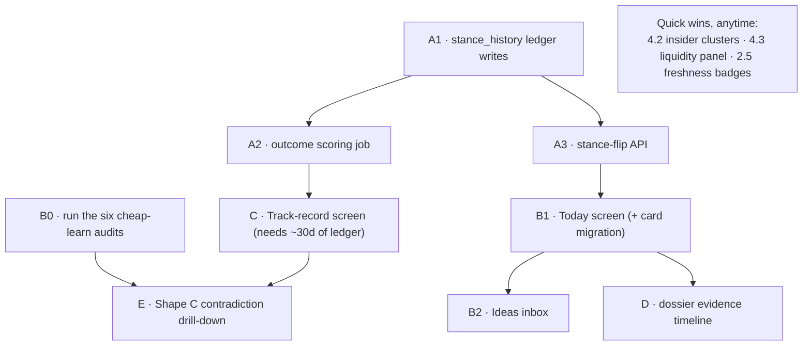

# Portfolio-AI Roadmap — Intelligence & UX

**This is the master plan. Start here.** Created 2026-06-09 from a full design review of the
collection → synthesis → presentation pipeline. If you only remember one doc, remember this one.

| Doc | Relationship to this one |
|-----|--------------------------|
| [`docs/meta_analysis_roadmap.md`](meta_analysis_roadmap.md) | Deep detail on the meta-analysis layers (Phases 1–3 shipped). This doc supersedes its "Later phases" section as the prioritized plan. |
| [`docs/AI_TASK_QUEUE_DESIGN.md`](AI_TASK_QUEUE_DESIGN.md) | Infra status for the AI task queue. Any new LLM job in this plan should be queue-managed. |
| [`docs/DASHBOARD_RESEARCH_LOOP.md`](DASHBOARD_RESEARCH_LOOP.md) | How the Action Queue / market brief / enrichment currently fit together. |

---

## The one-paragraph thesis

The system is **production-pipeline-rich and consumption-poor**. Collection and synthesis are
built and healthy (~40 scheduler jobs, meta-analysis Phases 1–3 shipped). What's missing is
(1) a **memory of its own opinions** — `ticker_meta_analysis` overwrites itself nightly, so the
system can never be scored — and (2) **screens organized around decisions** instead of data
sources. Fix those two things before adding any new collection or synthesis. The goal remains
the meta roadmap's north star: *help a human answer what to buy/sell, with inspectable
outputs* — never autonomous execution.

## The four-layer mental model

```mermaid
flowchart LR
    subgraph Collect["1 · COLLECT — rich, frozen until Learn exists"]
        A1["SearXNG market research"]
        A2["Alpha Hunter (site dorks)"]
        A3["Opportunity discovery"]
        A4["RSS + email ingest"]
        A5["Reddit / StockTwits"]
        A6["Congress + insider trades"]
        A7["ETF Watchtower holdings"]
        A8["Benchmarks / dividends"]
    end
    subgraph Synthesize["2 · SYNTHESIZE — shipped, healthy"]
        B1["ticker_analysis"]
        B2["ticker_meta_analysis<br/>stance · confidence · contradictions"]
        B3["sector_meta_analysis"]
        B4["market_daily_brief (regime)"]
        B5["social / congress AI"]
        B6["ui_ai_summaries"]
    end
    subgraph Decide["3 · DECIDE — exists, but buried"]
        C1["Action Queue + ai_review<br/>ALIGNED / TENSION / STALE"]
        C2["Advisory rebalance"]
    end
    subgraph Learn["4 · LEARN — missing entirely (Pillar 1)"]
        D1["stance_history ledger"]
        D2["Outcome scoring 7/30/90d"]
        D3["Stance-flip events"]
        D4["Track-record screen"]
    end
    Collect --> Synthesize --> Decide --> Learn
    Learn -.->|"down-weight noisy sources"| Synthesize
    Learn -.->|"kill collectors that never pay off"| Collect
```



The feedback-loop confusion of early 2026 came from repeatedly enriching layer 2 (sector priors,
regime fusion — all good work) while the loop never **terminated** anywhere: no grader (layer 4)
and no surface a human reads daily (layer 3 is one card among ~15 on the dashboard).

## Key findings from the 2026-06-09 design review

1. **Stance history is destroyed nightly.** `ticker_meta_analysis` has `UNIQUE (ticker)`
   (`database/schema/research/tables/ticker_meta_analysis.sql`) and the save path does
   `ON CONFLICT (ticker) DO UPDATE` (`web_dashboard/meta_analysis_service.py`). Yesterday's
   stance is unrecoverable. Phase 4 (outcome feedback) is **impossible** with current tables.
   Every week without a ledger is history lost forever — this is the time-sensitive item.
2. **Screens are source-centric, not decision-centric.** Congress, insiders, social, ETF,
   research, signals each have a page; no page answers "what changed and what deserves my
   attention today?"
3. **The alpha pipeline has no terminus.** `alpha_research` / `opportunity_discovery` articles
   land in the research list and stop. No triage, no accept-into-watchlist action, no feedback
   on which finds were good.
4. **The dashboard sprawls (~15 cards).** Portfolio tracking and intelligence are interleaved;
   neither is well served.
5. **No event/risk tracking that matters for micro-caps:** earnings dates, dilution filings,
   liquidity/exit risk, short interest. (Only "earnings" in the codebase is a growth ratio in
   `web_dashboard/signals/fundamental_signal.py`.)
6. **The "cheap learns" from the meta roadmap were never run** (six SQL-only audits gating the
   LLM-driven-research-selection shapes A–E).

---

## Pillar 1 — Give the system a memory (P0, do first)

### 1.1 `stance_history` append-only ledger (Research DB)

Sketch (adapt to local conventions; match `ticker_meta_analysis` migration style):

```sql
CREATE TABLE IF NOT EXISTS stance_history (
    id UUID PRIMARY KEY DEFAULT gen_random_uuid(),
    ticker TEXT NOT NULL,
    source TEXT NOT NULL,        -- 'ticker_meta' | 'ticker_analysis' | 'action_queue' | 'sector_meta'
    fund_key TEXT,               -- NULL for fund-agnostic sources; set for action_queue rows
                                 -- (action is fund-conditional: BUY only when fund doesn't hold, etc.)
    stance TEXT NOT NULL,        -- BULLISH/BEARISH/NEUTRAL/... or BUY/SELL/RISK/WATCH
    confidence NUMERIC,
    as_of TIMESTAMPTZ NOT NULL,
    price_at_stance NUMERIC,     -- close near as_of; NULL ok, backfillable from benchmark/price data
    key_drivers JSONB,
    risk_flags JSONB,
    model_used TEXT,
    source_ref JSONB,            -- pointer back to source row (id, inputs digest)
    created_at TIMESTAMPTZ DEFAULT now()
);
CREATE INDEX IF NOT EXISTS idx_stance_history_ticker_asof ON stance_history (ticker, as_of DESC);
```

Wire one INSERT into each save path — start with `meta_analysis_service.py` (the overwrite
offender), then `ticker_analysis_service.py` and the action-queue AI review job. Skip the
insert when stance + confidence are unchanged from the latest ledger row for that
(ticker, source, fund_key) to avoid noise rows.

**Action-queue mapping (decided 2026-06-10):** `action_queue_ai_review` rows store only a
*non-directional* verdict (ALIGNED/TENSION/STALE) — the directional `action`
(BUY/SELL/RISK/WATCH) is computed in-memory in
`web_dashboard/action_queue_service.py::build_action_queue_items()` and never persisted.
So the ledger hook must live **inside the review job at the moment it holds the queue item**:
record the mechanical `action` as `stance` (with `fund_key`), and store the AI `verdict` +
`one_liner` in the metadata jsonb (`source_ref`). The verdict-as-metadata enables the single
best calibration question in the system: *do TENSION-flagged actions hit less often than
ALIGNED ones?* If not, the AI review pass adds no information and can be retired.

### 1.2 Outcome scoring job (no LLM)

New scheduler module (e.g. `web_dashboard/scheduler/jobs_stance_outcomes.py`), nightly, cheap:

```sql
CREATE TABLE IF NOT EXISTS stance_outcomes (
    id UUID PRIMARY KEY DEFAULT gen_random_uuid(),
    stance_id UUID NOT NULL REFERENCES stance_history(id),
    horizon_days INT NOT NULL,            -- 7 | 30 | 90
    ticker_return NUMERIC,
    benchmark_return NUMERIC,             -- ^RUT same window (micro-cap book)
    excess_return NUMERIC,
    scored_at TIMESTAMPTZ DEFAULT now(),
    UNIQUE (stance_id, horizon_days)
);
```

For each ledger row aged ≥ horizon and not yet scored: compute ticker return vs ^RUT from
existing benchmark/price data. A BULLISH stance with positive excess return = a hit. This single
table converts every stance into a scored prediction.

**Directional scoring applies only to directional stances** (BULLISH/BEARISH, BUY/SELL).
WATCH is neutral-attention and RISK means "held position + elevated fear" — scoring RISK as
bearish would mislabel it. V1: keep RISK/WATCH rows in the ledger but exclude them from
directional hit-rate; a later pass can score RISK on realized drawdown/volatility instead.
The track-record screen (§2.4) should slice hit rate by `source`, confidence band, **and the
ai_review verdict in metadata** (ALIGNED vs TENSION calibration).

### 1.3 Stance-flip detection

With history, flips are computable: compare the two latest ledger rows per (ticker, source).
Expose as `GET /api/dashboard/stance-flips?since=...`. Flips are **more interesting than
stances** — they are the top item on the Today screen (Pillar 2) and candidates for the
contradiction drill-down (Pillar 3).

---

## Pillar 2 — Decision-centric screens

Four questions, four surfaces. Mostly aggregation over existing APIs/tables; almost zero new AI.

### 2.1 "Today" briefing screen — *what changed, what needs my attention?*

New route (e.g. `/today`) + `GET /api/today/briefing`, new template + `web_dashboard/src/js/today.ts`
(remember: edit TypeScript, never `static/js`). Sidebar link via `web_dashboard/shared_navigation.py`.

Content, in priority order (every block already has a data source):

| Block | Source |
|-------|--------|
| Market regime card | existing `GET /api/dashboard/market-brief` (`regime_canonical`) |
| Stance flips since yesterday | new (Pillar 1.3) |
| Top Action Queue items + ai_review verdicts | existing `GET /api/dashboard/action-queue` |
| New high-relevance alpha/opportunity articles | `research_articles` via `research_repository.py` |
| Watchlist movers (price/signal deltas) | existing signals data |
| Upcoming dividends / events | existing dividends data; earnings once 4.4 ships |

Migrate the intelligence cards (market brief, portfolio snapshot AI, fund digest) from the
dashboard to this screen; the dashboard returns to pure portfolio tracking. This fixes the
15-card sprawl without losing anything.

### 2.2 Ideas inbox — *which new ideas merit attention?*

The missing terminus for the alpha pipeline. New `/ideas` screen showing
`alpha_research` + `opportunity_discovery` articles as a ranked triage queue
(relevance score, extracted tickers, age), with three actions per row:

- **Accept** → add ticker(s) to watchlist via `web_dashboard/watchlist_access.py`
- **Dismiss** / **Snooze**

Persist decisions in a small Research-DB table (e.g. `idea_triage(article_id, status, decided_at, notes)`).
Side effect: accept/dismiss clicks become labeled data for the article relevance scorer.

### 2.3 Ticker dossier upgrade — *evidence timeline*

On ticker details, render all artifacts on one chronological axis under the price chart:
signals, congress trades, insider buys/sells, social spikes, article publications, stance
history (Pillar 1). "Three insiders bought the week before the stance flipped" is invisible
across six tabs and obvious on one timeline. Plotly (already used there) handles this as a
scatter/annotation layer on the price chart.

### 2.4 Track-record screen — *was the system right?*

Once `stance_outcomes` has ~30 days of rows: hit rate by source, sector, and confidence band;
best/worst calls; calibration (does confidence 0.8 actually hit more than 0.5?). This screen is
the input for deciding which collection jobs to keep (the Learn→Collect dashed arrow).

### 2.5 Cross-cutting polish

- **Freshness/provenance badge component**: standardized `as_of` + `model_used` chip rendered
  on every AI card/row (data already persisted nearly everywhere — Phase 1 item 7).
- **Thesis-status column on holdings tables**: latest meta stance vs the position you hold —
  ALIGNED / TENSION / STALE, the action-queue concept extended to the whole book.
- **Trade journal tie-in**: when a trade is logged, snapshot the artifacts that existed at that
  moment (stance, signals, queue verdict) so retrospectives show what the system believed at
  trade time.

---

## Pillar 3 — Smarter loops (only after Pillars 1–2)

1. **Run the six "cheap learns"** from
   [`meta_analysis_roadmap.md` → Exploratory section](meta_analysis_roadmap.md#exploratory--llm-driven-research-selection):
   article supply audit, domain health, theme-coverage stress test, contradiction supply,
   hypothesis-evaluable check, discovery-target check. SQL/log-only, ~30 min each. They gate
   everything below.
2. **Shape C — Contradiction Drill-Down** (likely winner per the roadmap's own decision rule):
   when ticker meta produces `contradictions ≥ 2` or `confidence < 0.5`, enqueue a targeted
   second research pass for that ticker; output a drill-down memo artifact + refreshed stance.
   This *is* the "feed data back into itself" idea — scoped, inspectable, consuming a signal
   the system already produces. Use the AI task queue, not a new legacy-lock job.
3. **Weekly retro newsletter** (infra exists in `jobs_outbound_newsletter.py`): stance flips of
   the week, hit rates from `stance_outcomes`, best/worst calls. The system reviewing itself
   instead of producing more forward chatter. (This also satisfies meta roadmap Phase 2c's
   "digests consume `regime_canonical`" when implemented.)
4. **Shape A — Smart Prioritizer** (optional, after C): use meta outputs + staleness to rank
   the nightly research queue instead of round-robin.

## Pillar 4 — New things to track (micro-cap-focused)

Ordered by value-per-effort:

| # | Tracker | Why / How | Effort |
|---|---------|-----------|--------|
| 4.1 | **Dilution watch** | #1 micro-cap killer. Monitor EDGAR full-text for S-3 / 424B5 / ATM offerings / reverse splits on holdings + watchlist. SEC plumbing exists (`web_dashboard/scheduler/sec_form4_poc.py`). Surface on Today screen + dossier. | M |
| 4.2 | **Insider cluster-buy detection** | 130k insider rows already collected. "3+ distinct insiders buying within 30 days" is one SQL view + a Today-screen block. No new collection. | S |
| 4.3 | **Liquidity / exit-risk panel** | Position size ÷ avg dollar volume = "days to exit" per holding. Pure math on existing data; more honest micro-cap risk than beta. Holdings-table column + portfolio panel. | S |
| 4.4 | **Earnings calendar** | Genuinely absent. Earnings dates for holdings/watchlist (yfinance), countdown badges on Today + dossier; optional pre-earnings AI note later. | M |
| 4.5 | **Short interest** | FINRA bi-monthly; days-to-cover on dossier. | M |
| 4.6 | **13F ownership deltas** | Quarterly EDGAR; institutional accumulation/distribution on dossier. | M/L |

---

## Cheap-learn results

Run date: **2026-06-10** (script: `web_dashboard/scripts/run_cheap_learn_audits.py`; raw JSON:
`docs/cheap_learn_audit_results.json`).

| Audit | Finding | Implication |
|-------|---------|-------------|
| 1. Article supply | 2,545 articles / 30d; dominant type `Ticker News` (2,022); `ETF Analysis` 269 from 1 source; 9 ETF rows with null `sector` | Sector meta quality OK but ETF sector invariant needs occasional cleanup |
| 2. Domain health | Table `research_domain_health` **not present** in Research DB | Shape B theme research should wait until domain-health tracking ships |
| 3. Theme coverage | rate_cuts 123/39 domains; ai_capex 698/64; lithium **22/13**; geopolitics 415/60; retail_consumer **26/14** | Lithium and retail_consumer below ~20-article / ~5-domain bar — **Shape B premature** for those themes |
| 4. Contradiction supply | **24** `ticker_meta_analysis` rows in 14d with `contradictions ≥ 2` AND `confidence < 0.5` (~1.7/day) | Below ~10/day steady-state — **defer dedicated Shape C job** until ledger + scoring mature; revisit after 30d |
| 5. Hypothesis evaluable | `^RUT` has **318** rows in Supabase `benchmark_data` | 7/30/90d stance scoring is feasible |
| 6. Discovery target | Supabase `etf_holdings_log` dropped (holdings in Research `etf_holdings_log`) | Run cross-check against `watched_tickers_v2` via Research DB when sizing Shape E |

**Decision:** Ship Pillar 1 (stance ledger + outcomes + flips) first. Start Shape A (Smart Prioritizer) only after track-record has signal. Defer Shape B/C until audits #2 and #4 improve.

### Phase A checklist

- [x] 1.1 `stance_history` table + INSERT hooks (meta, ticker_analysis, action_queue review)
- [x] 1.2 `stance_outcomes` nightly scoring job (7/30/90d vs ^RUT)
- [x] 1.3 `GET /api/dashboard/stance-flips`
- [x] B0 cheap-learn audits (this section)

## Sequencing



| Phase | Scope | Size |
|-------|-------|------|
| **A** (now — time-sensitive) | 1.1 ledger + 1.2 scoring + 1.3 flips; B0 cheap learns | days — **shipped 2026-06-10** |
| **B** | 2.1 Today screen, then 2.2 Ideas inbox | ~1–2 wk — **shipped 2026-06-10 (V1)** |
| **C** | 2.4 Track record (after ledger matures) | days — **shipped 2026-06-10 (V1; needs ~30d data)** |
| **D** | 2.3 dossier timeline; 2.5 polish; 4.4 earnings | ~1–2 wk — **partial 2026-06-10** |
| **E** | Pillar 3 Shape C + weekly retro | ~1 wk — **Shape C job shipped (gated); retro pending** |
| **F** | 4.1 dilution watch; 4.5/4.6 as appetite allows | ongoing — **4.1 advisory V1 shipped** |

### Phase B–F checklist (2026-06-10)

- [x] **B · §2.1** `/today`, `GET /api/today/briefing`, `today.ts`
- [x] **B · §2.2** `/ideas`, `idea_triage` table, triage API + `ideas.ts`
- [x] **C · §2.4** `/track-record`, `GET /api/track-record/summary`, verdict calibration slice
- [x] **D · §2.3** `GET /api/ticker/<ticker>/evidence-timeline` + dossier timeline panel on ticker details
- [x] **D · §2.5** `_freshness_badge.html` component (reuse on AI surfaces incrementally)
- [x] **D · §4.4** `GET /api/earnings/calendar` (yfinance, no persistence)
- [x] **E · Shape C** `contradiction_drilldown_job` (audit #4 gate; AI task queue)
- [x] **E · weekly retro** `weekly_stance_retro_job` (log summary; Mailgun digest hookup next)
- [x] **F · §4.1** `dilution_watch_job` advisory V1 (ticker scope scan; EDGAR hookup next)
- [ ] **F · §4.5/4.6** short interest / 13F (not started)

Quick wins (4.2, 4.3, 2.5 badges) slot into any phase as palate cleansers.

## Guardrails (carry over from the meta roadmap, plus new)

- **No autonomous trading.** Outputs are suggestions a human approves. Ever.
- **No new collection jobs until the Learn layer says which existing ones earn their keep.**
- New value must be a **new artifact type, a queue decision, or a screen** — not "more articles."
- New LLM call sites go through `collect_with_summary_model_chain` and the **AI task queue**
  (queue-managed; don't add new global-mutex jobs).
- Additive schema only: new tables/columns with fallbacks; never repurpose
  `ticker_meta_analysis`'s UPSERT semantics — the ledger is a **separate** append-only table.
- Flask is production; Streamlit is prototype-maintenance only. Edit TypeScript in
  `web_dashboard/src/js/`, never `static/js/`. Don't delete `verification/`.
- Keep this doc updated when phases land; it is linked from the README's top.

---

## Appendix — Agent kickoff prompt

A ready-to-paste prompt for a coding agent (Cursor plan mode, etc.) lives here so it's never
lost. Paste it as-is; it instructs the agent to read this doc first.

> You are working in the Portfolio-AI repo (Windows + PowerShell, venv at `.\venv`). Read
> `docs/ROADMAP.md` in full — it is the master plan — plus the Guardrails section of
> `docs/meta_analysis_roadmap.md` and `.claude/CLAUDE.md` for conventions (Flask is production,
> Streamlit is prototype-only; edit TypeScript in `web_dashboard/src/js/` never `static/js/`;
> use Decimal for money; run `python -m pytest tests/ -v` and keep it green).
>
> Implement the roadmap **in phase order, one phase per PR-sized change set**, starting with
> Phase A (Pillar 1): (1) `stance_history` append-only table in the Research DB matching the
> migration style of `ticker_meta_analysis`, with INSERT hooks in `meta_analysis_service.py`,
> `ticker_analysis_service.py`, and the action-queue AI review job (per ROADMAP §1.1: record
> the queue item's mechanical action as stance with fund_key; store the non-directional AI
> verdict as metadata — the action is computed in-memory and never persisted, so hook at
> review time), deduped against the latest row per (ticker, source, fund_key); (2) `stance_outcomes` scoring job
> (`web_dashboard/scheduler/jobs_stance_outcomes.py`, nightly, no LLM) computing 7/30/90-day
> returns vs ^RUT from existing benchmark data; (3) `GET /api/dashboard/stance-flips` API.
> Write unit tests for each (see `tests/test_jobs_rebalance.py` for job-test patterns). Then
> proceed to Phase B (Today screen per ROADMAP §2.1, then Ideas inbox §2.2), Phase C
> (track-record screen §2.4), Phase D (§2.3, §2.5, §4.4), Phase E (§Pillar 3), Phase F (§4.1+).
> Also run the six "cheap learn" SQL audits from `docs/meta_analysis_roadmap.md` (Exploratory
> section) early and write the results into `docs/ROADMAP.md` under a new "Cheap-learn results"
> heading.
>
> Hard rules: no autonomous trade execution; no new data-collection jobs; new LLM call sites
> must use `collect_with_summary_model_chain` and the AI task queue; additive schema only —
> never alter `ticker_meta_analysis`'s existing UPSERT; don't touch the `verification/` folder;
> update `docs/ROADMAP.md` phase table and check off items as you complete them; run the
> relevant test suite (`tests/test_flask_*.py` for Flask changes, `-k "not flask"` for core)
> before declaring any phase done. If a data assumption fails (e.g., a table or column named in
> the roadmap doesn't exist), stop and re-verify against `docs/database/research_schema.md` and
> `database/schema/` rather than guessing.
