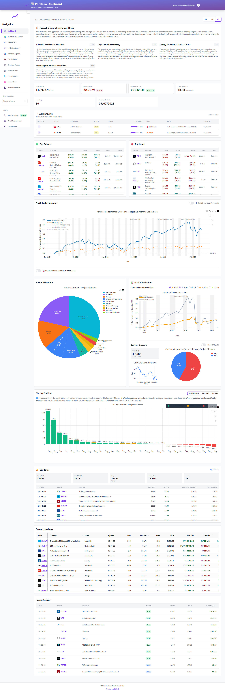
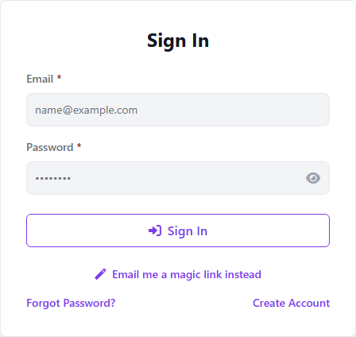
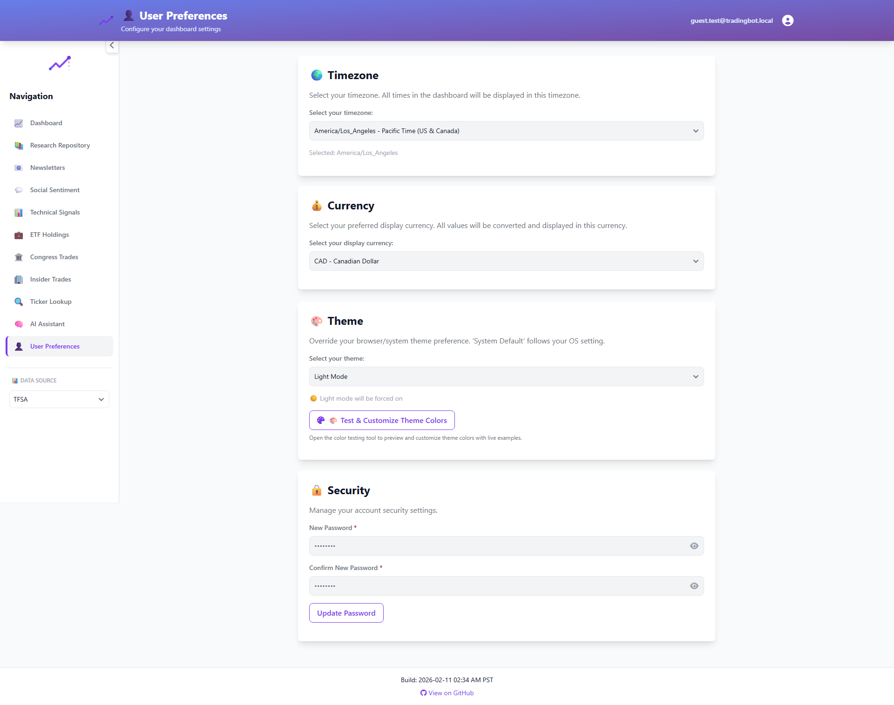
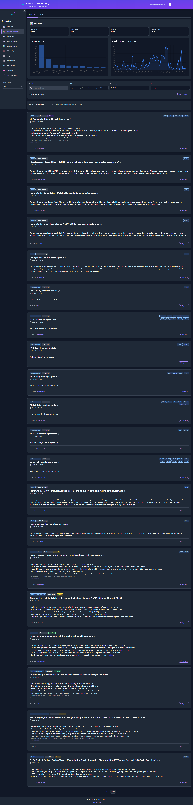
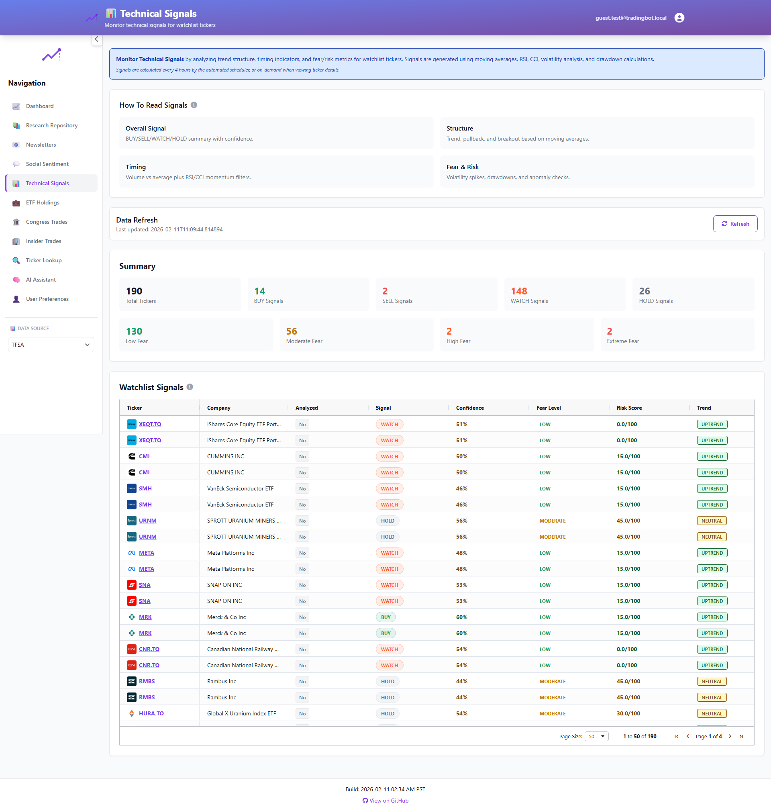
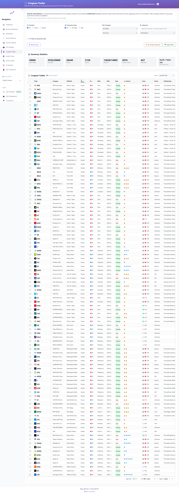
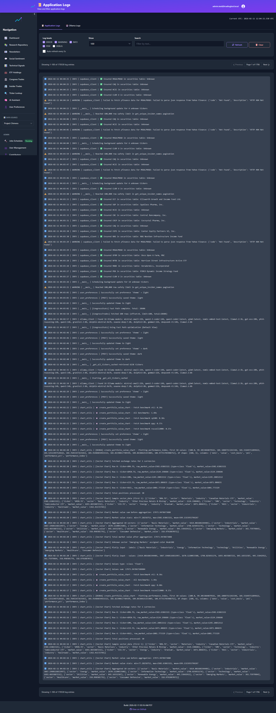

# 📈 Portfolio Performance Dashboard

A secure, multi-user web dashboard for tracking trading bot portfolio performance with Supabase backend.



## 🚀 Quick Start

### 1. Database Setup (One Command)
```sql
-- Copy and paste the entire content of schema/00_complete_setup.sql into Supabase SQL editor
-- This creates everything: tables, auth, permissions, RLS policies
```

### 2. Environment Setup
```bash
# Copy environment template
cp env.example .env

# Edit .env with your Supabase credentials
# SUPABASE_URL=https://your-project.supabase.co
# SUPABASE_ANON_KEY=your-anon-key
# JWT_SECRET=your-super-secret-jwt-key
# FLASK_SECRET_KEY=your-flask-secret-key
```

### 3. Migrate Your Data
```bash
python migrate.py
```

### 4. Deploy to Vercel
```bash
vercel --prod
```

## 🔐 User Authentication



- **Secure Login/Register** - Professional UI with Supabase Auth
- **Fund-Based Access** - Users only see their assigned funds
- **No "All Funds"** - Each user has specific fund access
- **Row Level Security** - Database-level access control

## 📁 Project Structure

```
web_dashboard/
├── schema/                    # 🗄️ Database schema files
│   ├── 00_complete_setup.sql  # 🎯 ONE FILE TO RULE THEM ALL
│   ├── 01_main_schema.sql     # Core portfolio tables
│   ├── 02_auth_schema.sql     # User authentication & permissions
│   ├── 03_sample_data.sql     # Test data (optional)
│   └── README.md             # Detailed schema documentation
├── templates/                 # 🎨 HTML templates
│   ├── base.html             # Base template with Flowbite navigation
│   ├── index.html            # Main dashboard
│   ├── settings.html         # User preferences (Flask v2)
│   ├── ticker_details.html  # Ticker details page (Flask v2)
│   ├── logs.html             # Admin logs viewer (Flask v2)
│   └── auth.html             # Login/register page
├── app.py                    # 🚀 Flask application
├── auth.py                   # 🔐 Authentication system
├── supabase_client.py        # 📊 Database client
├── migrate.py                # 📦 Data migration script
├── admin_assign_funds.py     # 👥 User management
├── requirements.txt          # 📋 Dependencies
├── env.example               # 🔧 Environment template (safe to commit)
├── credentials.example.txt   # 🔑 Credentials template (safe to commit)
├── .gitignore               # 🛡️ Protects sensitive files
└── SETUP_GUIDE.md           # 📖 Detailed setup instructions
```

## 🔧 Example Files (Safe to Commit)

### **Environment Template (`env.example`)**
```bash
# Copy this to .env and fill in your values
SUPABASE_URL=https://your-project-id.supabase.co
SUPABASE_ANON_KEY=your-anon-key-here
JWT_SECRET=your-super-secret-jwt-key-here
FLASK_SECRET_KEY=your-flask-secret-key-here
# Optional Supabase auth rollout flags
SUPABASE_LEGACY_HEADER_INJECTION=true
SUPABASE_AUTH_DIAGNOSTICS=false
USER_PREF_RPC_DIAGNOSTICS=false
# Scheduler runtime mode
SCHEDULER_RUNTIME_MODE=embedded
SCHEDULER_STATE_DIR=/tmp
```

### **Credentials Template (`credentials.example.txt`)**
```bash
# Copy this to supabase_credentials.txt and fill in your values
Database Password: [CHANGE_THIS_PASSWORD]
Project URL: https://your-project-id.supabase.co
Anon Key: your-anon-key-here
```

**See `SETUP_GUIDE.md` for detailed setup instructions.**

## 🛠️ Features

### Portfolio Tracking
- **Multi-Fund Support** - Separate tracking for different funds
- **Real-Time Data** - Live portfolio positions and performance
- **Performance Charts** - Interactive Plotly charts with benchmark comparison
- **Trade History** - Complete transaction log
- **Cash Balances** - Multi-currency cash tracking
- **Currency Conversion** - USD→CAD with exchange rates from Supabase

### Security & Permissions
- **User Authentication** - Secure login/registration
- **Fund Access Control** - Users only see assigned funds
- **Row Level Security** - Database-level permissions

## Scheduler Runtime Modes

- `SCHEDULER_RUNTIME_MODE=embedded` (default): Flask web process may auto-start scheduler.
- `SCHEDULER_RUNTIME_MODE=external`: web process does not auto-start scheduler; run `python scheduler_worker.py` in a dedicated worker process.
- `SCHEDULER_STATE_DIR` controls heartbeat/lock location (default `/tmp`). In external mode, use a shared mount if multiple containers need the same scheduler status visibility.
- **Session Management** - JWT tokens with expiration

### Admin Tools


- **Fund Assignment** - Assign funds to users
- **User Management** - List and manage users
- **Data Migration** - Import from CSV files
- **Scheduled Tasks** - Background job management

### AI Research Integration
- **Automated Research** - AI-driven news collection and summarization
- **Semantic Search** - Find relevant articles efficiently
- **Dark Mode Optimized** - Easy on the eyes for late-night research



### UI Framework (Flask Pages)
- **Tailwind CSS** (v3.4.1) - Primary CSS framework (utility-first styling)
- **Flowbite** (v2.5.2) - UI component library (modals, dropdowns, drawers, etc.)
- **Font Awesome** (v6.0.0) - Icon library
- **Mobile-First Design** - Responsive layout optimized for all devices
- **Hamburger Navigation** - Collapsible sidebar on mobile devices
- **User Menu Dropdown** - Quick access to Settings and Logout
- **See `AGENTS.md`** for complete frontend CSS & UI component standards and guidelines

### Advanced Market Signals
- **Technical Analysis** - Automated signal detection
- **Multi-Source Data** - Integrates price action, volume, and external indicators
- **Confidence Scores** - AI-driven confidence ratings for each signal
- **Actionable Insights** - Clear Buy/Sell/Hold recommendations


*Advanced Signals Dashboard - Technical Analysis at a Glance*

### Multi-Investor Features
- **NAV-Based Tracking** - Accurate per-investor returns using Net Asset Value
- **Unit-Based Ownership** - Similar to mutual fund share calculation
- **Fair Performance Attribution** - Investors who join later get correct returns
- **Dynamic Dashboard** - Automatically adjusts layout for single vs multi-investor funds
- **Investor Allocation Chart** - Visual breakdown of fund ownership

## ⏰ Background Scheduler

The dashboard includes APScheduler for running background tasks inside the Docker container.

### How It Works
- **Entrypoint script** starts APScheduler before Streamlit
- Jobs run in background threads while dashboard serves requests
- Job status and logs accessible via admin UI
- For production checks, use the server-first runbook: [`docs/SCHEDULER_HEALTH_CHECK_RUNBOOK.md`](docs/SCHEDULER_HEALTH_CHECK_RUNBOOK.md)
- Avoid local-only scheduler checks for production diagnosis; verify from server/container context.

### Available Jobs
| Job | Interval | Description |
|-----|----------|-------------|
| `exchange_rates` | 30 min | Fetch latest USD/CAD rate from Bank of Canada API |
| `market_research` | 6 hours | Collect general market news articles |
| `ticker_research` | 6 hours | Monitor news for portfolio holdings (ETFs → sectors) |
| `opportunity_discovery` | 12 hours | Hunt for new investment opportunities |

### Data Insights
Use the built-in tracking tools to follow smart money:
- **Congress Trading** - Track stock trades by US Congress members
- **Insider Trading** - Monitor corporate officer buying/selling
- **Ticker Deep Dives** - Detailed analysis of individual stocks


*Track Congressional Trading Activity*

### System Monitoring
Keep track of system health and background jobs with the built-in Admin Logs:


*Real-time System & Job Logs*

### Admin UI
Add to your Streamlit app:
```python
from scheduler_ui import render_scheduler_admin
render_scheduler_admin()
```

Features:
- View all scheduled jobs
- Run jobs immediately
- Pause/Resume jobs
- View recent execution logs

### Adding New Jobs
1. Define job function in `scheduler/jobs.py`
2. Add to `AVAILABLE_JOBS` dict
3. Register in `register_default_jobs()` function

Example:
```python
# In scheduler/jobs.py
def my_new_job():
    log_job_execution('my_job', success=True, message="Done!")

# In register_default_jobs():
scheduler.add_job(
    my_new_job,
    trigger=IntervalTrigger(hours=1),
    id='my_job',
    name='My Custom Job'
)
```

### Files
```
web_dashboard/
├── scheduler/
│   ├── __init__.py       # Module exports
│   ├── scheduler_core.py # APScheduler config & management
│   └── jobs.py           # Job definitions
├── scheduler_ui.py       # Streamlit admin UI
├── entrypoint.py         # Container entrypoint
└── Dockerfile            # Uses entrypoint.py
```

## 🔧 Development

### Local Development
```bash
# Install dependencies
pip install -r requirements.txt

# Run locally
python app.py
```

### Database Management
```bash
# Assign funds to users
python admin_assign_funds.py assign user@example.com "Project Chimera"

# List users and their funds
python admin_assign_funds.py
```

### Migration
```bash
# Migrate data from CSV files
python migrate.py
```

## 📊 API Endpoints

### Authentication
- `POST /api/auth/login` - User login
- `POST /api/auth/register` - User registration
- `POST /api/auth/logout` - User logout

### Portfolio Data
- `GET /api/funds` - Get user's assigned funds
- `GET /api/portfolio?fund=<name>` - Get portfolio data
- `GET /api/performance-chart?fund=<name>` - Get performance chart
- `GET /api/recent-trades?fund=<name>` - Get recent trades

## 🔐 Security Model

- **No "All Funds" Access** - Users only see their assigned funds
- **Fund-Based Permissions** - Each fund is assigned to specific users
- **Database-Level Security** - RLS policies enforce access control
- **JWT Authentication** - Secure session management
- **Automatic Redirects** - Unauthenticated users sent to login

### 🔒 Admin-Only Features
- **SQL Interface** (`/dev/sql`) - Direct database query access
- **Data Export APIs** (`/api/export/*`) - LLM data access
- **User Management** - Assign funds to users

### 🛡️ Security Measures
- **First User = Admin** - Only the first registered user gets admin access
- **No Hardcoded Credentials** - All sensitive data in environment variables
- **Database-Level Security** - Row Level Security (RLS) policies
- **JWT Token Security** - Secure session management with expiration
- **Gitignore Protection** - Credentials files are never committed to git

**See `SECURITY_GUIDE.md` for detailed security information.**

## 📋 Setup Checklist

- [ ] Supabase project created
- [ ] Database schema run (`schema/00_complete_setup.sql`)
- [ ] Environment variables set (`.env`)
- [ ] Data migrated (`python migrate.py`)
- [ ] Users registered on dashboard
- [ ] Funds assigned to users (`admin_assign_funds.py`)
- [ ] Dashboard deployed to Vercel
- [ ] Login/authentication working
- [ ] Fund access control verified

## 🐛 Troubleshooting

### Common Issues

**"Authentication required" errors:**
- Users need to register and have funds assigned
- Check that `user_funds` table has proper assignments

**"Access denied to this fund" errors:**
- User doesn't have access to the requested fund
- Use `admin_assign_funds.py` to assign funds

**Empty dashboard:**
- Run `python migrate.py` to populate with data
- Check that funds are assigned to the user

### Verification Commands

```sql
-- Check if all tables exist
SELECT table_name FROM information_schema.tables 
WHERE table_schema = 'public' 
ORDER BY table_name;

-- List users and their fund assignments
SELECT * FROM list_users_with_funds();

-- Test fund access for a user
SELECT * FROM get_user_funds('user-uuid-here');
```

## 📚 Documentation

- **Database Setup**: See `DATABASE_SETUP.md`
- **Schema Details**: See `schema/README.md`
- **API Reference**: See code comments in `app.py`
- **AI Research System**: See [`AI_RESEARCH_SYSTEM.md`](AI_RESEARCH_SYSTEM.md) - Complete guide to automated news collection, AI summarization, and semantic search

## 🚀 Deployment

The dashboard is designed to deploy easily to Vercel:

```bash
# Deploy to Vercel
vercel --prod

# Your dashboard will be live at:
# https://your-project.vercel.app
```

## 🎯 Key Benefits

- **Secure Multi-User** - Each user sees only their assigned funds
- **Professional UI** - Clean, modern dashboard interface
- **Real-Time Data** - Live portfolio tracking
- **Easy Management** - Simple admin tools for user/fund management
- **Scalable** - Built on Supabase for reliability and performance

---

**Your secure, multi-user portfolio dashboard is ready! 🎉**
